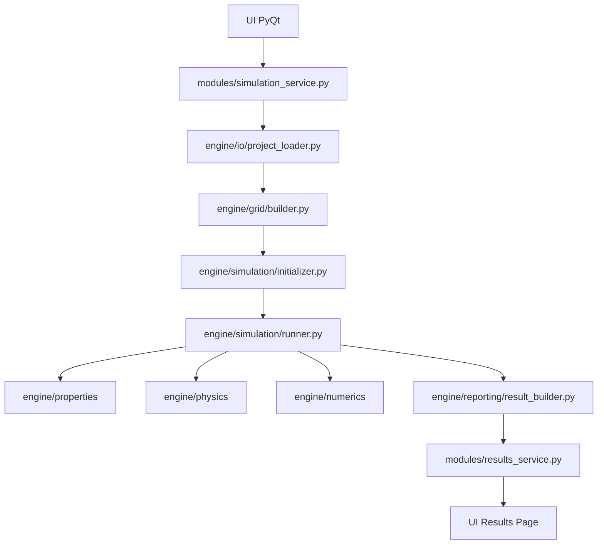

# Backend dan Engine Architecture untuk Reservoir Simulator

Dokumen ini dibuat untuk menentukan cara terbaik menyusun backend, modules, dan engine Python untuk software reservoir simulator berdasarkan [workflow.md](workflow.md), sekaligus tetap selaras dengan struktur repository yang sudah ada di folder `SIMULASI RESERVOIR`.

Tujuan utamanya sangat spesifik:

1. engine Python tidak berantakan,
2. frontend PyQt tidak tercampur dengan solver,
3. setiap rumus punya lokasi yang jelas,
4. kalau nanti kamu ingin mengubah rumus manual, kamu tidak bingung harus membuka file yang mana.

Dokumen ini sengaja tidak membahas UI lagi secara detail, karena itu sudah dibahas di [frontend.md](frontend.md). Fokus dokumen ini adalah engine lokal Python dan susunan modules backend.

## 1. Prinsip Utama Backend untuk Simulator Ini

Backend simulator seperti ini tidak boleh disusun seperti aplikasi CRUD biasa. Penyebabnya sederhana:

- ada bagian input dan validasi,
- ada bagian model fisika,
- ada bagian numerik,
- ada loop nonlinear,
- ada loop time step,
- ada reporting hasil.

Kalau semua itu dicampur dalam satu file besar atau satu class besar, maka hasilnya pasti sulit dirawat.

Jadi prinsip paling penting untuk backend ini adalah:

### 1.1 Pisahkan `UI logic`, `application/service logic`, dan `engine logic`

Artinya:

- folder `windows/` dan `ui/` hanya untuk PyQt,
- folder `modules/` hanya untuk service, orchestration, worker, dan validasi tingkat aplikasi,
- rumus, state, solver, dan physics harus tinggal di engine yang terpisah.

### 1.2 Satu keluarga rumus harus punya satu rumah yang jelas

Contoh aturan yang sehat:

- rumus transmissibility jangan tersebar di `grid_builder.py`, `simulation_service.py`, dan `main_window.py` sekaligus,
- rumus residual jangan tersebar di worker thread dan class report,
- rumus PVT jangan dicampur dengan event UI.

Kalau satu keluarga rumus punya satu lokasi tetap, kamu nanti bisa cepat ingat:

- mau ubah PVT -> buka file PVT,
- mau ubah relperm -> buka file relperm,
- mau ubah residual -> buka file residual,
- mau ubah solver -> buka file solver.

### 1.3 Orchestrator boleh memanggil rumus, tapi tidak menulis ulang rumus

Ini penting sekali.

Contoh yang benar:

- `simulation_service.py` memanggil `run_simulation()`
- `runner.py` memanggil `assemble_residual()` dan `solve_linear_system()`

Contoh yang salah:

- `simulation_service.py` menulis langsung rumus flux,
- `run_worker.py` menulis langsung rumus accumulation,
- `main_window.py` menghitung transmissibility.

### 1.4 State domain harus eksplisit

Simulator ini punya banyak data yang mirip tetapi perannya berbeda:

- input mentah,
- grid dan connection yang sudah dibentuk,
- state awal,
- state iterasi Newton,
- state yang sudah di-commit,
- hasil report.

Kalau semua disimpan sebagai dict atau array tanpa nama peran yang jelas, nanti saat debugging dan modifikasi rumus akan sangat membingungkan.

Karena itu backend harus memakai model state yang eksplisit.

## 2. Keputusan Arsitektur yang Paling Disarankan

Berdasarkan struktur repo sekarang:

```text
app/
modules/
ui/
windows/
```

struktur terbaik menurut saya adalah:

```text
app/        -> bootstrap aplikasi
windows/    -> layer window/page PyQt
ui/         -> file .ui Qt Designer
modules/    -> application layer dan service layer
engine/     -> pure Python simulation engine
```

Artinya saya menyarankan menambah satu folder baru bernama `engine/`.

Kenapa saya tidak menyarankan semua backend dimasukkan ke `modules/` saja?

Karena `modules/` akan cepat menjadi tempat campur aduk antara:

- service untuk UI,
- worker thread,
- validasi project,
- rumus reservoir,
- solver sparse,
- reporting.

Kalau tujuanmu adalah "rumus mudah dicari", maka menambah `engine/` justru membuat repo lebih rapi, bukan lebih berantakan.

## 3. Pembagian Tanggung Jawab per Folder

### 3.1 Folder `app/`

Tugas folder ini:

- entry point aplikasi,
- dependency wiring,
- bootstrap main window,
- application startup.

File yang cocok di sini:

```text
app/
- main.py
- bootstrap.py
- app_config.py
```

Aturan penting:

- jangan menaruh rumus fisika di sini,
- jangan menaruh solver linear di sini.

### 3.2 Folder `windows/`

Tugas folder ini:

- class `QMainWindow`,
- page widget,
- bind signal-slot,
- update komponen visual.

Aturan penting:

- jangan hitung residual di sini,
- jangan hitung transmissibility di sini,
- jangan hitung Jacobian di sini.

### 3.3 Folder `ui/`

Tugas folder ini:

- menyimpan `.ui` dari Qt Designer.

Aturan penting:

- tidak ada logic bisnis,
- tidak ada formula,
- tidak ada state solver.

### 3.4 Folder `modules/`

Tugas folder ini adalah `application layer`.

Di sinilah UI berbicara ke backend. Folder ini boleh tahu workflow aplikasi, tetapi tidak boleh menjadi tempat semua rumus utama ditulis.

File yang cocok di sini:

```text
modules/
- project_service.py
- validation_service.py
- simulation_service.py
- run_worker.py
- report_service.py
- results_service.py
- __init__.py
```

Makna tiap file:

- `project_service.py`: load/save project, mapping UI data ke domain object
- `validation_service.py`: validasi data project sebelum run
- `simulation_service.py`: pintu masuk untuk start simulation dari UI
- `run_worker.py`: worker thread untuk menjalankan engine tanpa membekukan UI
- `report_service.py`: export hasil ke CSV/XLSX/format lain
- `results_service.py`: menyiapkan hasil untuk tabel/plot UI

Aturan penting:

- file-file ini boleh mengatur alur,
- file-file ini tidak boleh menjadi lokasi utama rumus fisika atau numerik.

### 3.5 Folder `engine/`

Ini adalah jantung backend.

Semua yang sifatnya:

- domain reservoir,
- formula fisika,
- formula numerik,
- state runtime solver,
- time stepping,
- assembly residual/Jacobian,
- linear solver,

harus tinggal di sini.

Kalau tujuanmu adalah mempermudah pencarian rumus, maka folder inilah yang harus kamu anggap sebagai rumah utama engine.

## 4. Struktur `engine/` yang Paling Disarankan

Saya sarankan struktur seperti ini:

```text
engine/
- __init__.py

- domain/
  - __init__.py
  - project.py
  - grid.py
  - rock.py
  - fluid.py
  - state.py
  - schedule.py
  - results.py

- io/
  - __init__.py
  - ref_reader.py
  - grid_reader.py
  - pvt_reader.py
  - rock_reader.py
  - project_loader.py
  - project_writer.py

- grid/
  - __init__.py
  - builder.py
  - indexing.py
  - connections.py
  - geometry.py

- properties/
  - __init__.py
  - pvt.py
  - relperm.py
  - capillary.py
  - densities.py
  - compressibility.py

- physics/
  - __init__.py
  - transmissibility.py
  - potential.py
  - flux.py
  - accumulation.py
  - residual.py
  - wells.py

- numerics/
  - __init__.py
  - jacobian_fd.py
  - sparse_matrix.py
  - linear_solver.py
  - ilu.py
  - bicgstab.py
  - convergence.py

- simulation/
  - __init__.py
  - initializer.py
  - newton.py
  - timestep.py
  - runner.py
  - events.py

- reporting/
  - __init__.py
  - summary.py
  - exporters.py
  - result_builder.py

- common/
  - __init__.py
  - constants.py
  - units.py
  - exceptions.py
```

## 5. Kenapa Struktur Ini Paling Aman

Karena struktur ini mengikuti pertanyaan nyata yang nanti akan sering kamu punya.

### 5.1 Kalau ingin ubah rumus PVT

Buka:

- `engine/properties/pvt.py`
- `engine/properties/densities.py`
- `engine/properties/compressibility.py`

### 5.2 Kalau ingin ubah rumus relperm atau capillary pressure

Buka:

- `engine/properties/relperm.py`
- `engine/properties/capillary.py`

### 5.3 Kalau ingin ubah transmissibility

Buka:

- `engine/physics/transmissibility.py`

### 5.4 Kalau ingin ubah flux atau potential difference

Buka:

- `engine/physics/potential.py`
- `engine/physics/flux.py`

### 5.5 Kalau ingin ubah accumulation atau residual

Buka:

- `engine/physics/accumulation.py`
- `engine/physics/residual.py`

### 5.6 Kalau ingin ubah Jacobian numerik

Buka:

- `engine/numerics/jacobian_fd.py`

### 5.7 Kalau ingin ubah solver linear

Buka:

- `engine/numerics/linear_solver.py`
- `engine/numerics/ilu.py`
- `engine/numerics/bicgstab.py`

### 5.8 Kalau ingin ubah logika Newton atau time step

Buka:

- `engine/simulation/newton.py`
- `engine/simulation/timestep.py`
- `engine/simulation/runner.py`

Ini adalah keuntungan utama struktur berbasis engine yang dipisah dengan jelas.

## 6. Mapping Workflow ke Struktur Backend

Berdasarkan [workflow.md](workflow.md), mapping yang paling sehat adalah seperti ini.

### 6.1 Preparation

Masuk ke:

- `engine/io/`
- `engine/grid/builder.py`
- `engine/domain/`
- `engine/simulation/initializer.py`

### 6.2 Connection List

Masuk ke:

- `engine/grid/connections.py`
- `engine/grid/geometry.py`
- `engine/physics/transmissibility.py`

### 6.3 Residual Calculation

Masuk ke:

- `engine/properties/`
- `engine/physics/potential.py`
- `engine/physics/flux.py`
- `engine/physics/accumulation.py`
- `engine/physics/residual.py`

### 6.4 Jacobian

Masuk ke:

- `engine/numerics/jacobian_fd.py`

### 6.5 Newton Update

Masuk ke:

- `engine/simulation/newton.py`
- `engine/numerics/linear_solver.py`

### 6.6 Check Residual and Constraints

Masuk ke:

- `engine/numerics/convergence.py`
- `engine/simulation/timestep.py`

### 6.7 Reporting

Masuk ke:

- `engine/reporting/result_builder.py`
- `engine/reporting/exporters.py`

## 7. Mapping VBA Modules ke Python Engine

Supaya transisi dari VBA ke Python tidak membingungkan, saya sarankan mapping seperti ini.

| VBA module | Python location | Catatan |
| --- | --- | --- |
| `Data Module` | `engine/io/`, `engine/grid/`, `engine/simulation/initializer.py`, `engine/reporting/` | satu module VBA ini di Python memang lebih sehat dipecah |
| `PVT Module` | `engine/properties/pvt.py`, `densities.py`, `compressibility.py` | semua formula fluida tinggal satu keluarga |
| `Rock Module` | `engine/properties/relperm.py`, `capillary.py` | pisahkan relperm dan capillary kalau nanti model bertambah |
| `Residual Module` | `engine/physics/` + `engine/numerics/jacobian_fd.py` + `engine/simulation/newton.py` | di VBA masih campur, di Python sebaiknya dipisah |
| `Matrix Solver` | `engine/numerics/` | murni aljabar linear |
| `Matrix 1` | `engine/properties/` atau `engine/common/` | bisa jadi utilitas terpisah kalau dipakai |

Poin pentingnya:

- jangan memaksa satu module VBA menjadi satu file Python,
- yang dipertahankan adalah tanggung jawab logisnya, bukan nama file satu-banding-satu.

## 8. Desain File Supaya Rumus Mudah Dicari

Ini bagian paling penting untuk tujuanmu.

Kalau ingin rumus mudah dicari, saya sarankan aturan coding seperti ini.

### 8.1 Satu file untuk satu keluarga formula

Contoh:

- semua transmissibility di satu file,
- semua flux di satu file,
- semua accumulation di satu file,
- semua residual di satu file.

Jangan lakukan ini:

- transmissibility di `grid_builder.py`
- sedikit flux di `simulation_service.py`
- sisanya di `runner.py`

### 8.2 Nama file harus literal dan teknis

Pilih nama seperti:

- `transmissibility.py`
- `flux.py`
- `residual.py`
- `jacobian_fd.py`

Hindari nama terlalu umum seperti:

- `utils.py`
- `helpers.py`
- `math_tools.py`
- `core_logic.py`

Nama umum seperti itu cepat membuat rumus terserak.

### 8.3 Satu function mewakili satu operasi fisika penting

Contoh yang sehat:

- `compute_transmissibility()`
- `compute_phase_potential()`
- `compute_phase_flux()`
- `compute_oil_accumulation()`
- `assemble_cell_residual()`
- `assemble_full_residual()`

Kalau function terlalu besar, nanti kamu tetap bingung saat ingin mengubah satu rumus tertentu.

### 8.4 Orchestrator tidak boleh berisi rumus literal panjang

Contoh file orchestrator:

- `runner.py`
- `simulation_service.py`
- `run_worker.py`

File seperti ini sebaiknya berisi pemanggilan langkah, bukan rumus detail.

### 8.5 Jangan sembunyikan rumus penting di lambda, nested closure, atau callback UI

Kalau rumus utama tersembunyi di callback PyQt, nanti pencariannya sangat menyiksa.

## 9. Model Data yang Disarankan

Untuk menjaga backend tetap jelas, saya sarankan memakai `dataclass` untuk model inti.

Contoh object utama:

- `ProjectConfig`
- `ReferenceData`
- `GridSpec`
- `CellData`
- `Connection`
- `PVTTable`
- `RelPermTable`
- `ReservoirState`
- `IterationState`
- `StepResult`
- `RunResult`

Kenapa ini penting?

- nama data menjadi eksplisit,
- function jadi lebih mudah dibaca,
- debugging lebih mudah,
- UI dan engine tidak bertukar dict liar tanpa struktur.

## 10. Runtime Flow Backend yang Disarankan

Alur backend yang sehat sebaiknya seperti ini:



Maknanya:

- UI hanya mengirim perintah,
- service layer mengatur alur aplikasi,
- engine menjalankan simulasi,
- hasil dikembalikan lagi ke service layer,
- UI hanya menampilkan hasil.

## 10A. Kontrak Antar Layer Supaya Arsitektur Tetap Bersih

Bagian ini penting supaya arsitektur yang tertulis di dokumen tidak rusak saat implementasi dimulai.

### 10A.1 Kontrak `windows/ui -> modules`

Layer UI boleh:

- mengumpulkan input user,
- mengirim command seperti `load_project`, `validate_project`, `run_simulation`, `export_results`,
- menerima state ringkas, progress, warning, dan hasil untuk ditampilkan.

Layer UI tidak boleh:

- menghitung transmissibility,
- menghitung flux,
- menyusun residual,
- memanggil solver linear langsung,
- menyimpan rumus fisika di callback widget.

Artinya file seperti `main_window.py`, `run_page.py`, atau `results_page.py` hanya boleh berbicara ke `modules/`.

### 10A.2 Kontrak `modules -> engine`

Layer `modules/` boleh:

- memetakan data project dari UI ke object domain,
- memilih service atau worker mana yang dijalankan,
- memanggil engine,
- menangani event progress,
- memformat hasil untuk kebutuhan UI.

Layer `modules/` tidak boleh:

- menjadi tempat utama rumus PVT,
- menjadi tempat utama rumus residual,
- menjadi tempat utama rumus Jacobian,
- menyalin ulang rumus dari `engine/`.

Artinya `modules/` adalah orchestration layer, bukan layer fisika atau numerik.

### 10A.3 Kontrak internal `engine`

Aturan internal yang sehat untuk `engine/`:

- `domain/` boleh dipakai oleh semua sublayer engine,
- `io/` hanya baca/tulis project dan data,
- `grid/` membentuk geometri dan koneksi,
- `properties/` menghitung properti dari pressure/saturation,
- `physics/` menghitung hubungan fisik antar cell,
- `numerics/` menyelesaikan sisi aljabar dan convergence,
- `simulation/` hanya mengorkestrasi loop runtime engine,
- `reporting/` membentuk hasil akhir yang siap dibaca UI atau diekspor.

### 10A.4 Aturan dependency antar subfolder engine

Dependency yang aman:

```text
domain -> dipakai semua
io -> domain
grid -> domain
properties -> domain
physics -> domain + properties + grid
numerics -> domain
simulation -> domain + grid + properties + physics + numerics
reporting -> domain + simulation
```

Dependency yang harus dihindari:

- `properties` memanggil `simulation`
- `physics` memanggil `windows`
- `numerics` memanggil `modules`
- `reporting` menghitung ulang rumus fisika inti

### 10A.5 Kontrak workflow runtime yang harus dipertahankan

Supaya tetap sesuai [workflow.md](workflow.md), urutan runtime engine yang benar adalah:

```text
load project
-> build grid and connections
-> initialize state
-> evaluate properties
-> assemble residual
-> assemble Jacobian
-> solve linear system
-> update Newton state
-> check convergence
-> commit time step
-> build results/report
```

Kalau saat implementasi nanti ada file yang melompati urutan ini secara liar, itu biasanya tanda arsitektur mulai bocor.

## 11. Rekomendasi File Backend yang Paling Penting untuk Dibuat Dulu

Kalau kamu ingin memulai tanpa langsung membuat terlalu banyak file, urutan minimal yang paling masuk akal adalah:

### Tahap 1

```text
modules/
- simulation_service.py
- validation_service.py
- run_worker.py

engine/domain/
- state.py
- grid.py
- project.py

engine/grid/
- builder.py
- connections.py

engine/properties/
- pvt.py
- relperm.py

engine/physics/
- transmissibility.py
- flux.py
- accumulation.py
- residual.py

engine/numerics/
- jacobian_fd.py
- linear_solver.py

engine/simulation/
- initializer.py
- newton.py
- runner.py
```

Dengan susunan ini saja, kamu sudah punya fondasi engine yang cukup jelas.

### Tahap 2

Tambahkan:

- `potential.py`
- `compressibility.py`
- `convergence.py`
- `timestep.py`
- `result_builder.py`
- `project_loader.py`

### Tahap 3

Tambahkan:

- `wells.py`
- `exporters.py`
- model-model lanjutan untuk schedule, comparison, dan case management.

## 11A. Peta Rumus ke File, Function, dan Caller

Bagian ini adalah peta kerja paling operasional saat kamu nanti ingin mengubah rumus manual.

| Rumus / logika | File utama | Function yang sebaiknya ada | Dipanggil oleh |
| --- | --- | --- | --- |
| jumlah grid | `engine/grid/builder.py` | `build_grid()` | `project_loader.py`, `runner.py` |
| bulk volume cell | `engine/grid/geometry.py` | `compute_bulk_volume()` | `build_grid()` |
| connection list | `engine/grid/connections.py` | `build_connections()` | `build_grid()` |
| harmonic permeability | `engine/physics/transmissibility.py` | `compute_harmonic_permeability()` | `compute_transmissibility()` |
| transmissibility | `engine/physics/transmissibility.py` | `compute_transmissibility()` | `build_connections()`, `assemble_flux_terms()` |
| interpolasi PVT | `engine/properties/pvt.py` | `interpolate_pvt()`, `evaluate_cell_pvt()` | `evaluate_properties()` |
| densitas in-situ | `engine/properties/densities.py` | `compute_oil_density()`, `compute_water_density()`, `compute_gas_density()` | `evaluate_cell_pvt()` |
| kompresibilitas | `engine/properties/compressibility.py` | `compute_oil_compressibility()`, `compute_water_compressibility()`, `compute_gas_compressibility()` | `evaluate_cell_pvt()` |
| relperm | `engine/properties/relperm.py` | `interpolate_relperm()`, `evaluate_cell_relperm()` | `evaluate_properties()` |
| capillary pressure | `engine/properties/capillary.py` | `compute_pcow()`, `compute_pcgw()` | `evaluate_cell_relperm()` |
| potential difference | `engine/physics/potential.py` | `compute_oil_potential()`, `compute_water_potential()`, `compute_gas_potential()` | `assemble_flux_terms()` |
| flux phase | `engine/physics/flux.py` | `compute_oil_flux()`, `compute_water_flux()`, `compute_gas_flux()` | `assemble_flux_terms()` |
| pore volume efektif | `engine/physics/accumulation.py` | `compute_effective_pore_volume()` | `assemble_accumulation_terms()` |
| accumulation oil/water/gas | `engine/physics/accumulation.py` | `compute_oil_accumulation()`, `compute_water_accumulation()`, `compute_gas_accumulation()` | `assemble_cell_residual()` |
| residual per cell | `engine/physics/residual.py` | `assemble_cell_residual()` | `assemble_full_residual()` |
| residual seluruh model | `engine/physics/residual.py` | `assemble_full_residual()` | `newton_step()` |
| Jacobian finite-difference | `engine/numerics/jacobian_fd.py` | `assemble_jacobian_fd()` | `newton_step()` |
| RHS Newton | `engine/simulation/newton.py` | `build_newton_rhs()` | `newton_step()` |
| linear solver | `engine/numerics/linear_solver.py` | `solve_linear_system()` | `newton_step()` |
| ILU | `engine/numerics/ilu.py` | `build_ilu0()`, `apply_ilu()` | `solve_linear_system()` |
| BiCGSTAB | `engine/numerics/bicgstab.py` | `solve_bicgstab()` | `solve_linear_system()` |
| update Newton state | `engine/simulation/newton.py` | `apply_newton_update()` | `newton_step()` |
| cek convergence | `engine/numerics/convergence.py` | `compute_residual_error()`, `is_converged()` | `newton_step()`, `runner.py` |
| kontrol time step | `engine/simulation/timestep.py` | `accept_timestep()`, `reject_timestep()`, `update_timestep()` | `runner.py` |
| commit state | `engine/simulation/runner.py` | `commit_timestep_state()` | `run_simulation()` |
| hasil/report | `engine/reporting/result_builder.py` | `build_step_result()`, `build_run_result()` | `run_simulation()`, `results_service.py` |

Cara pakainya sederhana:

- mau ubah rumus fisika, buka kolom `File utama`.
- mau tahu nama function yang harus dicari atau dibuat, lihat kolom `Function yang sebaiknya ada`.
- mau tahu efek perubahan itu menjalar ke mana, lihat kolom `Dipanggil oleh`.

## 11B. Isi Minimal File Fase 1 Supaya Langsung Siap Diisi

Bagian ini menjawab pertanyaan implementasi paling praktis: saat file fase 1 dibuat, masing-masing minimal harus berisi apa.

### 11B.1 `modules/simulation_service.py`

Minimal berisi:

- `run_simulation(project_config)`
- `validate_and_run(project_config)`
- `load_results(run_result)`

Fungsi file ini:

- menjadi pintu masuk dari UI,
- memanggil worker atau engine,
- tidak berisi rumus inti.

### 11B.2 `modules/validation_service.py`

Minimal berisi:

- `validate_project(project_config)`
- `validate_grid_inputs(project_config)`
- `validate_pvt_inputs(project_config)`
- `validate_rock_inputs(project_config)`
- `validate_initial_state(project_config)`

Fungsi file ini:

- memblokir run jika input belum layak,
- memberi error operasional ke UI.

### 11B.3 `modules/run_worker.py`

Minimal berisi:

- class `RunWorker`
- signal `started`, `progress`, `warning`, `finished`, `failed`
- method `run()`

Fungsi file ini:

- menjalankan engine di thread terpisah,
- menjaga UI tetap responsif.

### 11B.4 `engine/domain/project.py`

Minimal berisi dataclass:

- `ProjectConfig`
- `ReferenceData`
- `SolverConfig`
- `RunConfig`

### 11B.5 `engine/domain/grid.py`

Minimal berisi dataclass:

- `GridSpec`
- `CellData`
- `Connection`
- `GridModel`

### 11B.6 `engine/domain/state.py`

Minimal berisi dataclass:

- `ReservoirState`
- `IterationState`
- `CellPVTProperties`
- `CellRockProperties`

### 11B.7 `engine/grid/builder.py`

Minimal berisi:

- `build_grid(project_config)`
- `build_cell_data(grid_spec)`
- `attach_connections(grid_model)`

### 11B.8 `engine/grid/connections.py`

Minimal berisi:

- `build_connections(grid_model)`
- `find_cartesian_neighbors(cell_index, grid_spec)`

### 11B.9 `engine/properties/pvt.py`

Minimal berisi:

- `interpolate_pvt(table, pressure)`
- `evaluate_cell_pvt(reference_data, table, pressure)`

### 11B.10 `engine/properties/relperm.py`

Minimal berisi:

- `interpolate_relperm(table, saturation)`
- `evaluate_cell_relperm(rock_tables, sw, sg)`

### 11B.11 `engine/physics/transmissibility.py`

Minimal berisi:

- `compute_harmonic_permeability(k1, k2)`
- `compute_transmissibility(k1, k2, area, distance, unit_factor=0.00603)`

### 11B.12 `engine/physics/flux.py`

Minimal berisi:

- `compute_oil_flux(connection, upwind_props, potential)`
- `compute_water_flux(connection, upwind_props, potential)`
- `compute_gas_flux(connection, upwind_props, potential)`
- `assemble_flux_terms(cell_index, grid_model, state, properties)`

### 11B.13 `engine/physics/accumulation.py`

Minimal berisi:

- `compute_effective_pore_volume(cell, pressure, reference_data)`
- `compute_oil_accumulation(cell, state_n, state_k, properties_n, properties_k, dt)`
- `compute_water_accumulation(...)`
- `compute_gas_accumulation(...)`

### 11B.14 `engine/physics/residual.py`

Minimal berisi:

- `assemble_cell_residual(cell_index, grid_model, state_n, state_k, properties_n, properties_k, dt)`
- `assemble_full_residual(grid_model, state_n, state_k, dt)`

### 11B.15 `engine/numerics/jacobian_fd.py`

Minimal berisi:

- `assemble_jacobian_fd(grid_model, state_n, state_k, dt, perturbation_config)`
- `perturb_pressure(...)`
- `perturb_sw(...)`
- `perturb_sg(...)`

### 11B.16 `engine/numerics/linear_solver.py`

Minimal berisi:

- `solve_linear_system(matrix, rhs, solver_config)`

Lalu boleh mendelegasikan ke:

- `solve_bicgstab(...)`
- `build_ilu0(...)`

### 11B.17 `engine/simulation/initializer.py`

Minimal berisi:

- `initialize_state(project_config, grid_model)`
- `initialize_hydrostatic_pressure(reference_data, grid_model)`
- `initialize_saturations(project_config, grid_model)`

### 11B.18 `engine/simulation/newton.py`

Minimal berisi:

- `newton_step(grid_model, state_n, state_k, dt, solver_config)`
- `build_newton_rhs(residual)`
- `apply_newton_update(state_k, correction)`

### 11B.19 `engine/simulation/runner.py`

Minimal berisi:

- `run_simulation(project_config)`
- `run_timestep(...)`
- `commit_timestep_state(...)`
- `emit_progress(...)`

Fungsi file ini:

- menjadi orkestrator utama runtime engine,
- tetap tidak menulis ulang rumus fisika detail.

## 11C. Checklist Kesesuaian Implementasi terhadap Workflow

Bagian ini dipakai sebagai alat cek saat coding, supaya implementasi backend tidak menyimpang dari workflow utama.

Checklist per tahap:

1. `Preparation`: apakah project loader, grid builder, dan initializer sudah terpisah?
2. `Connection List`: apakah koneksi dan transmissibility dibentuk sebelum residual pertama dihitung?
3. `Residual Calculation`: apakah semua properti dievaluasi dari state iterasi saat itu sebelum residual disusun?
4. `Jacobian`: apakah assembly Jacobian memakai residual yang sama basis state-nya dengan residual utama?
5. `Newton Update`: apakah RHS dibentuk dari `-Residual` dan update state dilakukan di satu titik yang jelas?
6. `Check Constraints`: apakah convergence check dan timestep acceptance/rejection tidak tercampur dengan UI?
7. `Reporting`: apakah hasil dibangun dari state yang sudah di-commit, bukan dari state iterasi sementara?

Kalau jawaban untuk salah satu poin ini `tidak`, berarti implementasi mulai menjauh dari workflow yang sudah menjadi acuan utama.

## 12. Larangan Arsitektur yang Sebaiknya Kamu Hindari

Ada beberapa pola yang terlihat cepat di awal tetapi sangat berbahaya untuk project seperti ini.

### 12.1 Satu file besar `simulator.py`

Ini membuat semua rumus, state, dan alur menyatu. Awalnya terasa cepat, tetapi nanti setiap perubahan rumus akan sulit dicari.

### 12.2 Menaruh rumus di `main_window.py`

Ini akan membuat UI dan engine melekat terlalu kuat.

### 12.3 Menaruh semua rumus di `utils.py`

Ini adalah salah satu cara tercepat membuat backend menjadi kabur dan tidak terindeks secara mental.

### 12.4 Menyimpan state penting sebagai dict tanpa model domain

Untuk prototype kecil mungkin masih bisa, tetapi untuk simulator dengan pressure, saturation, connection, dan step result, ini akan cepat membingungkan.

### 12.5 Menulis ulang rumus yang sama di banyak tempat

Contohnya transmissibility dihitung di builder, lalu di residual, lalu di results. Ini harus dihindari.

## 13. Aturan Praktis Supaya Nanti Tidak Bingung Mencari Rumus

Kalau ini ingin dijadikan aturan kerja tim atau aturan pribadimu, saya sarankan aturan sederhana berikut.

1. Satu file satu keluarga rumus.
2. Nama file harus menyebut nama konsep fisiknya.
3. File service tidak boleh berisi rumus inti.
4. File UI tidak boleh berisi rumus inti.
5. Satu rumus penting hanya punya satu implementasi utama.
6. Semua runtime orchestration memanggil function, bukan menyalin rumus.
7. Semua model state utama punya class yang jelas.

Kalau 7 aturan ini dijaga, backend akan tetap mudah dibaca walaupun project membesar.

## 14. Rekomendasi Final yang Paling Praktis

Kalau saya ringkas ke keputusan yang paling penting:

1. Pertahankan `app/`, `windows/`, `ui/`, dan `modules/` untuk struktur aplikasi dan frontend.
2. Tambahkan `engine/` sebagai rumah utama semua domain, formula, solver, dan simulation runtime.
3. Jadikan `modules/` sebagai application/service layer, bukan tempat formula fisika.
4. Pecah engine berdasarkan keluarga logika: `domain`, `io`, `grid`, `properties`, `physics`, `numerics`, `simulation`, `reporting`.
5. Tempatkan setiap rumus pada file yang literal dan mudah dicari, misalnya `transmissibility.py`, `flux.py`, `residual.py`, `jacobian_fd.py`.

Kalau tujuan utamanya adalah membuat engine Python yang membuatmu tidak bingung saat ingin mengubah rumus manual, maka struktur berbasis `engine/` seperti di atas adalah pilihan paling aman, paling rapi, dan paling tahan tumbuh.