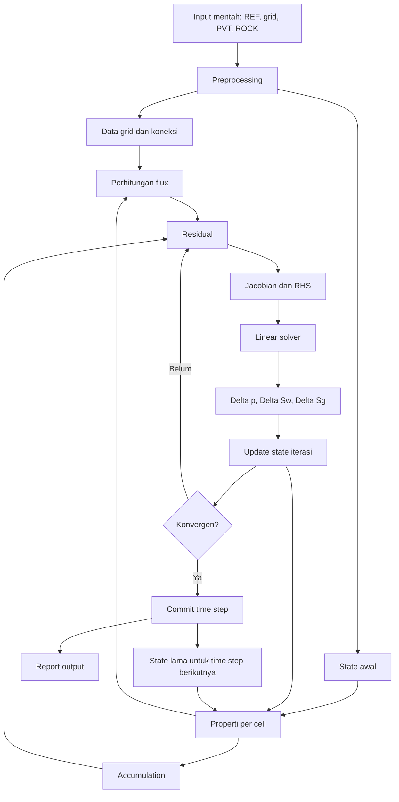

# CRUD Data Reservoir Simulator

Dokumen ini dibuat untuk menjawab satu pertanyaan inti:

"Data apa saja yang masuk ke simulator, diproses jadi apa, keluar jadi apa, lalu output mana yang dipakai lagi sebagai input tahap berikutnya?"

Fokus dokumen ini bukan teori fisika reservoir secara penuh, tetapi lifecycle data-nya. Jadi cara bacanya adalah:

1. lihat dulu sumber input mentah,
2. lihat data turunan yang dibentuk,
3. lihat state yang diiterasi,
4. lihat output solver,
5. lihat output report,
6. lihat hubungan output-menjadi-input di tahap berikutnya.

Dokumen ini disusun berdasarkan alur yang sudah dirangkum di [workflow.md](workflow.md), terutama workflow aktual workbook VBA `ressim_NewClass2.xlsm`.

Versi yang sekarang sudah disesuaikan dengan 6 module utama di [vba.md](vba.md), supaya kamu bisa melihat CRUD bukan cuma dari sisi entitas data, tetapi juga dari sisi owner module VBA yang membuat, membaca, meng-update, dan menimpa data itu.

## 1. Cara Membaca CRUD di Dokumen Ini

Di konteks simulator ini, arti CRUD sedikit berbeda dari CRUD aplikasi database biasa.

- `Create`: data pertama kali dibentuk, dialokasikan, dihitung, atau dibaca dari input.
- `Read`: data dipakai oleh proses lain sebagai input.
- `Update`: data lama diganti, diperbarui, atau dioverwrite pada iterasi atau time step berikutnya.
- `Delete`: data tidak selalu benar-benar dihapus; sering kali artinya di-reset, direalokasi, atau nilainya ditimpa saat run baru dimulai.

Jadi kalau di dokumen ini saya tulis `Delete`, maknanya bisa salah satu dari ini:

- array dibersihkan untuk run baru,
- nilai lama tidak dipakai lagi setelah commit time step,
- data sementara dibuang setelah iterasi selesai,
- report lama dioverwrite atau ditambah baris baru tergantung desain implementasi.

## 2. Gambaran Besar Alur Data

Secara ringkas, alurnya seperti ini:



Arti alur ini:

- input mentah tidak langsung menjadi output akhir,
- sebagian besar input mentah terlebih dulu berubah menjadi data turunan,
- data turunan lalu dipakai membentuk residual dan Jacobian,
- hasil solver tidak langsung menjadi report, tetapi lebih dulu dipakai meng-update state,
- state yang sudah konvergen lalu di-commit menjadi input untuk time step berikutnya,
- output report adalah hasil paling akhir dari satu state yang sudah diterima.

## 2A. Peta 6 Module VBA sebagai Owner CRUD

Kalau [vba.md](vba.md) dijadikan acuan utama, maka lifecycle data di simulator ini sebenarnya dimiliki oleh 6 module berikut.

### 2A.1 Data Module

Peran CRUD utamanya:

- `Create`: baca data referensi, buat grid, buat connection list, alokasikan memory, bentuk initial state, buat report.
- `Read`: membaca semua parameter kontrol simulasi dan state saat report.
- `Update`: update `PreviousState` saat pindah time step.
- `Delete`: reset array dan clear report saat run baru dimulai.

Data utama yang dia pegang:

- `ReferenceData`
- `GridData`
- `ConnectionList`
- `InitialState`
- `PreviousState`
- `ReportRows`

### 2A.2 PVT Module

Peran CRUD utamanya:

- `Create`: baca tabel PVT dan hitung properti fluida per pressure.
- `Read`: baca pressure dari state dan parameter referensi fluida.
- `Update`: overwrite hasil interpolasi PVT per cell saat pressure berubah.
- `Delete`: hasil interpolasi lama tertimpa oleh evaluasi berikutnya.

Data utama yang dia pegang:

- `PVTTable`
- `CellPVT`

### 2A.3 Rock Module

Peran CRUD utamanya:

- `Create`: baca tabel relperm/capillary pressure dan hitung properti relatif untuk saturasi tertentu.
- `Read`: baca saturasi current state.
- `Update`: overwrite hasil relperm per cell saat saturasi berubah.
- `Delete`: hasil lama tertimpa oleh evaluasi baru.

Data utama yang dia pegang:

- `RockFluidTable`
- `CellRockFluid`

### 2A.4 Residual Module

Peran CRUD utamanya:

- `Create`: hitung flux, accumulation, residual, RHS, Jacobian numerik, dan Newton correction.
- `Read`: baca connection list, state lama, state iterasi, properti PVT, properti relperm.
- `Update`: update `IterationState`, `Residual`, `Jacobian`, dan `RHS` berulang kali di Newton loop.
- `Delete`: residual dan Jacobian iterasi lama tertimpa oleh assembly berikutnya.

Data utama yang dia pegang:

- `IterationState`
- `NetFlux`
- `Accumulation`
- `Residual`
- `Jacobian`
- `RHS`
- `NewtonCorrection`

### 2A.5 Matrix Solver

Peran CRUD utamanya:

- `Create`: ubah matrix COO ke CSR, bangun ILU, hasilkan solusi linear.
- `Read`: baca `Jacobian` dan `RHS`.
- `Update`: update vector iteratif internal solver sampai konvergen.
- `Delete`: buffer solver dan preconditioner lama dibuang saat solve berikutnya.

Data utama yang dia pegang:

- `SparseCSR`
- `ILUType`
- `SolverResult`

### 2A.6 Matrix 1

Peran CRUD utamanya:

- `Create`: hitung `z-factor` gas dari `Tpr` dan `Ppr`.
- `Read`: baca parameter gas reduced properties.
- `Update`: update iterasi akar `y`.
- `Delete`: nilai iterasi sebelumnya tertimpa sampai akar ditemukan.

Data utama yang dia pegang:

- `y` iterasi akar
- `z-factor`

Catatan:

- pada workflow utama workbook, module ini tampak belum dipakai langsung oleh `RunSim`, jadi dia lebih mirip utility tambahan daripada owner alur utama.

## 3. Sumber Input Utama

Kalau diringkas, simulator butuh lima kelompok input besar.

### 3.1 Data referensi

Biasanya berasal dari sheet `REF` pada workbook.

Isi utamanya:

- `dREF`: depth referensi.
- `pREF`: pressure referensi.
- `rDENOIL`, `rDENWATER`, `rDENGAS`: densitas referensi.
- `cROCK`: kompresibilitas batuan.
- `Pb`: bubble-point atau pressure acuan.
- `CoRef`, `CwRef`, `CgRef`: kompresibilitas referensi fluida.

Fungsi utamanya:

- membentuk tekanan awal,
- membentuk properti fluida yang bergantung tekanan,
- menjadi dasar komputasi kompresibilitas dan densitas in-situ.

### 3.2 Data grid dan properti cell

Pada workbook contoh, banyak nilainya masih seragam.

Isi utamanya:

- `nx`, `ny`, `nz`.
- `dx`, `dy`, `dz`.
- porosity.
- `permX`, `permY`, `permZ`.
- `PVMult`, `TransMult`.
- `depth` cell.
- status active/inactive bila nanti dikembangkan.

Fungsi utamanya:

- menentukan ukuran model,
- menentukan volume cell,
- menentukan koneksi antar cell,
- menentukan transmissibility.

### 3.3 Tabel PVT

Biasanya berasal dari sheet `PVT`.

Isi utamanya:

- pressure table,
- `Bo`, `Bw`, `Bg`,
- `mo`, `mw`, `mg`,
- `Rso`, `Rsw`,
- kemungkinan `Psat` dan parameter lain.

Fungsi utamanya:

- menyediakan properti fluida yang harus diinterpolasi untuk tiap pressure cell.

### 3.4 Tabel rock-fluid

Biasanya berasal dari sheet `ROCK`.

Isi utamanya:

- `Sw`, `Sg`,
- `kro`, `krw`, `krg`,
- `Pcow`, `Pcgw`.

Fungsi utamanya:

- menentukan mobility tiap phase,
- menentukan capillary pressure,
- ikut menentukan arah dan besar flux.

### 3.5 Kondisi awal dan kontrol simulasi

Isi utamanya:

- pressure awal,
- saturasi awal,
- `dt`, `tMax`, iterasi maksimum,
- toleransi residual,
- batasan numerik lain.

Fungsi utamanya:

- memberi starting point Newton,
- menentukan seberapa lama simulasi berjalan,
- menentukan kapan solusi dianggap konvergen.

## 4. Peta Entitas Data Utama

Bagian ini adalah ringkasan paling penting kalau kamu ingin cepat melihat siapa membuat apa, siapa membaca apa, dan output mana jadi input tahap berikutnya.

Karena sekarang dokumen ini diselaraskan ke [vba.md](vba.md), tabel ini juga menunjukkan module owner dan procedure utama yang terlibat.

| Entitas Data | Owner module VBA | Create utama | Read utama | Update/Delete logis | Output jadi input apa? |
| --- | --- | --- | --- | --- | --- |
| ReferenceData | `Data Module` + `PVT Module` | `ReadRefData` | `Initialization`, `calcPVT`, accumulation | Tetap selama run, ditimpa saat input baru dibaca | Menjadi input state awal dan properti fluida |
| GridData | `Data Module` | `ReadGridData` | `GridDim`, `Initialization`, accumulation, flux | Umumnya statik selama run, reset saat model baru | Menjadi input connection list, volume, pore volume |
| PVTTable | `PVT Module` | `ReadPVTData` | `calcPVT`, `CalcModel_PVT` | Tabel tetap, hasil interpolasinya yang terus tertimpa | Menjadi input `Bo`, `Bw`, `Bg`, `mu`, `Rso`, `Rsw` |
| RockFluidTable | `Rock Module` | `ReadTableRock` | `CalcRelperm` | Tabel tetap, hasil interpolasinya yang terus tertimpa | Menjadi input mobility dan potential difference |
| ConnectionList | `Data Module` | `GridDim` | `NetFluxIn`, `Pertub1Cell`, sparsity Jacobian | Dibuat sekali di awal, dibangun ulang saat grid berubah | Menjadi input flux dan struktur Jacobian |
| InitialState | `Data Module` | `Initialization` | `CalcModel_PVT`, `CalcAllResid`, report awal | Dibentuk sekali saat run dimulai | Menjadi tebakan pertama iterasi |
| PreviousState (`n`) | `Data Module` + `Residual Module` | `Initialization`, lalu `UpdateNewTime` | accumulation term di `ResidCell` | Diupdate setelah time step konvergen, state lama tertimpa | Menjadi input state lama pada time step berikutnya |
| IterationState (`k`) | `Residual Module` | salinan dari initial/previous state lalu update Newton | `calcPVT`, `CalcRelperm`, flux, residual, Jacobian | Diupdate tiap iterasi Newton, iterate lama tertimpa | Menjadi input residual berikutnya |
| CellPVT | `PVT Module` | `calcPVT`, `CalcModel_PVT` | density, mobility, accumulation, gravity term | Diupdate tiap evaluasi pressure | Menjadi input flux, accumulation, gravity term |
| CellRockFluid | `Rock Module` | `CalcRelperm` | mobility, capillary pressure, flux | Diupdate tiap evaluasi saturasi | Menjadi input flux dan residual |
| NetFlux | `Residual Module` | `NetFluxIn` lalu dijumlah di `ResidCell` | residual assembly | Dihitung ulang setiap assembly, hasil lama tertimpa | Menjadi input residual |
| Accumulation | `Residual Module` | `ResidCell` | residual assembly | Dihitung ulang setiap assembly, hasil lama tertimpa | Menjadi input residual |
| Residual | `Residual Module` | `ResidCell`, `CalcAllResid` | convergence check, `Pertub1Cell`, `RHS` | Diupdate tiap iterasi, residual lama tertimpa | Menjadi input Jacobian solve dan cek konvergensi |
| Jacobian | `Residual Module` + `Matrix Solver` | nilai diisi di `Pertub1Cell`, struktur dibuat di `AllocateMemory` | `SolveSparseSystem` | Diisi ulang tiap iterasi Newton, Jacobian lama tertimpa | Menjadi input sistem linear |
| RHS | `Residual Module` | `NewTonIteration`, `solveMat` | `SolveSparseSystem` | Diupdate tiap iterasi Newton | Menjadi input sistem linear |
| NewtonCorrection | `Matrix Solver` | `SolveSparseSystem` | update state di `NewTonIteration` | Solusi lama tertimpa oleh solve berikutnya | Menjadi input IterationState baru |
| ReportRows | `Data Module` | `MakeReport` | user, plotting, analisis | Ditambah atau di-clear saat run baru | Menjadi output akhir yang dibaca user |

## 5. CRUD Detail per Entitas

Di bawah ini saya pecah satu per satu supaya kamu bisa benar-benar melihat lifecycle-nya.

Catatan penting:

- section `5` ini tetap entity-centric, jadi kamu bisa melihat hidup-matinya tiap data satu per satu.
- setelah section ini, saya tambahkan section khusus CRUD per module VBA agar mapping ke [vba.md](vba.md) lebih langsung.

### 5.1 ReferenceData

Isi data:

- depth referensi,
- pressure referensi,
- densitas referensi,
- kompresibilitas referensi,
- parameter acuan lain.

Create:

- dibaca dari sheet `REF` lewat proses seperti `ReadRefData`.

Read:

- dibaca oleh `Initialization` untuk membentuk pressure awal,
- dibaca oleh model PVT untuk menghitung densitas dan kompresibilitas,
- dibaca oleh model batuan untuk efek compressibility.

Update:

- umumnya tidak berubah selama satu run simulasi.
- hanya berubah jika user mengganti input lalu menjalankan simulasi ulang.

Delete:

- secara praktis tidak dihapus di tengah run.
- akan tergantikan saat run baru membaca input baru.

Input yang dibutuhkan:

- nilai numerik dari user atau sheet referensi.

Output yang dihasilkan:

- tekanan referensi,
- gradien awal,
- parameter model fluida dan batuan.

Output jadi input berikutnya:

- ya, langsung menjadi input `Initialization`, `CalcModel_PVT`, dan accumulation model.

### 5.2 GridData

Isi data:

- jumlah cell,
- ukuran cell,
- depth,
- porosity,
- permeabilitas,
- multiplier volume dan transmissibility.

Create:

- dibaca atau diisi pada proses seperti `ReadGridData`.

Read:

- dibaca oleh `GridDim` untuk membentuk koneksi,
- dibaca oleh perhitungan bulk volume dan pore volume,
- dibaca oleh transmissibility calculation,
- dibaca oleh initialization bila pressure awal bergantung depth.

Update:

- pada workbook contoh, hampir semuanya statik selama simulasi.
- pada software lebih lanjut bisa diupdate jika ada geomechanics atau perubahan aktif/inaktif, tapi belum terlihat di workbook ini.

Delete:

- tidak dihapus saat runtime normal.
- di-reset ketika model baru dimuat.

Input yang dibutuhkan:

- dimensi grid dan properti cell.

Output yang dihasilkan:

- `ngrid`, `Vb`, `depth`, `perm`, `phi`, dan data dasar koneksi.

Output jadi input berikutnya:

- ya, menjadi input utama `ConnectionList`, `Initialization`, `PoreVolume`, dan `Flux`.

### 5.3 PVTTable

Isi data:

- pasangan pressure-property untuk semua properti fluida.

Create:

- dibaca dari sheet `PVT` lewat proses seperti `ReadPVTData`.

Read:

- dibaca setiap kali simulator perlu interpolasi `Bo`, `Bw`, `Bg`, `mu`, `Rso`, `Rsw`.

Update:

- tabelnya sendiri tetap.
- yang berubah adalah hasil interpolasinya per cell, bukan source table-nya.

Delete:

- tidak dihapus saat runtime.
- diganti hanya jika input PVT baru dimuat.

Input yang dibutuhkan:

- tabel pressure dan properti fluida.

Output yang dihasilkan:

- nilai properti fluida per cell setelah interpolasi.

Output jadi input berikutnya:

- ya, menjadi input `CellPVT`, densitas, mobility, accumulation, dan flux.

### 5.4 RockFluidTable

Isi data:

- kurva relative permeability dan capillary pressure.

Create:

- dibaca dari sheet `ROCK` lewat proses seperti `ReadTableRock`.

Read:

- dibaca saat saturasi cell perlu diubah menjadi `kro`, `krw`, `krg`, `Pcow`, `Pcgw`.

Update:

- source table tetap.
- yang diupdate adalah hasil interpolasi per cell pada setiap iterasi.

Delete:

- tidak dihapus di tengah run.

Input yang dibutuhkan:

- tabel saturasi versus `kr` dan `Pc`.

Output yang dihasilkan:

- mobility phase dan capillary pressure per cell.

Output jadi input berikutnya:

- ya, menjadi input `PotentialDifference`, `Flux`, dan `Residual`.

### 5.5 ConnectionList

Isi data:

- pasangan cell yang terkoneksi,
- area interface,
- jarak antar pusat cell,
- transmissibility,
- multiplier koneksi,
- jumlah koneksi per cell.

Create:

- dibentuk oleh proses seperti `GridDim` dari grid geometry dan properti arah.

Read:

- dibaca oleh perhitungan flux,
- dibaca oleh pembentukan Jacobian sparse,
- dibaca oleh loop residual tiap cell.

Update:

- biasanya hanya dibuat sekali di awal run.
- bisa berubah jika grid dinamis, tetapi itu belum fokus workbook ini.

Delete:

- secara normal tidak dihapus selama satu run.
- dibangun ulang saat model diganti.

Input yang dibutuhkan:

- `GridData`, `perm`, `A`, `L`, `TransMult`.

Output yang dihasilkan:

- daftar tetangga per cell,
- transmissibility tiap koneksi,
- struktur sparsity Jacobian.

Output jadi input berikutnya:

- ya, menjadi input `NetFlux`, `Residual`, dan `Jacobian`.

### 5.6 InitialState

Isi data:

- pressure awal,
- `Sw`, `Sg`, `So` awal.

Create:

- dibentuk oleh `Initialization` dari reference data, depth, dan asumsi saturasi awal.

Read:

- dibaca oleh `CalcModel_PVT`, residual awal, dan report awal.

Update:

- hanya sekali saat start run.
- setelah itu state aktif berpindah menjadi `PreviousState` dan `IterationState`.

Delete:

- tidak benar-benar dihapus, tetapi nilainya akan ditimpa pada run baru.

Input yang dibutuhkan:

- `ReferenceData`, `GridData`, aturan saturasi awal.

Output yang dihasilkan:

- tebakan solusi pertama sebelum Newton berjalan.

Output jadi input berikutnya:

- ya, menjadi input `CalcModel_PVT`, residual awal, dan report kondisi `t = 0`.

### 5.7 PreviousState (`n`)

Isi data:

- pressure lama,
- saturasi lama,
- kadang properti lama yang di-cache.

Create:

- pertama kali berasal dari `InitialState`.
- setelah itu berasal dari state yang sudah konvergen di akhir time step.

Read:

- dibaca oleh accumulation term,
- dibaca untuk membandingkan perubahan state,
- dibaca saat time step baru dimulai.

Update:

- diupdate oleh proses seperti `UpdateNewTime` setelah satu time step diterima.

Delete:

- state lama sebelumnya tidak benar-benar dihapus, tetapi ditimpa oleh state konvergen terbaru.

Input yang dibutuhkan:

- hasil state konvergen sebelumnya.

Output yang dihasilkan:

- basis state lama untuk accumulation.

Output jadi input berikutnya:

- ya, menjadi input wajib accumulation di time step berikutnya.

### 5.8 IterationState (`k`)

Isi data:

- pressure tebakan sekarang,
- `Sw`, `Sg`, `So` tebakan sekarang.

Create:

- saat mulai time step, biasanya disalin dari `PreviousState`.
- setelah Newton correction, state ini dibentuk ulang.

Read:

- dibaca hampir oleh semua proses runtime: PVT, relperm, flux, residual, Jacobian, convergence check.

Update:

- diupdate setiap iterasi Newton.
- inilah data yang paling sering berubah selama solver berjalan.

Delete:

- nilai iterasi lama hilang secara praktis saat diganti oleh iterasi baru.

Input yang dibutuhkan:

- `PreviousState` dan `NewtonCorrection`.

Output yang dihasilkan:

- state tebakan baru.

Output jadi input berikutnya:

- ya, langsung menjadi input `CellPVT`, `CellRockFluid`, `Residual`, dan iterasi berikutnya.

### 5.9 CellPVT

Isi data:

- `Bo`, `Bw`, `Bg`,
- `mo`, `mw`, `mg`,
- `Rso`, `Rsw`,
- densitas in-situ,
- kompresibilitas per cell.

Create:

- dihitung dari `PVTTable` menggunakan pressure pada `IterationState`.

Read:

- dibaca oleh flux,
- dibaca oleh accumulation,
- dibaca oleh potential difference,
- dibaca oleh report bila properti cell ingin dicetak.

Update:

- diupdate tiap iterasi Newton ketika pressure berubah.

Delete:

- hasil lama diganti saat properti baru dihitung.

Input yang dibutuhkan:

- `PVTTable`, pressure cell, reference parameter.

Output yang dihasilkan:

- properti fluida aktual per cell.

Output jadi input berikutnya:

- ya, menjadi input flux, gravity term, accumulation, dan residual.

### 5.10 CellRockFluid

Isi data:

- `kro`, `krw`, `krg`,
- `Pcow`, `Pcgw`.

Create:

- dihitung dari `RockFluidTable` menggunakan saturasi pada `IterationState`.

Read:

- dibaca oleh mobility,
- dibaca oleh potential difference,
- dibaca oleh flux calculation.

Update:

- diupdate tiap iterasi Newton ketika saturasi berubah.

Delete:

- nilai lama diganti saat hasil interpolasi baru dihitung.

Input yang dibutuhkan:

- `RockFluidTable`, `Sw`, `Sg`.

Output yang dihasilkan:

- properti relatif batuan-fluida per cell.

Output jadi input berikutnya:

- ya, menjadi input mobility, flux, residual, dan Jacobian perturbation.

### 5.11 NetFlux

Isi data:

- `NetFlux_o`,
- `NetFlux_w`,
- `NetFlux_g`.

Create:

- dijumlahkan dari semua koneksi pada satu cell.

Read:

- dibaca oleh pembentukan residual.

Update:

- dihitung ulang setiap kali residual di-assemble.
- otomatis berubah ketika state, PVT, atau `kr` berubah.

Delete:

- nilai flux assembly sebelumnya tertimpa oleh assembly baru.

Input yang dibutuhkan:

- `ConnectionList`, `IterationState`, `CellPVT`, `CellRockFluid`.

Output yang dihasilkan:

- total aliran masuk/keluar tiap phase per cell.

Output jadi input berikutnya:

- ya, menjadi input langsung `Residual`.

### 5.12 Accumulation

Isi data:

- `Acc_o`,
- `Acc_w`,
- `Acc_g`.

Create:

- dihitung dari perbedaan kandungan fluida antara `PreviousState` dan `IterationState`.

Read:

- dibaca oleh residual assembly.

Update:

- dihitung ulang setiap residual assembly.

Delete:

- nilai lama tertimpa oleh hasil perhitungan baru.

Input yang dibutuhkan:

- `PreviousState`, `IterationState`, `CellPVT`, `GridData`, `dt`.

Output yang dihasilkan:

- perubahan kandungan massa phase selama satu time step.

Output jadi input berikutnya:

- ya, menjadi input langsung `Residual`.

### 5.13 Residual

Isi data:

- residual oil per cell,
- residual water per cell,
- residual gas per cell,
- `ResidErr` sebagai error maksimum.

Create:

- dibentuk dari `NetFlux - Accumulation` ditambah source/sink bila ada.

Read:

- dibaca oleh convergence check,
- dibaca oleh RHS Newton,
- dibaca oleh Jacobian perturbation untuk membentuk turunan numerik.

Update:

- dihitung ulang berulang kali dalam Newton loop.

Delete:

- residual iterasi sebelumnya hilang saat residual baru dihitung.

Input yang dibutuhkan:

- `NetFlux`, `Accumulation`, source/sink, aturan residual.

Output yang dihasilkan:

- error neraca massa tiap cell-phase,
- nilai error maksimum model.

Output jadi input berikutnya:

- ya, menjadi input `Jacobian`, `RHS`, dan `ConvergenceCheck`.

### 5.14 Jacobian

Isi data:

- matriks sparse sensitivitas residual terhadap unknown.

Create:

- dibentuk dengan perturbation numerik dari `IterationState`.

Read:

- dibaca oleh linear solver.

Update:

- dihitung ulang tiap iterasi Newton karena state berubah.

Delete:

- Jacobian lama praktis dibuang saat Jacobian baru dibentuk.

Input yang dibutuhkan:

- `Residual`, `IterationState`, `ConnectionList`, struktur sparse.

Output yang dihasilkan:

- matriks sistem linear Newton.

Output jadi input berikutnya:

- ya, menjadi input `SolveSparseSystem`.

### 5.15 RHS

Isi data:

- vektor kanan sistem linear, biasanya `-Residual`.

Create:

- dibentuk setelah residual tersedia.

Read:

- dibaca oleh linear solver.

Update:

- diupdate tiap iterasi Newton.

Delete:

- tertimpa oleh RHS baru pada iterasi berikutnya.

Input yang dibutuhkan:

- `Residual`.

Output yang dihasilkan:

- vektor forcing sistem Newton.

Output jadi input berikutnya:

- ya, menjadi input `SolveSparseSystem`.

### 5.16 NewtonCorrection

Isi data:

- `Delta p`,
- `Delta Sw`,
- `Delta Sg`.

Create:

- dihasilkan oleh linear solver dari `Jacobian` dan `RHS`.

Read:

- dibaca oleh update state.

Update:

- dihasilkan ulang tiap iterasi Newton.

Delete:

- correction lama hilang setelah correction baru dihitung.

Input yang dibutuhkan:

- `Jacobian`, `RHS`.

Output yang dihasilkan:

- koreksi unknown.

Output jadi input berikutnya:

- ya, menjadi input `IterationState` baru.

### 5.17 ReportRows

Isi data:

- waktu simulasi,
- pressure per cell atau ringkasannya,
- saturasi,
- bisa juga residual, rate, atau indikator lain tergantung desain report.

Create:

- dibuat oleh proses seperti `MakeReport`.

Read:

- dibaca oleh user,
- dibaca kembali kalau ingin dibuat plot, analisis, atau validasi.

Update:

- ditambah untuk time step baru,
- atau dioverwrite jika format report memang update-in-place.

Delete:

- biasanya dibersihkan saat run baru dimulai atau saat user menghapus output lama.

Input yang dibutuhkan:

- state konvergen,
- waktu simulasi,
- metrik yang ingin dilaporkan.

Output yang dihasilkan:

- hasil simulasi yang bisa dibaca manusia.

Output jadi input berikutnya:

- kadang ya, bila output report dipakai untuk plotting, history matching, atau analisis lanjutan.
- untuk solver inti, report biasanya bukan input balik langsung.

## 5B. CRUD dari 6 Module VBA

Kalau section `5` tadi menjawab "entitas data ini hidupnya bagaimana", maka section ini menjawab "module VBA ini mengelola data apa saja dan CRUD-nya bagaimana".

### 5B.1 Data Module

Procedure owner utama:

- `ReadRefData`
- `ReadGridData`
- `GridDim`
- `AllocateMemory`
- `Initialization`
- `ReadAllDATA`
- `RunSim`
- `UpdateNewTime`
- `MakeReport`

Create:

- membuat `ReferenceData` dari sheet `REF`.
- membuat `GridData` dasar dari `ReadGridData`.
- membuat `ConnectionList` di `GridDim`.
- membuat struktur sparse awal di `AllocateMemory`.
- membuat `InitialState` di `Initialization`.
- membuat `ReportRows` di `MakeReport`.

Read:

- membaca seluruh input utama workbook.
- membaca state solver saat akan menulis report.
- membaca parameter simulasi seperti `IterMax`, `delTime`, `tMax`, `ResidErr`.

Update:

- meng-update `PreviousState` lewat `UpdateNewTime`.
- meng-update waktu simulasi dan indeks time step di `RunSim`.
- meng-update sheet hasil pada setiap report step.

Delete:

- `ReDim` pada array grid dan state secara logis menghapus isi lama saat run baru.
- `MakeReport` melakukan clear output saat `itime = 0`.

Output yang dikirim ke module lain:

- ke `PVT Module`: pressure awal dan parameter referensi.
- ke `Rock Module`: saturasi state yang nanti diinterpolasi.
- ke `Residual Module`: connection list, state lama, state iterasi, dan kontrol time step.

Kenapa module ini penting untuk CRUD:

- karena hampir semua data umur panjang simulator lahir di sini atau setidaknya pertama kali dialokasikan di sini.

### 5B.2 PVT Module

Procedure owner utama:

- `ReadPVTData`
- `calcPVT`
- `CalcModel_PVT`

Create:

- membuat `PVTTable` dari sheet `PVT`.
- membuat `CellPVT` lokal lewat `calcPVT(pVal)`.
- membuat cache `PVT(i)` lewat `CalcModel_PVT`.

Read:

- membaca `pVal` atau pressure cell.
- membaca densitas referensi dan kompresibilitas referensi.
- membaca source table PVT.

Update:

- hasil interpolasi `CellPVT` terus berubah saat pressure berubah.
- cache `PVT(i)` di-overwrite saat `CalcModel_PVT` dipanggil lagi.

Delete:

- properti per cell lama tidak disimpan sebagai history permanen; nilainya tertimpa oleh evaluasi baru.

Output yang dikirim ke module lain:

- ke `Residual Module`: `Bo`, `Bw`, `Bg`, `mu`, `Rso`, `Rsw`, densitas, kompresibilitas.
- ke `Data Module`: properti yang dipakai setelah `Initialization` dan setelah `UpdateNewTime`.

Catatan CRUD penting:

- ada dua pola create di sini: create source table sekali, lalu create hasil interpolasi berulang kali.

### 5B.3 Rock Module

Procedure owner utama:

- `ReadTableRock`
- `CalcRelperm`

Create:

- membuat `RockFluidTable` dari sheet `ROCK`.
- membuat `CellRockFluid` dari `Sw` dan `Sg` tertentu.

Read:

- membaca saturasi current state.
- membaca tabel oil-water dan gas-water.

Update:

- hasil `kro`, `krw`, `krg`, `Pcow`, `Pcgw` berubah setiap kali saturasi berubah.

Delete:

- hasil relperm lama tertimpa oleh interpolasi baru.

Output yang dikirim ke module lain:

- ke `Residual Module`: mobility input dan capillary pressure input.

Catatan CRUD penting:

- mirip `PVT Module`, source table stabil tetapi hasil per cell sangat dinamis.

### 5B.4 Residual Module

Procedure owner utama:

- `ResidCell`
- `NetFluxIn`
- `CalcAllResid`
- `Pertub1Cell`
- `NewTonIteration`
- `solveMat`

Create:

- membuat `NetFlux` per koneksi dan per cell.
- membuat `Accumulation` per cell.
- membuat `Residual` per cell.
- membuat nilai Jacobian numerik ke `aMat.Val`.
- membuat `RHS`.
- membuat `IterationState` baru setelah Newton correction diterapkan.

Read:

- membaca `ConnectionList` dari `Data Module`.
- membaca `CellPVT` dari `PVT Module`.
- membaca `CellRockFluid` dari `Rock Module`.
- membaca `PreviousState` dan `IterationState`.
- membaca `Jacobian` structure yang sudah dialokasikan.

Update:

- meng-update `ResidErr` di `CalcAllResid`.
- meng-update `pk`, `swk`, `sgk`, `sok` di `NewTonIteration`.
- meng-update `aMat.Val` di `Pertub1Cell`.
- meng-update `RHS` setiap Newton step.

Delete:

- flux, residual, Jacobian values, dan correction lama tertimpa di iterasi berikutnya.
- ini module dengan data sementara paling banyak.

Output yang dikirim ke module lain:

- ke `Matrix Solver`: `Jacobian` dan `RHS`.
- ke `Data Module`: state konvergen yang nanti di-commit dan dilaporkan.

Kenapa module ini paling kritis:

- karena hampir semua data runtime yang bergerak cepat hidup di sini.

### 5B.5 Matrix Solver

Procedure owner utama:

- `COO_to_CSR`
- `SpMV`
- `Dot`
- `Norm`
- `RCM`
- `ScaleMatrix`
- `BuildILU`
- `GetDiag`
- `ILU_Update`
- `ApplyILU`
- `SolvePBiCGSTAB`
- `SolveSparseSystem`
- `TestSparseSolver`

Create:

- membuat representasi `SparseCSR` dari COO.
- membuat preconditioner `ILUType`.
- membuat vektor solusi `x`.

Read:

- membaca `Jacobian` dan `RHS` dari `Residual Module`.
- membaca struktur non-zero yang sebelumnya disiapkan `Data Module`.

Update:

- meng-update vector internal solver `r`, `p`, `v`, `s`, `t`, `ph`, `sh`, `x` di setiap iterasi BiCGSTAB.

Delete:

- buffer internal solver tertimpa pada solve berikutnya.
- preconditioner lama dibuang ketika sistem baru disolve.

Output yang dikirim ke module lain:

- ke `Residual Module`: `NewtonCorrection` hasil solve.

Catatan CRUD penting:

- module ini tidak mengerti fisika reservoir; dia hanya owner lifecycle data linear algebra.

### 5B.6 Matrix 1

Procedure owner utama:

- `zFactorHY`
- `FindFYZero`
- `FY`
- `dFYdY`

Create:

- membuat nilai iterasi `y` dan hasil `z-factor`.

Read:

- membaca `Tpr` dan `Ppr`.

Update:

- `y` di-update berulang kali sampai akar tercapai.

Delete:

- iterasi lama hilang saat iterasi Newton satu-variabel bergerak ke tebakan baru.

Output yang dikirim ke module lain:

- secara konsep bisa memberi properti gas ke `PVT Module`, tetapi pada flow utama `RunSim` belum terlihat dipanggil langsung.

Catatan CRUD penting:

- module ini perlu dipandang sebagai utility tambahan, bukan owner utama lifecycle data simulasi sekarang.

## 6. Alur End-to-End: Input, Proses, Output, Input Lagi antar Module

Bagian ini paling penting untuk menjawab pertanyaanmu tentang "output apa jadi input apa".

Di versi yang sudah diselaraskan dengan [vba.md](vba.md), saya juga tulis owner module utamanya di setiap tahap.

### 6.1 Tahap baca input mentah

Owner module utama:

- `Data Module`
- `PVT Module`
- `Rock Module`

Input:

- `REF`
- grid
- `PVT`
- `ROCK`
- kontrol simulasi

Proses:

- baca semua data,
- validasi ukuran data,
- siapkan array dasar.

Output:

- `ReferenceData`
- `GridData`
- `PVTTable`
- `RockFluidTable`
- parameter run

Output jadi input berikutnya:

- ya, semuanya menjadi input tahap preprocessing dan initialization.

### 6.2 Tahap preprocessing model

Owner module utama:

- `Data Module`

Input:

- `ReferenceData`
- `GridData`
- `PVTTable`
- `RockFluidTable`

Proses:

- hitung `ngrid`,
- bentuk `ConnectionList`,
- alokasikan array solver,
- siapkan struktur sparse.

Output:

- `ConnectionList`
- ukuran array solver
- metadata model

Output jadi input berikutnya:

- ya, menjadi input flux, residual, Jacobian, dan runtime loop.

### 6.3 Tahap pembentukan state awal

Owner module utama:

- `Data Module`

Input:

- `ReferenceData`
- `GridData`
- aturan initial condition

Proses:

- hitung pressure awal dari depth dan referensi,
- isi saturasi awal,
- hitung `So = 1 - Sw - Sg` bila diperlukan.

Output:

- `InitialState`

Output jadi input berikutnya:

- ya, menjadi input `CalcModel_PVT`, residual awal, dan `PreviousState` pertama.

### 6.4 Tahap evaluasi properti per iterasi

Owner module utama:

- `PVT Module`
- `Rock Module`

Input:

- `IterationState`
- `PVTTable`
- `RockFluidTable`
- `ReferenceData`

Proses:

- interpolasi PVT per pressure,
- interpolasi `kr` dan `Pc` per saturasi,
- hitung densitas, mobility, dan properti turunan lain.

Output:

- `CellPVT`
- `CellRockFluid`

Output jadi input berikutnya:

- ya, menjadi input direct untuk flux, accumulation, dan residual.

### 6.5 Tahap residual assembly

Owner module utama:

- `Residual Module`

Input:

- `ConnectionList`
- `IterationState`
- `PreviousState`
- `CellPVT`
- `CellRockFluid`
- `dt`

Proses:

- hitung potential difference,
- hitung flux tiap koneksi,
- jumlahkan `NetFlux` tiap cell,
- hitung accumulation,
- bentuk residual tiap phase,
- hitung `ResidErr`.

Output:

- `NetFlux`
- `Accumulation`
- `Residual`
- `ResidErr`

Output jadi input berikutnya:

- ya, residual menjadi input convergence check dan sistem Newton.

### 6.6 Tahap Jacobian dan solve linear

Owner module utama:

- `Residual Module`
- `Matrix Solver`

Input:

- `Residual`
- `IterationState`
- `ConnectionList`

Proses:

- perturbasi state sedikit,
- hitung residual baru,
- susun `Jacobian`,
- susun `RHS = -Residual`,
- solve sistem linear sparse.

Output:

- `Jacobian`
- `RHS`
- `NewtonCorrection`

Output jadi input berikutnya:

- ya, correction menjadi input update state.

### 6.7 Tahap update iterasi

Owner module utama:

- `Residual Module`

Input:

- `IterationState`
- `NewtonCorrection`

Proses:

- update pressure,
- update `Sw`, `Sg`,
- hitung ulang `So`,
- cek batas fisik bila perlu.

Output:

- `IterationState` baru

Output jadi input berikutnya:

- ya, state baru kembali menjadi input evaluasi properti dan residual berikutnya.

### 6.8 Tahap commit time step

Owner module utama:

- `Data Module`
- `PVT Module`

Input:

- `IterationState` yang sudah konvergen,
- waktu sekarang,
- kontrol time step.

Proses:

- salin state konvergen ke state lama,
- majukan waktu simulasi,
- siapkan run untuk time step berikutnya.

Output:

- `PreviousState` baru,
- `time` baru,
- state final time step.

Output jadi input berikutnya:

- ya, `PreviousState` baru menjadi input accumulation pada time step berikutnya.

### 6.9 Tahap report

Owner module utama:

- `Data Module`

Input:

- state final time step,
- waktu simulasi,
- metrik yang ingin dicatat.

Proses:

- tulis hasil ke sheet atau file report,
- format data agar bisa dibaca manusia.

Output:

- row atau tabel hasil simulasi.

Output jadi input berikutnya:

- biasanya tidak langsung ke solver,
- tetapi bisa menjadi input plotting, validasi, atau analisis history.

## 7. Data yang Paling Sering Berubah vs Data yang Stabil

Supaya lebih kebayang, data simulator bisa dibagi dua kelompok besar.

### 7.1 Data yang relatif stabil selama satu run

- `ReferenceData`
- `GridData`
- `PVTTable`
- `RockFluidTable`
- `ConnectionList`

Karakter:

- biasanya dibaca sekali di awal,
- lalu sering dibaca ulang,
- tetapi jarang diupdate saat runtime.

### 7.2 Data yang berubah setiap iterasi atau time step

- `IterationState`
- `PreviousState`
- `CellPVT`
- `CellRockFluid`
- `NetFlux`
- `Accumulation`
- `Residual`
- `Jacobian`
- `RHS`
- `NewtonCorrection`
- `ReportRows`

Karakter:

- terus berubah selama solver berjalan,
- sebagian adalah data sementara,
- sebagian lagi adalah state penting yang di-commit untuk melanjutkan simulasi.

## 8. Apa yang Benar-Benar Menjadi Output Akhir?

Kalau pertanyaannya adalah "mana output akhir yang memang untuk user?", jawabannya ada dua level.

### 8.1 Output akhir numerik internal

Ini adalah output yang selesai dipakai solver:

- pressure konvergen,
- saturasi konvergen,
- properti cell yang konsisten dengan state akhir,
- waktu simulasi yang sudah maju.

Ini disebut output internal karena walaupun nilainya sudah benar secara solver, dia masih berupa data kerja program.

### 8.2 Output akhir yang dibaca user

Ini adalah output yang biasanya benar-benar ingin dilihat user:

- report pressure versus waktu,
- report saturasi versus waktu,
- peta distribusi pressure,
- peta distribusi saturasi,
- tabel summary hasil simulasi.

Jadi urutannya begini:

- solver menghasilkan state konvergen,
- state konvergen menjadi input report,
- report menjadi output yang dibaca user.

## 9. Output yang Menjadi Input Lagi

Ini inti dari simulator iteratif. Banyak output tidak berhenti sebagai output saja, tetapi dipakai lagi sebagai input.

Contoh paling penting:

1. `InitialState` adalah output dari `Initialization`, tetapi langsung menjadi input `CalcModel_PVT` dan residual awal.
2. `CellPVT` adalah output interpolasi PVT, tetapi langsung menjadi input density, mobility, accumulation, dan flux.
3. `CellRockFluid` adalah output interpolasi `kr` dan `Pc`, tetapi langsung menjadi input flux dan residual.
4. `Residual` adalah output assembly neraca massa, tetapi langsung menjadi input `RHS`, `Jacobian`, dan cek konvergensi.
5. `NewtonCorrection` adalah output linear solver, tetapi langsung menjadi input update state.
6. `IterationState` baru adalah output update, tetapi langsung menjadi input evaluasi properti dan residual berikutnya.
7. `IterationState` konvergen adalah output Newton loop, tetapi langsung menjadi input `UpdateNewTime`.
8. `PreviousState` baru adalah output commit time step, tetapi langsung menjadi input accumulation di time step selanjutnya.
9. `ReportRows` adalah output report, dan pada sistem yang lebih maju bisa menjadi input plotting, dashboard, atau history matching.

Kalau dibikin satu kalimat pendek:

"Di simulator reservoir, hampir semua output antara bukan output akhir, tetapi input untuk tahap berikutnya."

## 10. Kalau Diterjemahkan ke Desain Software Python

Kalau nanti dokumen ini mau dipakai untuk implementasi software Python, maka secara desain data kamu minimal butuh objek atau struktur seperti ini.

Bagian ini sekarang lebih cocok dibaca sesudah section `5B`, karena section `5B` sudah memperlihatkan owner module VBA yang nanti bisa kamu terjemahkan menjadi owner module Python.

```text
ReferenceData
GridData
PVTTable
RockFluidTable
ConnectionList
SimulationControl
State
CellPVT
CellRockFluid
ResidualVector
JacobianMatrix
SolverResult
ReportTable
```

Alur objeknya kira-kira begini:

```text
Input files / sheets
-> parsed into domain data objects
-> build grid and connections
-> initialize state
-> derive cell properties
-> assemble residual and Jacobian
-> solve and update state
-> commit time step
-> export report
```

Kalau mau dibuat lebih rapi di software, peran modulnya bisa dipisah seperti ini:

- `reader`: baca input mentah.
- `models`: simpan struktur data domain.
- `grid`: bangun cell dan koneksi.
- `pvt`: hitung properti fluida.
- `rock`: hitung `kr` dan `Pc`.
- `residual`: hitung flux dan residual.
- `jacobian`: bentuk matriks sensitivitas.
- `solver`: selesaikan sistem linear.
- `simulation`: atur Newton loop dan time step.
- `report`: tulis output.

## 11. Ringkasan Super Singkat

Kalau mau diingat paling singkat, alur CRUD datanya seperti ini:

1. `Create input`: baca `REF`, grid, `PVT`, `ROCK`, kontrol simulasi.
2. `Create derived data`: bentuk koneksi, transmissibility, state awal, properti cell.
3. `Read repeatedly`: semua data itu dibaca berulang untuk flux, accumulation, residual, Jacobian.
4. `Update repeatedly`: state, residual, Jacobian, dan correction diupdate tiap iterasi.
5. `Commit update`: state konvergen dipindah menjadi state lama untuk time step berikutnya.
6. `Create output`: report ditulis untuk user.
7. `Delete/reset logically`: data sementara ditimpa atau dibangun ulang pada iterasi dan run berikutnya.

Kalau mau satu kalimat yang benar-benar inti:

"Input mentah dibaca sekali, data turunan dibentuk di awal, state solver diupdate terus selama iterasi, lalu state konvergen dijadikan input untuk time step berikutnya dan akhirnya ditulis menjadi report output."