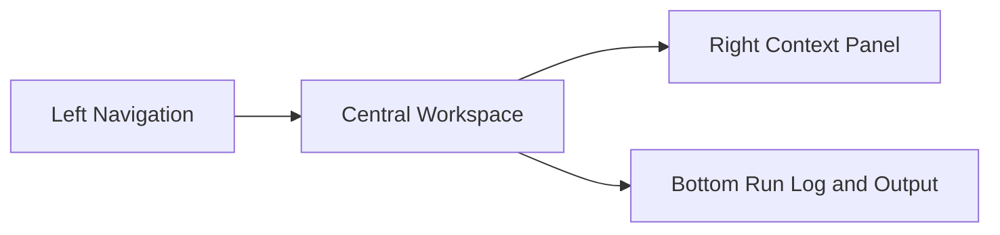

# Frontend, UI/UX, dan Arsitektur Desktop App Reservoir Simulator

Dokumen ini menjelaskan seperti apa bentuk software yang paling masuk akal untuk workflow simulator reservoir yang sudah dirangkum di [workflow.md](workflow.md).

Tujuannya bukan hanya membuat tampilan yang "bagus", tetapi membuat software yang:

1. enak dipelajari user baru,
2. tetap efisien untuk user teknis,
3. tidak mencampur UI dengan solver,
4. siap berkembang dari prototype workbook menjadi desktop app yang rapi.

Dokumen ini diasumsikan untuk stack desktop Python + PyQt. Rekomendasinya sengaja dibuat kompatibel dengan pola widget PyQt yang stabil dan umum dipakai untuk scientific desktop application.

## 1. Prinsip Utama UI/UX untuk Simulator Ini

Workflow simulator ini bukan aplikasi CRUD biasa. User tidak datang untuk sekadar isi form dan simpan data. User datang untuk:

- menyiapkan model,
- memvalidasi input,
- menjalankan simulasi,
- memantau proses solve,
- membaca hasil numerik dan visual,
- membandingkan kasus.

Karena itu, UI yang baik untuk aplikasi ini harus mengikuti 5 prinsip:

### 1.1 Pisahkan mode kerja user

User biasanya bekerja dalam mode yang berbeda:

1. `Setup model`
2. `Review and validate`
3. `Run simulation`
4. `Analyze results`

Kalau semua mode ini dicampur di satu layar, user akan bingung. Jadi UI harus membagi layar berdasarkan mode kerja, bukan berdasarkan semua object teknis sekaligus.

### 1.2 Jangan paksa user melihat semua parameter sekaligus

Reservoir simulator punya banyak parameter. Menaruh semua input di satu form panjang akan membuat user lelah dan rawan salah.

Lebih baik pakai:

- navigasi bertahap,
- section yang jelas,
- validasi per panel,
- ringkasan status input.

### 1.3 Tampilkan status model dengan cepat

Sebelum user menekan `Run`, software harus bisa menjawab cepat:

- grid sudah valid atau belum,
- tabel PVT sudah ada atau belum,
- tabel relperm sudah ada atau belum,
- initial condition sudah lengkap atau belum,
- solver settings sudah masuk akal atau belum.

Jadi UI perlu status cards atau checklist, bukan hanya form.

### 1.4 Saat simulasi berjalan, UI harus berubah jadi mode observasi

Saat solver jalan, user tidak sedang mengedit banyak parameter. User butuh:

- progress,
- residual history,
- Newton iteration status,
- log error/warning,
- ability untuk stop atau pause jika nanti dibutuhkan.

Jadi mode `Run` harus terasa berbeda dari mode `Input`.

### 1.5 Hasil harus dibaca secara visual dan numerik

User teknis tidak cukup diberi chart saja. Mereka juga butuh tabel. Tetapi kalau hanya tabel, hasil sulit dipahami cepat.

Jadi page hasil sebaiknya selalu punya kombinasi:

- summary cards,
- plot,
- heatmap/map view,
- data table detail.

## 2. Bentuk Produk yang Paling Disarankan

Untuk workflow seperti ini, bentuk software yang paling cocok adalah:

`single main window + left navigation + central workspace + contextual right panel + bottom run/output panel`

Artinya bukan banyak window terpisah yang beterbangan, melainkan satu shell aplikasi utama dengan area kerja yang jelas.

Kenapa bentuk ini paling cocok:

- user tidak kehilangan konteks,
- mudah menjaga urutan kerja,
- cocok untuk scientific/engineering app,
- enak untuk project-based workflow,
- mudah dikembangkan di PyQt dengan `QMainWindow`, `QStackedWidget`, `QSplitter`, dan `QDockWidget`.

## 3. Layout Utama yang Disarankan

Layout utama aplikasi desktop ini sebaiknya seperti berikut.



Atau lebih konkret:

```text
+---------------------------------------------------------------+
| Top Bar: Project | Save | Validate | Run | Stop | Settings    |
+-----------+-----------------------------------+---------------+
| Left Nav  | Main Workspace                    | Right Panel   |
|           |                                   |               |
| Dashboard | page aktif                        | properties /  |
| Model     |                                   | detail / help |
| Grid      |                                   |               |
| PVT       |                                   |               |
| Rock      |                                   |               |
| Initial   |                                   |               |
| Run       |                                   |               |
| Results   |                                   |               |
| Report    |                                   |               |
+-----------+-----------------------------------+---------------+
| Bottom Panel: log, warnings, residual, solver progress        |
+---------------------------------------------------------------+
```

## 4. Struktur Page yang Paling Disarankan

Supaya user tidak bingung, saya sarankan aplikasi dibagi menjadi 8 page utama.

### 4.1 Dashboard

Fungsi:

- halaman pertama saat app dibuka,
- menampilkan status project,
- shortcut ke langkah kerja utama.

Isi yang disarankan:

- kartu `Project Info`
- kartu `Grid Status`
- kartu `PVT Status`
- kartu `Rock Status`
- kartu `Initial Condition Status`
- kartu `Solver Settings`
- daftar `Recent Runs`
- tombol besar `Open Project`, `New Project`, `Validate`, `Run`

UX goal:

- dalam 5 detik user tahu project ini siap jalan atau belum.

### 4.2 Model Setup

Fungsi:

- mengatur metadata project dan mode simulasi.

Isi yang disarankan:

- nama project,
- deskripsi singkat,
- satuan yang dipakai,
- jenis model: single-phase / two-phase / three-phase,
- mode numerik: fully implicit,
- final time,
- default time step,
- toleransi solver,
- maximum Newton iteration.

UX goal:

- user dapat melihat identitas kasus tanpa masuk ke detail grid/PVT.

### 4.3 Grid and Rock Page

Fungsi:

- input dan review geometri serta properti batuan.

Isi yang disarankan:

- sub-tab `Grid Dimensions`
- sub-tab `Cell Properties`
- sub-tab `Connections Preview`
- sub-tab `Depth and Active Cells`

Widget yang cocok:

- `QFormLayout` untuk parameter global,
- `QTableView` untuk properti per cell,
- preview grid sederhana 2D,
- mini statistics panel: `ngrid`, porosity min/max, permeability min/max, jumlah inactive cell.

UX goal:

- user bisa cepat tahu apakah grid sudah benar tanpa harus membaca raw array panjang.

### 4.4 PVT Page

Fungsi:

- input tabel PVT,
- validasi kelengkapan dan range pressure,
- preview interpolasi.

Isi yang disarankan:

- tabel PVT editable/importable,
- plot kecil untuk `Bo`, `Bw`, `Bg`, `mu`, `Rso`, `Rsw` terhadap pressure,
- status warning jika tabel tidak monotonic atau ada range pressure yang berlubang.

UX goal:

- user tidak hanya input tabel, tetapi langsung melihat bentuk kurvanya.

### 4.5 Rock-Fluid Page

Fungsi:

- input relperm dan capillary pressure,
- preview curve oil-water dan gas-water.

Isi yang disarankan:

- tabel oil-water,
- tabel gas-water,
- plot `kro/krw/pcow` terhadap `Sw`,
- plot `krg/krwg/pcgw` terhadap `Sg`,
- catatan model 3-phase yang dipilih nanti.

UX goal:

- user mudah melihat kurva, bukan hanya angka tabel.

### 4.6 Initial Condition and Schedule Page

Fungsi:

- menetapkan kondisi awal reservoir dan jadwal simulasi.

Isi yang disarankan:

- `p_ref`, `d_ref`, densitas referensi,
- initial `Sw`, `Sg`, `So`,
- opsi hidrostatik atau manual,
- start time, end time, time step,
- nanti bisa diperluas ke well schedule.

UX goal:

- user bisa membedakan `model property` dan `run condition`.

### 4.7 Run Monitor Page

Fungsi:

- halaman khusus saat simulasi berjalan.

Isi yang disarankan:

- progress bar time step,
- progress bar Newton iteration,
- residual plot realtime,
- tabel iteration summary,
- warning console,
- tombol `Run`, `Stop`, `Clear Log`, `Export Log`.

UX goal:

- saat solver berjalan, user tidak merasa aplikasi hang.

### 4.8 Results and Report Page

Fungsi:

- melihat hasil setelah run selesai.

Isi yang disarankan:

- summary cards: final time, total runs, convergence rate,
- tab `Maps`
- tab `Trends`
- tab `Tables`
- tab `Case Comparison`
- tab `Export`

UX goal:

- user bisa berpindah dari pertanyaan `apakah run berhasil?` ke `apa makna hasilnya?` tanpa keluar dari app.

## 5. Pola Navigasi yang Paling Aman untuk User

Untuk desktop scientific app, saya sarankan kombinasi ini:

- `navigation rail` di kiri untuk page utama,
- `top action bar` untuk command penting,
- `breadcrumbs / section title` di atas workspace,
- `right context panel` untuk detail field yang sedang dipilih.

Kenapa bukan tab yang sangat banyak di atas?

- karena jika semua fitur dijadikan top tab, tab akan cepat penuh,
- nama-nama teknis panjang akan sulit dipindai,
- user baru lebih mudah paham menu vertikal yang urut.

Urutan nav yang saya rekomendasikan:

1. `Dashboard`
2. `Model`
3. `Grid`
4. `PVT`
5. `Rock-Fluid`
6. `Initial & Schedule`
7. `Run`
8. `Results`
9. `Report`

Urutan ini sengaja mengikuti mental model workflow, bukan struktur class backend.

## 6. UI/UX yang Bagus untuk User Baru

Kalau target user-mu nanti bisa termasuk mahasiswa, engineer muda, atau user yang belum terbiasa dengan simulator, maka UI harus punya fitur berikut.

### 6.1 Checklist kesiapan model

Contoh:

- `Grid loaded`
- `PVT loaded`
- `Rock table loaded`
- `Initial condition valid`
- `Solver settings valid`
- `Ready to run`

Kalau ada yang belum lengkap, tampilkan status merah atau kuning dengan pesan spesifik.

### 6.2 Inline validation

Jangan tunggu user menekan `Run` baru muncul error besar.

Contoh validasi langsung:

- `Sw + Sg <= 1`
- tekanan akhir lebih besar dari tekanan awal tertentu jika memang disyaratkan,
- tabel pressure harus berurutan,
- relperm harus berada di rentang masuk akal.

### 6.3 Preview sebelum run

Sebelum run, tampilkan ringkasan:

- total cell,
- total connection,
- pressure range input,
- saturation range,
- final time,
- estimated number of time steps.

Ini membantu user menangkap kesalahan sebelum solver dimulai.

### 6.4 Bantuan kontekstual

Di scientific app, tooltip dan helper text sangat penting.

Contoh:

- di field `Tolerance`, beri penjelasan singkat: `residual error maksimum untuk konvergensi Newton`
- di field `PV Multiplier`, beri penjelasan fungsi fisiknya
- di page `Run`, beri arti warna residual plot

### 6.5 Pesan error yang operasional

Jangan hanya tampilkan:

- `Simulation failed`

Lebih baik tampilkan:

- `Newton tidak konvergen pada time step 4`
- `Residual water stagnan selama 8 iterasi`
- `Tabel PVT tidak mencakup pressure 3200 psi`

## 7. Visual Direction yang Disarankan

Bagian ini harus dibaca sebagai guideline frontend yang cukup ketat. Tujuannya supaya saat implementasi nanti kamu tidak bingung, dan hasilnya tetap terlihat seperti software engineering professional, bukan dashboard mainan.

Target kelas visual yang saya sarankan adalah:

- desktop industrial/scientific software,
- data-dense tetapi tetap rapi,
- warna netral dan terkendali,
- panel yang tegas,
- minim ornamen,
- fokus pada hierarki informasi.

Kalau ingin membayangkan kelas visualnya, target rasanya dekat ke keluarga software subsurface/engineering seperti Petrel atau tNavigator: serius, tenang, padat informasi, dan terasa dibuat untuk kerja teknis berjam-jam. Yang diambil adalah kelas profesionalismenya, bukan meniru tampilan brand mereka secara literal.

Referensi prinsip desain yang aman untuk kelas software seperti ini:

- `enterprise desktop density`, bukan gaya landing page atau SaaS marketing,
- `Fluent desktop clarity`, yaitu command bar jelas, panel jelas, dan warna tidak berteriak,
- `Carbon-like data discipline`, yaitu tabel, inspector, dan status area yang rapi untuk aplikasi teknis.

### 7.1 Karakter visual yang harus terasa

Frontend yang baik untuk software ini harus terasa seperti berikut:

- serius,
- presisi,
- stabil,
- terkontrol,
- nyaman dipakai lama,
- tidak childish,
- tidak berisik.

Artinya secara praktis:

- warna aksen dipakai hemat,
- panel memakai border halus, bukan kartu berbayang besar,
- radius sudut kecil sampai sedang,
- ikon konsisten satu gaya,
- tipografi tenang dan mudah dibaca,
- animasi sangat sedikit.

### 7.2 Sistem warna yang disarankan

Saya sarankan palette netral dingin dengan satu aksen biru-petroleum. Ini lebih dekat ke rasa software engineering modern daripada palette krem atau terlalu dekoratif.

| Token | Nilai | Fungsi |
| --- | --- | --- |
| `color_shell` | `#EEF2F6` | background shell utama aplikasi |
| `color_workspace` | `#F7F9FB` | background area kerja utama |
| `color_surface` | `#FFFFFF` | panel, card, form, dialog |
| `color_surface_alt` | `#F1F4F8` | header tabel, area sekunder, panel pasif |
| `color_border_subtle` | `#D7DEE7` | border default |
| `color_border_strong` | `#B8C3D1` | divider aktif, focus group |
| `color_text_primary` | `#1F2937` | teks utama |
| `color_text_secondary` | `#5B6676` | teks sekunder |
| `color_text_disabled` | `#93A1B2` | teks disabled |
| `color_primary` | `#0F5C8E` | aksi utama, selection utama |
| `color_primary_hover` | `#0C4A73` | hover aksi utama |
| `color_primary_soft` | `#DCEAF7` | selected background, subtle highlight |
| `color_success` | `#2D6A4F` | status sukses |
| `color_warning` | `#A86A15` | status peringatan |
| `color_danger` | `#B2413F` | status error/kritis |
| `color_info` | `#2563A6` | info tambahan |
| `color_focus` | `#0F5C8E` | outline focus keyboard |

Aturan penggunaan warna:

- `color_primary` hanya untuk hal yang memang actionable atau selected.
- jangan gunakan warna terang banyak sekaligus dalam satu page.
- panel utama tetap netral; warna dipakai untuk status, selection, dan CTA.
- `danger` hanya untuk error, destructive action, atau state gagal.
- `warning` hanya untuk data belum lengkap, bukan untuk semua informasi penting.

### 7.3 Warna chart dan visualisasi hasil

Warna chart tidak boleh bertabrakan dengan warna status sistem.

Saya sarankan palette data seperti ini:

- series 1: `#0F5C8E`
- series 2: `#0F766E`
- series 3: `#6B8E23`
- series 4: `#B7791F`
- series 5: `#A14F49`
- series 6: `#5C6F91`

Aturan chart:

- gridline tipis `#DDE4EC`
- background plot putih atau abu sangat muda
- jangan pakai gradient fill berat
- legend harus sederhana dan rata kiri
- gunakan warna yang sama secara konsisten untuk phase yang sama

Contoh mapping phase yang bagus:

- oil: biru tua
- water: teal
- gas: olive atau slate blue

### 7.4 Tipografi yang disarankan

Untuk software desktop Windows yang ingin terasa profesional, saya sarankan dua opsi aman:

- opsi paling praktis: `Segoe UI` atau `Segoe UI Variable`
- opsi dengan identitas lebih kuat: `IBM Plex Sans`

Kalau ingin paling aman untuk eksekusi PyQt dan paling dekat ke rasa software enterprise Windows, gunakan:

- UI font utama: `Segoe UI`
- data/angka/log: `Cascadia Mono`

Kalau kamu rela membundel font sendiri untuk identitas yang lebih kuat:

- UI font utama: `IBM Plex Sans`
- data/angka/log: `IBM Plex Mono`

Aturan tipografi:

- cukup pakai maksimal 2 keluarga font,
- satu untuk UI dan satu untuk data monospace,
- jangan campur banyak font dekoratif.

Skala ukuran yang disarankan:

| Elemen | Ukuran | Berat |
| --- | --- | --- |
| window title / page title | `20-22 px` | `600` |
| section title | `16-18 px` | `600` |
| card title | `14-15 px` | `600` |
| body text | `12-13 px` | `400` |
| field label | `12 px` | `500` |
| table text | `12 px` | `400` |
| log/mono text | `11-12 px` | `400` |

### 7.5 Icon system yang disarankan

Jangan campur icon set. Pilih satu sistem saja untuk seluruh aplikasi.

Yang paling cocok untuk software seperti ini:

- `Fluent System Icons`

Kenapa ini cocok:

- terasa enterprise,
- rapi untuk desktop,
- tidak terlalu playful,
- cocok untuk toolbar, navigation, dan status.

Aturan icon:

- ukuran toolbar utama: `20 px`
- ukuran navigation: `18-20 px`
- ukuran tabel/status: `14-16 px`
- pakai outline/regular style sebagai default
- gunakan filled style hanya untuk alert atau active state yang sangat penting
- selalu icon + label untuk action utama

Contoh pasangan icon yang cocok:

- project: folder/document
- validate: check/shield
- run: play/caret-right
- stop: stop/square
- results: chart/line
- report: document/table
- settings: gear

### 7.6 Spacing dan density yang disarankan

Supaya terasa seperti software engineering, density harus efisien tetapi tidak sesak.

Gunakan grid dasar `8 px`.

Ukuran yang disarankan:

- padding page luar: `20-24 px`
- gap antar section utama: `24 px`
- padding panel/card: `16-20 px`
- gap antar field dalam satu group: `12 px`
- gap label ke input: `6 px`
- tinggi field standar: `32 px`
- tinggi tombol standar: `32 px`
- tinggi row tabel: `28-32 px`
- tinggi toolbar: `48-52 px`

Ini penting supaya UI tidak terlihat seperti mainan yang serba besar, tetapi juga tidak terlalu rapat seperti software lama yang melelahkan mata.

### 7.7 Surface, border, dan elevation

Aturan visual yang saya sarankan:

- radius panel: `6 px`
- radius input: `4 px`
- radius dialog: `8 px`
- border default: `1 px solid color_border_subtle`
- shadow hanya untuk dialog, dropdown, dan floating panel
- jangan beri shadow tebal di semua card

Prinsipnya:

- software ini harus terlihat tegas dan bersih,
- pemisahan area lebih banyak dari alignment, border halus, dan warna permukaan,
- bukan dari shadow besar atau gradient dekoratif.

### 7.8 Theme implementation guideline untuk PyQt

Saat implementasi nanti, theme sebaiknya dipegang sebagai token, bukan warna yang ditulis acak per widget.

Contoh naming yang disarankan:

```text
theme.color_shell
theme.color_workspace
theme.color_surface
theme.color_border_subtle
theme.color_text_primary
theme.color_primary
theme.color_warning
theme.font_ui
theme.font_mono
theme.radius_input
theme.radius_panel
theme.spacing_md
theme.spacing_lg
```

Tujuannya:

- saat mengganti theme, kamu tidak harus mengedit semua file UI,
- warna dan spacing tetap konsisten,
- style QSS lebih mudah dipelihara.

### 7.9 Hal visual yang harus dihindari

Hindari hal-hal berikut kalau ingin hasilnya profesional:

- background gradasi mencolok,
- warna neon atau terlalu jenuh,
- terlalu banyak card dengan shadow besar,
- radius tombol besar seperti aplikasi mobile,
- icon campur aduk dari beberapa set,
- banyak badge warna-warni tanpa makna,
- form centang-cetong yang tidak sejajar,
- tombol icon-only untuk aksi penting.

## 8. Layout Detail per Area

### 8.1 Top Bar

Top bar harus terasa seperti command bar software engineering, bukan header website.

Standar yang disarankan:

- tinggi: `48-52 px`
- background: `color_surface`
- border bawah tipis `color_border_subtle`
- sisi kiri: project name + breadcrumb sederhana
- sisi tengah: boleh kosong atau berisi context title
- sisi kanan: command penting

Isi top bar sebaiknya hanya action penting:

- `New`
- `Open`
- `Save`
- `Validate`
- `Run`
- `Stop`
- `Export`
- `Settings`

Aturan:

- jangan isi lebih dari 7-8 command utama,
- `Run` adalah primary button,
- `Stop` adalah danger/critical command yang tampil jelas hanya saat run berjalan,
- action sekunder pindah ke menu atau dropdown.

### 8.2 Left Navigation

Left navigation adalah tulang punggung orientasi user. Panel ini harus sangat stabil dan tidak sering berubah.

Standar yang disarankan:

- lebar: `220-240 px`
- background sedikit lebih gelap dari workspace utama
- icon + label selalu tampil
- active item diberi indicator jelas, bukan hanya warna teks
- item dikelompokkan berdasarkan workflow

Struktur grouping yang disarankan:

- `Setup`: Dashboard, Model, Grid, PVT, Rock-Fluid, Initial
- `Execution`: Run
- `Output`: Results, Report

Karena ini tool teknis, label teks lebih penting daripada sekadar estetika. Jangan pakai icon-only navigation untuk aplikasi seperti ini.

### 8.3 Central Workspace

Central workspace adalah area kerja inti. Semua keputusan layout harus mengutamakan area ini.

Setiap page sebaiknya memakai anatomi tetap:

- header page,
- content body,
- optional footer action row.

Standar yang disarankan:

- padding kiri-kanan page: `24 px`
- padding atas-bawah page: `20 px`
- jangan lebih dari 2 area scroll vertikal dalam satu page
- form panjang sebaiknya dipecah menjadi group box atau section card
- tabel besar harus mendapat ruang visual paling dominan

Contoh anatomy:

- header: judul page + status kecil + action lokal
- content: form/table/chart
- footer: action page seperti `Apply`, `Validate`, `Reset`

### 8.4 Right Context Panel

Panel kanan sebaiknya bukan tempat semua kontrol disimpan, tetapi tempat context, help, dan inspector.

Standar yang disarankan:

- lebar: `320-360 px`
- boleh collapsible
- idealnya punya tab ringan seperti `Info`, `Properties`, `Stats`

Panel ini dipakai untuk:

- penjelasan field,
- metadata object yang dipilih,
- ringkasan statistik,
- warning lokal,
- formula atau arti parameter.

Ini sangat membantu agar page utama tidak terlalu padat.

### 8.5 Bottom Panel

Bottom panel adalah area observasi runtime. Ini sangat penting untuk software solver.

Standar yang disarankan:

- tinggi default: `180-220 px`
- bisa di-resize dan di-collapse
- gunakan tab internal ringan: `Log`, `Validation`, `Residual`, `Timing`

Panel bawah cocok untuk:

- log,
- progress,
- warning trace,
- residual summary,
- timing info.

Bottom panel bisa collapsible supaya saat user fokus input atau lihat hasil, panel ini tidak mengganggu.

### 8.6 Dialog, modal, dan flyout

Aturan penting:

- modal dipakai hanya untuk action penting: import, export, destructive action, atau settings global
- jangan pakai modal untuk semua edit kecil
- untuk property tambahan, lebih baik pakai right inspector atau expandable section
- confirmation dialog harus singkat dan spesifik

### 8.7 Standar form page

Untuk page input seperti `Model`, `PVT`, `Rock-Fluid`, dan `Initial`, layout form yang paling aman adalah:

- satu kolom besar untuk desktop sempit,
- dua kolom untuk desktop lebar,
- label selalu di atas field atau sejajar konsisten,
- field advanced diletakkan dalam section yang bisa dibuka-tutup.

Jangan gunakan satu form panjang tanpa pengelompokan visual yang jelas.

## 9. Frontend dan Backend yang Tepat untuk Desktop PyQt

Di desktop app seperti ini, istilah frontend dan backend bukan berarti harus ada server HTTP.

Untuk versi awal, saya justru menyarankan:

- `frontend = PyQt desktop UI`
- `backend = Python simulation engine + services lokal`

Jadi belum perlu backend web terpisah kecuali nanti kamu memang ingin multi-user, remote compute, atau distributed run.

### 9.1 Frontend

Frontend bertugas untuk:

- render window dan widget,
- menerima input user,
- menampilkan validasi,
- mengatur navigation,
- menampilkan progress dan hasil,
- mengirim command ke application layer.

Di PyQt, ini biasanya berupa:

- `QMainWindow`
- `QWidget` page-page utama
- `QStackedWidget` untuk switch page
- `QTableView` / `QTreeView`
- `QDockWidget` atau `QSplitter`
- `QDialog` untuk setting/import/export

### 9.2 Backend

Backend lokal bertugas untuk:

- baca input project,
- validasi domain,
- bangun grid dan connection,
- evaluasi PVT dan relperm,
- assemble residual dan Jacobian,
- jalankan solver,
- simpan hasil,
- kirim event progress ke UI.

### 9.3 Application Layer

Di antara frontend dan backend, kamu sangat butuh layer tengah:

- `application layer` atau `controller/service layer`

Tugasnya:

- menerjemahkan aksi UI menjadi command,
- mengatur state project,
- memastikan UI tidak langsung memanggil solver detail,
- mengatur worker thread,
- mengirim hasil ringkas ke tampilan.

Ini penting karena kalau UI langsung berbicara ke solver, codebase akan cepat berantakan.

## 10. Arsitektur Kode yang Disarankan

Karena repo-mu sekarang sudah punya folder `app`, `modules`, `ui`, dan `windows`, bentuk yang paling masuk akal adalah seperti ini:

```text
app/
- main.py
- bootstrap.py

windows/
- main_window.py
- dashboard_page.py
- model_page.py
- grid_page.py
- pvt_page.py
- rock_page.py
- initial_page.py
- run_page.py
- results_page.py

ui/
- main_window.ui
- dashboard_page.ui
- model_page.ui
- grid_page.ui
- pvt_page.ui
- rock_page.ui
- initial_page.ui
- run_page.ui
- results_page.ui

modules/
- project_service.py
- validation_service.py
- simulation_service.py
- run_worker.py
- report_service.py
- plot_service.py

core/
- domain/
- physics/
- numerics/
- simulation/
- io/
```

Kalau belum ingin menambah folder `core` sekarang, minimal jaga supaya `modules/` menjadi service/backend layer, bukan campuran widget dan solver.

## 11. Pola Interaksi PyQt yang Saya Sarankan

### 11.1 Gunakan `QMainWindow` sebagai shell utama

Karena kamu butuh:

- menu/toolbar,
- central widget,
- dock panel,
- status bar.

### 11.2 Gunakan `QStackedWidget` untuk page switching

Ini lebih rapi daripada membuka banyak window terpisah.

### 11.3 Gunakan `QTableView` + model sendiri untuk data teknis

Untuk grid, PVT, relperm, hasil iterasi, jangan pakai widget tabel sederhana kalau datanya akan membesar. `QTableView` lebih scalable dan lebih bersih untuk scientific app.

### 11.4 Jalankan solver di worker thread

Jangan jalankan solver langsung di main UI thread.

Pola yang disarankan:

- UI kirim command `Run`
- `RunWorker` jalan di `QThread` atau `QRunnable`
- worker emit signal progress
- UI update plot/log/progress bar

Kalau tidak begitu, aplikasi akan terasa freeze saat run berjalan.

### 11.5 Pakai signal/slot untuk event penting

Contoh event:

- `validationFinished`
- `runStarted`
- `iterationUpdated`
- `timeStepFinished`
- `runFinished`
- `runFailed`

## 12. Komponen Frontend yang Sebaiknya Ada

Bagian ini harus dibaca sebagai daftar komponen wajib beserta standar perilakunya.

### 12.1 Command bar

Standarnya:

- berisi action global,
- urutan command stabil,
- icon + label,
- primary action hanya satu per context.

### 12.2 Status badge

Standarnya:

- hanya untuk state yang jelas: `Ready`, `Incomplete`, `Warning`, `Running`, `Failed`, `Done`
- warna badge mengikuti token status
- jangan gunakan badge sebagai dekorasi semata

### 12.3 Validation summary panel

Standarnya:

- menampilkan daftar problem terurut,
- klik item bisa membawa user ke field yang salah,
- pesan error harus operasional, bukan generik.

### 12.4 Editable table panel

Standarnya:

- pakai header yang jelas,
- sorting dan selection konsisten,
- row height stabil,
- angka rata kanan,
- text teknis rata kiri,
- kolom penting bisa di-freeze jika nanti datanya besar.

### 12.5 Inspector / property panel

Standarnya:

- selalu menampilkan konteks object yang dipilih,
- jangan terlalu ramai,
- tampilkan metadata, bantuan, statistik, dan warning lokal.

### 12.6 Chart / plot panel

Standarnya:

- background bersih,
- legend jelas,
- warna seri konsisten,
- axis title terbaca,
- toolbar plot tidak terlalu dominan.

### 12.7 Run log console

Standarnya:

- monospace font,
- timestamp opsional,
- level pesan jelas: info, warning, error,
- auto-scroll bisa dimatikan jika perlu.

### 12.8 Results filter bar

Standarnya:

- filter waktu,
- filter variable,
- filter cell/region,
- export shortcut.

### 12.9 Export dialog

Standarnya:

- pilihan format jelas,
- scope export jelas,
- preview singkat kalau perlu,
- jangan penuh opsi teknis yang tidak penting untuk user awal.

Komponen yang sangat disarankan:

- recent projects screen
- compare cases dialog
- notification toast ringan
- inline field help
- collapsible advanced settings
- empty state yang informatif

## 13. Desain Hasil dan Visualisasi

Page hasil jangan hanya menampilkan angka. Saya sarankan minimal ada 4 mode baca hasil:

### 13.1 Summary mode

Menampilkan:

- final time,
- total Newton iterations,
- jumlah step konvergen,
- step gagal,
- residual maksimum terakhir.

### 13.2 Trend mode

Menampilkan kurva terhadap waktu:

- average pressure,
- selected cell pressure,
- `Sw`, `Sg`, `So`,
- residual history.

### 13.3 Map mode

Menampilkan distribusi per cell:

- pressure map,
- oil saturation map,
- water saturation map,
- gas saturation map.

Untuk versi awal, map 2D sudah cukup jika grid masih kartesian sederhana.

### 13.4 Table mode

Menampilkan:

- state per cell,
- flux summary,
- residual per cell,
- iteration summary.

## 14. Style UX yang Paling Aman untuk Software Ini

Kalau tujuanmu adalah user tidak bingung, maka aturan UX yang paling aman adalah:

### 14.1 Aturan interaksi utama

1. satu page untuk satu tujuan kerja,
2. jangan lebih dari 2 level navigasi dalam satu saat,
3. selalu tampilkan status kesiapan model,
4. jangan sembunyikan error penting,
5. jangan paksa user membaca log untuk memahami semua masalah,
6. tampilkan chart dan tabel berdampingan untuk hasil,
7. pisahkan `basic settings` dan `advanced settings`.

### 14.2 Aturan perilaku field dan action

- field wajib harus terlihat jelas sejak awal
- default value harus masuk akal
- tombol `Run` disabled kalau model belum valid
- perubahan belum tersimpan harus punya dirty-state indicator
- destructive action harus minta konfirmasi
- warning tidak boleh muncul terlambat setelah proses panjang jika sebenarnya bisa dicek di awal

### 14.3 Do

- buat hierarchy visual yang tegas
- jaga alignment sangat rapi
- pakai whitespace untuk memisahkan group
- buat feedback status cepat dan konsisten
- tampilkan data penting dalam summary ringkas sebelum detail panjang
- buat user selalu tahu: saya sedang di page mana, object mana yang dipilih, dan apakah model siap dijalankan

### 14.4 Don't

- jangan pakai warna cerah di semua tempat
- jangan pakai terlalu banyak card dekoratif
- jangan jadikan semua action sebagai tombol primer
- jangan sembunyikan error penting di toast sesaat
- jangan buat hasil hanya tabel atau hanya chart
- jangan buat page penuh istilah teknis tanpa bantuan konteks
- jangan pakai popup beruntun untuk workflow utama

### 14.5 Checklist evaluasi sebelum implement page baru

Sebelum satu page dianggap selesai, cek hal berikut:

- apakah tujuan page ini satu dan jelas?
- apakah action utamanya mudah ditemukan?
- apakah error bisa dipahami tanpa membaca kode/log?
- apakah user baru tahu harus mulai dari mana?
- apakah warna dan spacing-nya konsisten dengan page lain?
- apakah page ini tetap nyaman dipakai 1-2 jam kerja?

## 15. Rekomendasi Implementasi Bertahap

Supaya realistis, saya sarankan UI dibangun bertahap seperti ini.

### Fase 1

- `MainWindow`
- left navigation
- Dashboard
- Model page
- Grid page
- PVT page
- Rock page
- Run page sederhana

Tujuan:

- project bisa diinput, divalidasi, dan dijalankan.

### Fase 2

- Results page
- plot residual realtime
- report export
- project save/load

Tujuan:

- app sudah enak dipakai end-to-end.

### Fase 3

- case comparison
- richer map view
- advanced solver settings
- better well model editor

Tujuan:

- app mulai terasa seperti tool engineering yang matang.

## 16. Rekomendasi Final yang Paling Praktis

Kalau saya ringkas jadi guideline eksekusi paling penting, maka frontend software ini sebaiknya diputuskan seperti berikut:

1. Gunakan `MainWindow` tunggal dengan command bar atas, navigation kiri, workspace tengah, inspector kanan, dan bottom runtime panel.
2. Kejar kelas visual `enterprise engineering desktop`: tenang, padat, netral, dan sangat terstruktur.
3. Gunakan palette netral dingin dengan satu aksen `petroleum blue`, bukan warna ramai atau gradient dekoratif.
4. Gunakan satu sistem icon saja, idealnya `Fluent System Icons`.
5. Gunakan satu font UI yang stabil dan satu font monospace untuk data/log.
6. Pegang grid spacing `8 px`, tinggi kontrol `32 px`, dan border halus sebagai standar.
7. Prioritaskan alignment, density, dan readability dibanding animasi atau ornamen.
8. Semua page harus mengikuti workflow user, bukan struktur kode internal.
9. Tampilkan validasi, readiness status, dan runtime feedback secepat mungkin.
10. Hasil selalu hadir minimal dalam 4 bentuk: summary, trend, map, dan table.

Kalau targetmu adalah software yang terasa profesional seperti kelas tool subsurface engineering, maka patokan utamanya bukan membuat UI yang "wah", tetapi membuat UI yang:

- disiplin,
- stabil,
- konsisten,
- mudah dipindai,
- nyaman dipakai lama,
- dan membuat user selalu tahu apa langkah berikutnya.

Dengan workflow simulator yang kamu punya sekarang, guideline frontend seperti ini jauh lebih aman daripada UI yang penuh card, banyak warna, terlalu banyak icon, atau layout yang terasa seperti dashboard presentasi.