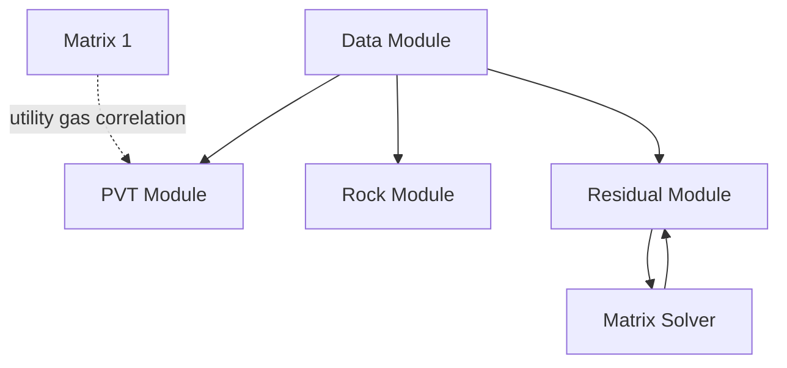

# Breakdown VBA Reservoir Simulator

Dokumen ini merangkum 6 module utama dari workbook Excel VBA reservoir simulator. Format setiap module dibuat konsisten:

1. peran module,
2. kode lengkap module,
3. breakdown deklarasi global,
4. breakdown setiap `Sub` dan `Function`,
5. cara kerja module di dalam alur simulator,
6. catatan penting bila ada typo, asumsi, atau bagian yang masih tampak seperti versi latihan.

Tujuan dokumen ini bukan hanya menunjukkan kodenya, tetapi juga menjelaskan:

- kode ini dipakai untuk apa,
- data apa yang dibaca,
- data apa yang dihasilkan,
- siapa yang memakai hasil itu,
- bagaimana alurnya dari awal simulasi sampai report keluar.

## Gambaran Besar Hubungan Antar Module

Secara runtime, hubungan 6 module utamanya bisa dibayangkan seperti ini:



Arti hubungan ini:

- `Data Module` adalah pengatur utama data model, grid, alokasi memori, inisialisasi, loop waktu, dan report.
- `PVT Module` menghitung properti fluida dari pressure.
- `Rock Module` menghitung relative permeability dan capillary pressure dari saturasi.
- `Residual Module` menghitung flux, accumulation, residual, Jacobian numerik, dan update Newton.
- `Matrix Solver` menyelesaikan sistem linear sparse yang dibentuk oleh Newton.
- `Matrix 1` adalah utility korelasi `z-factor` gas, meskipun pada potongan kode ini belum terlihat dipanggil langsung oleh workflow utama.

## 1. Data Module

### 1.1 Peran Module

`Data Module` adalah module pengendali utama untuk:

- definisi ukuran grid,
- properti dasar reservoir,
- konektivitas antar cell,
- alokasi array global,
- pembentukan initial condition,
- pembacaan data referensi,
- menjalankan loop simulasi waktu,
- menulis hasil ke sheet report.

Kalau dibahas paling singkat:

`Data Module` adalah tulang punggung struktur data dan runtime flow simulator.

### 1.2 Kode Lengkap

```vb
Option Explicit
Option Base 1


' Grid dimension
Public ngrid As Long
Dim nx As Integer, ny As Integer, nz As Integer
Public dx() As Double, dy() As Double, dz() As Double
Public IterMax As Integer, ResidErr As Double, delTime As Double

'Grid Properties
Public por() As Double, permX() As Double, permY() As Double, permZ() As Double
Public Vb() As Double, PVMult() As Double, NullG() As Boolean, depth() As Double

'Connectivity
Public Type ConGrid
  nCon As Integer
  iCon() As Long
  ACon() As Double
  LCon() As Double
  Trans() As Double
  tMult() As Double
  depth As Double
  Vb As Double
  por As Double
End Type


Public Type SparseType
    Val() As Double
    iRow() As Long
    jCol() As Long
    n As Long
    nnz As Long
End Type


Public pInit As Double
Public gCon() As ConGrid
Public aMat As SparseType

Sub ReadGridData()
Dim i As Long


nx = 5
ny = 5
nz = 1

ngrid = nx * ny * nz

'memory allocation to store data as much as required
ReDim NullG(1 To ngrid)
ReDim Vb(1 To ngrid)
ReDim PVMult(1 To ngrid)
ReDim por(1 To ngrid)
ReDim permX(1 To ngrid)
ReDim permY(1 To ngrid)
ReDim permZ(1 To ngrid)
ReDim depth(1 To ngrid)


' initialization param values
For i = 1 To ngrid
   NullG(i) = False
   por(i) = 0.25
   PVMult(i) = 1
   permX(i) = 1000
   permY(i) = 1000
   permZ(i) = 250
Next


ReDim dx(1 To nx)
For i = 1 To nx
  dx(i) = 200
Next

ReDim dy(1 To ny)
For i = 1 To ny
  dy(i) = 200
Next

ReDim dz(1 To nz)
For i = 1 To nz
  dz(i) = 100
Next

ReDim gCon(1 To ngrid)

End Sub

Sub GridDim()
Dim Depthx As Double
Dim iGrid As Long, i As Integer, j As Integer, k As Integer, ic As Byte
Dim iGridW As Long, iGridE As Long, iGridS As Long, iGridN As Long, iGridT As Long, iGridB As Long
Call ReadGridData

' ini hanya contuh
Depthx = 3000

iGrid = 0
For k = 1 To nz
    Depthx = Depthx + dz(k)
    For j = 1 To ny
        For i = 1 To nx
           ic = 0
           
           iGrid = iGrid + 1
           
           iGridE = iGrid + 1
           iGridW = iGrid - 1
           iGridN = iGrid - nx
           iGridS = iGrid + nx

           If k > 1 Then iGridT = iGrid - nx * ny
           If k < nz Then iGridB = iGrid + nx * ny
           depth(iGrid) = Depthx
           If i = 1 Or i = nx And nx > 1 Then ic = ic + 1
           If i > 1 And i < nx And nx > 1 Then ic = ic + 2

           If j = 1 Or j = ny And ny > 1 Then ic = ic + 1
           If j > 1 And j < ny And ny > 1 Then ic = ic + 2

           If (k = 1 Or k = nz) And nz > 1 Then ic = ic + 1
           If k > 1 And k < nz Then ic = ic + 2

           With gCon(iGrid)
                .Vb = dx(i) * dy(j) * dz(k)
                .por = por(iGrid)
                .nCon = ic
                .depth = Depthx
                'allocate memore required as many as number of connections
                ReDim .iCon(1 To ic)
                ReDim .LCon(1 To ic)
                ReDim .ACon(1 To ic)
                ReDim .Trans(1 To ic)
                ReDim .tMult(1 To ic)
           End With
           
        Next
    Next
Next


ic = 0
iGrid = 0
For k = 1 To nz
    For j = 1 To ny
        For i = 1 To nx
           ic = 0
           iGrid = iGrid + 1
           iGridE = iGrid + 1
           iGridW = iGrid - 1
           iGridN = iGrid - nx
           iGridS = iGrid + nx
           iGridT = iGrid - nx * ny
           iGridB = iGrid + nx * ny

           With gCon(iGrid)
              
           If i = 1 And nx > 1 Then
             ic = ic + 1
             .iCon(ic) = iGridE
             .LCon(ic) = 0.5 * (dx(i) + dx(i + 1))
             .ACon(ic) = dy(j) * dz(k)
            .Trans(ic) = 0.00603 * 2 * (permX(iGrid) * permX(iGridE)) * .ACon(ic) / (permX(iGrid) + permX(iGridE)) / .LCon(ic)

           ElseIf i = nx And nx > 1 Then
             ic = ic + 1
            .iCon(ic) = iGridW
            .LCon(ic) = 0.5 * (dx(i) + dx(i - 1))
            .ACon(ic) = dy(j) * dz(k)
            .Trans(ic) = 0.00603 * 2 * (permX(iGrid) * permX(iGridW)) * .ACon(ic) / (permX(iGrid) + permX(iGridW)) / .LCon(ic)

           ElseIf i > 1 And i < nx And nx > 1 Then
             ic = ic + 1
            .iCon(ic) = iGridW
            .LCon(ic) = 0.5 * (dx(i) + dx(i - 1))
            .ACon(ic) = dy(j) * dz(k)
            .Trans(ic) = 0.00603 * 2 * (permX(iGrid) * permX(iGridW)) * .ACon(ic) / (permX(iGrid) + permX(iGridW)) / .LCon(ic)

             ic = ic + 1
            .iCon(ic) = iGridE
            .LCon(ic) = 0.5 * (dx(i) + dx(i + 1))
            .ACon(ic) = dy(j) * dz(k)
            .Trans(ic) = 0.00603 * 2 * (permX(iGrid) * permX(iGridE)) * .ACon(ic) / (permX(iGrid) + permX(iGridE)) / .LCon(ic)
           End If


           If j = 1 And ny > 1 Then
             ic = ic + 1
             .iCon(ic) = iGridS
             .LCon(ic) = 0.5 * (dy(j) + dy(j + 1))
             .ACon(ic) = dx(i) * dz(k)
             .Trans(ic) = 0.00603 * 2 * (permY(iGrid) * permY(iGridS)) * .ACon(ic) / (permY(iGrid) + permY(iGridS)) / .LCon(ic)

           ElseIf j = ny And ny > 1 Then
             ic = ic + 1
             .iCon(ic) = iGridN
             .LCon(ic) = 0.5 * (dy(j) + dy(j - 1))
             .ACon(ic) = dx(i) * dz(k)
             .Trans(ic) = 0.00603 * 2 * (permY(iGrid) * permY(iGridN)) * .ACon(ic) / (permY(iGrid) + permY(iGridN)) / .LCon(ic)
           ElseIf j > 1 And j < ny And ny > 1 Then
             ic = ic + 1
            .iCon(ic) = iGridN
             .LCon(ic) = 0.5 * (dy(j) + dy(j - 1))
             .ACon(ic) = dx(i) * dz(k)
             .Trans(ic) = 0.00603 * 2 * (permY(iGrid) * permY(iGridN)) * .ACon(ic) / (permY(iGrid) + permY(iGridN)) / .LCon(ic)

             ic = ic + 1
            .iCon(ic) = iGridS
            .LCon(ic) = 0.5 * (dy(j) + dy(j + 1))
            .ACon(ic) = dx(i) * dz(k)
             .Trans(ic) = 0.00603 * 2 * (permY(iGrid) * permY(iGridS)) * .ACon(ic) / (permY(iGrid) + permY(iGridS)) / .LCon(ic)
           End If

           If k = 1 And nz > 1 Then
             ic = ic + 1
             .iCon(ic) = iGridB
             .LCon(ic) = 0.5 * (dz(k) + dz(k + 1))
             .ACon(ic) = dx(i) * dy(j)
             .Trans(ic) = 0.00603 * 2 * (permZ(iGrid) * permZ(iGridB)) * .ACon(ic) / (permZ(iGrid) + permZ(iGridB)) / .LCon(ic)
           ElseIf k = nz And nz > 1 Then
             ic = ic + 1
            .iCon(ic) = iGridT
             .LCon(ic) = 0.5 * (dz(k) + dz(k - 1))
             .ACon(ic) = dx(i) * dy(j)
             .Trans(ic) = 0.00603 * 2 * (permZ(iGrid) * permZ(iGridT)) * .ACon(ic) / (permZ(iGrid) + permZ(iGridT)) / .LCon(ic)
           ElseIf k > 1 And k < nz And nz > 1 Then
             ic = ic + 1
            .iCon(ic) = iGridT
             .LCon(ic) = 0.5 * (dz(k) + dz(k - 1))
             .ACon(ic) = dx(i) * dy(j)
             .Trans(ic) = 0.00603 * 2 * (permZ(iGrid) * permZ(iGridT)) * .ACon(ic) / (permZ(iGrid) + permZ(iGridT)) / .LCon(ic)

             ic = ic + 1
            .iCon(ic) = iGridB
             .LCon(ic) = 0.5 * (dz(k) + dz(k + 1))
             .ACon(ic) = dx(i) * dy(j)
             .Trans(ic) = 0.00603 * 2 * (permZ(iGrid) * permZ(iGridB)) * .ACon(ic) / (permZ(iGrid) + permZ(iGridB)) / .LCon(ic)
           
           End If
        End With
        Next
    Next
Next


End Sub

Sub AllocateMemory()
Dim i As Long, j As Long, RowNumber As Long, ColNumber As Long, iCell As Long
Dim NonZero As Long, R2 As Long, delArray As Long

ReDim pnn(1 To ngrid): ReDim pk(1 To ngrid): ReDim pn1(1 To ngrid)

ReDim swnn(1 To ngrid): ReDim swn1(1 To ngrid): ReDim swk(1 To ngrid)
ReDim sgnn(1 To ngrid): ReDim sgn1(1 To ngrid): ReDim sgk(1 To ngrid)
ReDim sonn(1 To ngrid): ReDim son1(1 To ngrid): ReDim sok(1 To ngrid)

ReDim vpnn(1 To ngrid): ReDim vpn1(1 To ngrid): ReDim vpk(1 To ngrid)
ReDim OIPnn(1 To ngrid): ReDim OIPn1(1 To ngrid): ReDim OIPk(1 To ngrid)
ReDim GIPnn(1 To ngrid): ReDim GIPn1(1 To ngrid): ReDim GIPk(1 To ngrid)
ReDim WIPnn(1 To ngrid): ReDim WIPn1(1 To ngrid): ReDim WIPk(1 To ngrid)
ReDim Psat(1 To ngrid)
ReDim PVT(1 To ngrid)

NonZero = 0
For i = 1 To ngrid
  'Debug.Print "Cell-" & i & " = " & gCon(i).nCon + 1
  NonZero = NonZero + 9 * (gCon(i).nCon + 1)
Next

aMat.n = 3 * ngrid
aMat.nnz = NonZero

ReDim aMat.Val(1 To NonZero)
ReDim aMat.iRow(1 To NonZero)
ReDim aMat.jCol(1 To NonZero)
Dim iVal As Long, k As Long


iVal = 1
For i = 1 To ngrid
      For j = 0 To gCon(i).nCon
          iCell = i
          If j > 0 Then iCell = gCon(i).iCon(j)
          RowNumber = 3 * i - 2
          ColNumber = 3 * iCell - 2
          '-----------------------row number
          aMat.iRow(iVal) = RowNumber
          aMat.iRow(iVal + 1) = RowNumber
          aMat.iRow(iVal + 2) = RowNumber

          aMat.iRow(iVal + 3) = RowNumber + 1
          aMat.iRow(iVal + 4) = RowNumber + 1
          aMat.iRow(iVal + 5) = RowNumber + 1

          aMat.iRow(iVal + 6) = RowNumber + 2
          aMat.iRow(iVal + 7) = RowNumber + 2
          aMat.iRow(iVal + 8) = RowNumber + 2
          '-----------------------Col number
          aMat.jCol(iVal) = ColNumber
          aMat.jCol(iVal + 1) = ColNumber + 1
          aMat.jCol(iVal + 2) = ColNumber + 2

          aMat.jCol(iVal + 3) = ColNumber
          aMat.jCol(iVal + 4) = ColNumber + 1
          aMat.jCol(iVal + 5) = ColNumber + 2

          aMat.jCol(iVal + 6) = ColNumber
          aMat.jCol(iVal + 7) = ColNumber + 1
          aMat.jCol(iVal + 8) = ColNumber + 2
          iVal = iVal + 9
       Next
   Next


End Sub

Sub Initialization()
Dim i As Long
For i = 1 To ngrid
  swnn(i) = Sheets("INIT").Range("B1")
  sgnn(i) = Sheets("INIT").Range("B2")
  sonn(i) = Sheets("INIT").Range("B3")
  pInit = Sheets("INIT").Range("B7")
  Psat(i) = Pb
  pnn(i) = pInit + rDENOIL * (gCon(i).depth - dREF) / 144: swk(i) = swnn(i): sgk(i) = sgnn(i): sok(i) = sonn(i)
  Next
  pk() = pnn()

End Sub


Sub ReadRefData()
  With Sheets("REF")
     dREF = .Range("B1")
     rDENOIL = .Range("B3")
     rDENWATER = .Range("B4")
     rDENGAS = .Range("B5")
     pREF = .Range("B2")
     cROCK = .Range("B6")
     Pb = .Range("B7")
     CoRef = .Range("E1")
     CwRef = .Range("E2")
     CgRef = .Range("E3")
     pREF = .Range("B2")
  End With
End Sub

Public Sub ReadAllDATA()
  Call ReadRefData
  Call ReadGridData
  Call GridDim
  Call ReadPVTData
  Call ReadTableRock
End Sub

Public Sub RunSim()
Dim Res As ResidualType
Dim itime As Integer
Dim iter As Integer
Dim tOL As Double
Dim tMax As Double, vTime As Double

tOL = 0.00000001
IterMax = 50
delTime = 2
tMax = 10

'reading data
Call ReadAllDATA
Call AllocateMemory
Call Initialization
Call CalcModel_PVT
vTime = 0
itime = 0

Call MakeReport(0, 0)
 Do ' loop time step
    iter = 0
    Debug.Print "===================================="
    Do ' Newtong Iteration
       Call CalcAllResid
       If ResidErr <= tOL Then Exit Do
       Call NewTonIteration
       iter = iter + 1
       Debug.Print "iter - " & iter & " : " & ResidErr
       DoEvents
    Loop Until iter >= IterMax Or ResidErr <= tOL
    vTime = vTime + delTime
    itime = itime + 1
    DoEvents
    Call UpdateNewTime(itime, vTime)
    Call MakeReport(itime, vTime)
 Loop Until vTime >= tMax
End Sub

Sub UpdateNewTime(ByVal it As Integer, ByVal vT As Double)
Dim i As Long
For i = 1 To ngrid
  pn1(i) = pk(i): swn1(i) = swk(i): sgn1(i) = sgk(i): son1(i) = sok(i)
  pnn(i) = pk(i): swnn(i) = swnn(i): sgnn(i) = sgk(i): sonn(i) = sok(i)
Next
Call CalcModel_PVT
End Sub

Sub MakeReport(ByVal itime, ByVal vTime)
Dim i As Integer, j As Integer, k As Integer, iG As Long
Dim RowCell As Long
Dim iss As Byte
Dim ArrSheet As Variant
ArrSheet = Array("RESULT GRID PRESSURE", "RESULT GRID SO", "RESULT GRID SW", "RESULT GRID SG")

For iss = 1 To 4
    With Sheets(ArrSheet(iss))
    If itime = 0 Then .Range("A1:BZ2000").ClearContents
    RowCell = (ny + 2) * (itime) + 1
    .Range("A" & RowCell) = "Time = " & vTime
    iG = 0
    For k = 1 To nz
        For j = 1 To ny
            For i = 1 To nx
              iG = iG + 1
              If iss = 1 Then .Cells(RowCell + j, i + (k - 1) * (nz + 2)) = pk(iG)
              If iss = 2 Then .Cells(RowCell + j, i + (k - 1) * (nz + 2)) = sok(iG)
              If iss = 3 Then .Cells(RowCell + j, i + (k - 1) * (nz + 2)) = swk(iG)
              If iss = 4 Then .Cells(RowCell + j, i + (k - 1) * (nz + 2)) = sgk(iG)
            Next
        Next
    Next
    End With
Next
End Sub
```

### 1.3 Breakdown Deklarasi Global

#### `ngrid`, `nx`, `ny`, `nz`

Gunanya:

- menyimpan jumlah grid total dan jumlah grid per arah.

Cara kerja:

- `nx`, `ny`, `nz` menentukan bentuk model kartesian.
- `ngrid = nx * ny * nz` dipakai hampir di semua array global.

#### `dx()`, `dy()`, `dz()`

Gunanya:

- menyimpan ukuran cell per arah.

Cara kerja:

- nilai ini dipakai untuk menghitung volume cell, area koneksi, dan jarak antar pusat cell.

#### `por()`, `permX()`, `permY()`, `permZ()`, `Vb()`, `PVMult()`, `NullG()`, `depth()`

Gunanya:

- menyimpan properti batuan dan geometri dasar per cell.

Cara kerja:

- `por` untuk porositas.
- `permX`, `permY`, `permZ` untuk permeabilitas arah.
- `Vb` untuk bulk volume.
- `PVMult` untuk pengali pore volume.
- `NullG` untuk penanda cell aktif/tidak aktif.
- `depth` untuk kedalaman cell.

#### `ConGrid`

Gunanya:

- menyimpan data konektivitas satu cell.

Isi penting:

- `nCon`: jumlah tetangga terkoneksi.
- `iCon()`: daftar indeks tetangga.
- `ACon()`: area koneksi.
- `LCon()`: jarak karakteristik antar cell.
- `Trans()`: transmissibility per koneksi.
- `tMult()`: multiplier transmissibility.
- `depth`, `Vb`, `por`: properti cell yang disimpan lagi di level koneksi.

#### `SparseType`

Gunanya:

- menyimpan matriks sparse dalam format COO.

Isi penting:

- `Val()`: nilai elemen non-zero.
- `iRow()`: nomor baris.
- `jCol()`: nomor kolom.
- `n`: ukuran matriks.
- `nnz`: jumlah non-zero.

#### `gCon()` dan `aMat`

Gunanya:

- `gCon()` menyimpan semua data koneksi grid.
- `aMat` menyimpan Jacobian global yang nanti diisi di residual module lalu disolve di matrix solver.

### 1.4 Breakdown Procedure dan Function

#### `ReadGridData()`

Gunanya:

- mengisi model grid dasar dan properti default semua cell.

Input:

- tidak membaca dari file eksternal pada versi ini.
- semua nilai di-hardcode dalam VBA.

Output:

- `nx = 5`, `ny = 5`, `nz = 1`.
- array ukuran cell.
- array porositas, permeabilitas, depth placeholder, dan `gCon`.

Cara kerja:

1. menetapkan jumlah grid arah `x`, `y`, `z`.
2. menghitung `ngrid`.
3. mengalokasikan semua array properti grid.
4. mengisi default uniform property ke semua cell.
5. mengisi `dx`, `dy`, `dz` seragam.
6. mengalokasikan `gCon` untuk semua cell.

Makna praktis:

- ini membuat model latihan 5 x 5 x 1 yang sederhana.

#### `GridDim()`

Gunanya:

- membangun kedalaman cell, jumlah koneksi tiap cell, dan transmissibility semua koneksi.

Input:

- `dx`, `dy`, `dz`, `permX`, `permY`, `permZ`, `por`.

Output:

- isi lengkap `gCon(i)` untuk semua cell.

Cara kerja:

1. memanggil `ReadGridData` lagi untuk memastikan data grid ada.
2. loop semua cell untuk menentukan jumlah tetangga `ic`.
3. menghitung `Vb`, `depth`, dan mengalokasikan array koneksi di setiap cell.
4. loop kedua untuk mengisi siapa tetangganya, panjang koneksi, area interface, dan transmissibility.
5. transmissibility dihitung dengan harmonic average permeability dan faktor konversi `0.00603`.

Makna praktis:

- ini adalah jembatan antara geometri grid dan persamaan aliran.
- tanpa `GridDim`, residual tidak tahu cell ini terkoneksi ke mana.

Catatan penting:

- `GridDim()` memanggil `ReadGridData()` lagi walaupun `ReadAllDATA()` juga sudah memanggilnya. Secara fungsi masih jalan, tetapi ini redundan.

#### `AllocateMemory()`

Gunanya:

- mengalokasikan semua array state dan membangun struktur indeks Jacobian sparse.

Input:

- `ngrid` dan `gCon(i).nCon`.

Output:

- array pressure/saturasi untuk state lama, state iterasi, dan state baru.
- array PV dan fluid-in-place.
- array `PVT()`.
- struktur `aMat` lengkap dengan posisi baris-kolom non-zero.

Cara kerja:

1. `ReDim` semua array state solver.
2. menghitung `NonZero = sum 9 * (nCon + 1)`.
3. menentukan ukuran matriks `aMat.n = 3 * ngrid`.
4. mengisi pola `iRow` dan `jCol` untuk blok `3 x 3` milik cell sendiri dan semua tetangganya.

Makna praktis:

- procedure ini belum mengisi nilai Jacobian, tetapi sudah menyiapkan tempatnya.

#### `Initialization()`

Gunanya:

- membentuk kondisi awal pressure dan saturasi.

Input:

- sheet `INIT`.
- `Pb`, `dREF`, `rDENOIL`, dan `gCon(i).depth`.

Output:

- `pnn`, `pk`, `swnn`, `sgnn`, `sonn`, `swk`, `sgk`, `sok`, `Psat`.

Cara kerja:

1. membaca `Sw`, `Sg`, `So`, dan `pInit` dari sheet `INIT`.
2. menetapkan `Psat(i) = Pb`.
3. menghitung pressure awal hidrostatik berdasarkan depth cell.
4. menyalin saturasi awal ke state iterasi.
5. menyalin `pnn` ke `pk`.

Makna praktis:

- `pnn` adalah state lama.
- `pk` adalah state tebakan saat iterasi sekarang.
- awal time step pertama, keduanya sama.

#### `ReadRefData()`

Gunanya:

- membaca parameter referensi dari sheet `REF`.

Input:

- sel-sel pada sheet `REF`.

Output:

- `dREF`, `pREF`, `rDENOIL`, `rDENWATER`, `rDENGAS`, `cROCK`, `Pb`, `CoRef`, `CwRef`, `CgRef`.

Cara kerja:

- mapping langsung dari sel Excel ke variabel global.

#### `ReadAllDATA()`

Gunanya:

- menjadi pintu masuk pembacaan seluruh input model.

Urutan kerja:

1. `ReadRefData`
2. `ReadGridData`
3. `GridDim`
4. `ReadPVTData`
5. `ReadTableRock`

Makna praktis:

- satu procedure ringkas agar `RunSim` cukup memanggil satu pintu baca data.

#### `RunSim()`

Gunanya:

- procedure utama yang menjalankan seluruh simulasi.

Input:

- semua data dari sheet.
- parameter solver seperti `IterMax`, `delTime`, `tMax`, `tOL`.

Output:

- state hasil simulasi per time step.
- report ke sheet hasil.

Cara kerja:

1. set toleransi, iterasi maksimum, ukuran time step, dan waktu maksimum.
2. panggil `ReadAllDATA`.
3. panggil `AllocateMemory`.
4. panggil `Initialization`.
5. panggil `CalcModel_PVT`.
6. tulis report awal.
7. masuk loop time step.
8. di dalam setiap time step, lakukan Newton loop:
   - `CalcAllResid`
   - cek `ResidErr`
   - jika belum kecil, panggil `NewTonIteration`
9. setelah iterasi selesai, majukan waktu.
10. panggil `UpdateNewTime`.
11. panggil `MakeReport`.
12. ulangi sampai `vTime >= tMax`.

Makna praktis:

- inilah orkestrator simulator.

#### `UpdateNewTime()`

Gunanya:

- memindahkan state konvergen sekarang menjadi state referensi time step berikutnya.

Input:

- `pk`, `swk`, `sgk`, `sok`.

Output:

- `pn1`, `swn1`, `sgn1`, `son1`, lalu update `pnn`, `swnn`, `sgnn`, `sonn`.

Cara kerja:

1. menyalin current iterate ke array `n+1`.
2. menyalin current iterate juga ke array `nn` sebagai state lama baru.
3. memanggil `CalcModel_PVT` lagi.

Catatan penting:

- ada indikasi bug di sini karena `swnn(i) = swnn(i)` tidak meng-update water saturation lama dari `swk(i)`.
- secara maksud fisik, kemungkinan yang diinginkan adalah `swnn(i) = swk(i)`.

#### `MakeReport()`

Gunanya:

- menulis hasil pressure dan saturasi ke sheet output.

Input:

- `pk`, `sok`, `swk`, `sgk`, `itime`, `vTime`.

Output:

- isi sheet:
  - `RESULT GRID PRESSURE`
  - `RESULT GRID SO`
  - `RESULT GRID SW`
  - `RESULT GRID SG`

Cara kerja:

1. menyiapkan daftar nama sheet output.
2. jika `itime = 0`, membersihkan isi lama.
3. menghitung baris tempat menulis block hasil untuk waktu tertentu.
4. loop semua cell sesuai urutan `k, j, i`.
5. menulis `pk`, `sok`, `swk`, atau `sgk` tergantung sheet.

Makna praktis:

- inilah jembatan dari data internal solver ke hasil yang bisa dilihat user di Excel.

### 1.5 Cara Kerja Data Module dalam Flow Simulator

Urutan nyatanya seperti ini:

```text
RunSim
-> ReadAllDATA
-> AllocateMemory
-> Initialization
-> CalcModel_PVT
-> MakeReport awal
-> loop Newton + time step
-> UpdateNewTime
-> MakeReport
```

Jadi peran `Data Module` bukan menghitung flux atau residual secara detail, melainkan:

- menyiapkan arena perhitungannya,
- menyiapkan state awal,
- memanggil module lain di urutan yang benar,
- lalu menulis hasil ke Excel.

## 2. PVT Module

### 2.1 Peran Module

`PVT Module` dipakai untuk mengubah pressure menjadi properti fluida reservoir, seperti:

- `Bo`, `Bw`, `Bg`,
- viskositas `mo`, `mw`, `mg`,
- `Rso`, `Rsw`,
- densitas in-situ,
- kompresibilitas fluida.

Kalau diringkas:

`PVT Module` menjawab pertanyaan: pada pressure tertentu, sifat oil/water/gas-nya berapa?

### 2.2 Kode Lengkap

```vb
Public nPVT As Integer
Public PbO As Double ' original
Public p_PVT() As Double
Public Bo_PVT() As Double, mo_PVT() As Double, Rso_PVT() As Double
Public Bg_PVT() As Double, mg_PVT() As Double
Public Bw_PVT() As Double, mw_PVT() As Double, Rsw_PVT() As Double
'Public Box As Double, mox As Double, Rsox As Double, Bgx As Double, mgx As Double, Bwx As Double, mwx As Double, Rswx As Double


Public Type PVTType
   Bo As Double
   mo As Double
   Rso As Double
   Bg As Double
   mg As Double
   Bw As Double
   mw As Double
   Rsw As Double
   denO As Double
   denG As Double
   denW As Double
   Psat As Double
   Co As Double
   Cg As Double
   Cw As Double
End Type


Public rDENOIL As Double, rDENWATER As Double, rDENGAS As Double
Public dREF As Double, pREF As Double, cROCK As Double, Pb As Double
Public CoRef As Double, CwRef As Double, CgRef As Double

Public PVT() As PVTType


Sub ReadPVTData()
Dim i As Integer
With Sheets("PVT")
PbO = .Range("B1")
' check num PVT Data
For i = 3 To 2000
  If .Range("A" & i) = "" Then
     nPVT = i - 3
     Exit For
  End If
Next

ReDim p_PVT(1 To nPVT)
ReDim Bo_PVT(1 To nPVT): ReDim mo_PVT(1 To nPVT): ReDim Rso_PVT(1 To nPVT)
ReDim Bg_PVT(1 To nPVT): ReDim mg_PVT(1 To nPVT)
ReDim Bw_PVT(1 To nPVT): ReDim mw_PVT(1 To nPVT): ReDim Rsw_PVT(1 To nPVT)

For i = 1 To nPVT
  p_PVT(i) = .Range("A" & 2 + i)
  Bo_PVT(i) = .Range("B" & 2 + i): mo_PVT(i) = .Range("C" & 2 + i): Rso_PVT(i) = .Range("D" & 2 + i)
  Bg_PVT(i) = .Range("E" & 2 + i): mg_PVT(i) = .Range("F" & 2 + i)
  Bw_PVT(i) = .Range("G" & 2 + i): mw_PVT(i) = .Range("H" & 2 + i): Rsw_PVT(i) = .Range("I" & 2 + i)
Next
End With
Dim xpvtx As PVTType
xpvtx = calcPVT(3000)
End Sub

Public Function calcPVT(ByVal pVal As Double) As PVTType
Dim dpx As Double
Dim pvtx As PVTType
For i = 1 To nPVT - 1
   If (pVal - p_PVT(i)) * (pVal - p_PVT(i + 1)) <= 0 Then
       dpx = p_PVT(i) - p_PVT(i + 1)
       pvtx.Bo = (Bo_PVT(i) - Bo_PVT(i + 1)) / dpx: pvtx.Bo = Bo_PVT(i) + pvtx.Bo * (pVal - p_PVT(i))
       pvtx.mo = (mo_PVT(i) - mo_PVT(i + 1)) / dpx: pvtx.mo = mo_PVT(i) + pvtx.mo * (pVal - p_PVT(i))
       pvtx.Rso = (Rso_PVT(i) - Rso_PVT(i + 1)) / dpx: pvtx.Rso = Rso_PVT(i) + pvtx.Rso * (pVal - p_PVT(i))
       pvtx.Bg = (Bg_PVT(i) - Bg_PVT(i + 1)) / dpx: pvtx.Bg = Bg_PVT(i) + pvtx.Bg * (pVal - p_PVT(i))
       pvtx.mg = (mg_PVT(i) - mg_PVT(i + 1)) / dpx: pvtx.mg = mg_PVT(i) + pvtx.mg * (pVal - p_PVT(i))
       pvtx.Bw = (Bw_PVT(i) - Bw_PVT(i + 1)) / dpx: pvtx.Bw = Bw_PVT(i) + pvtx.Bw * (pVal - p_PVT(i))
       pvtx.mw = (mw_PVT(i) - mw_PVT(i + 1)) / dpx: pvtx.mw = mw_PVT(i) + pvtx.mw * (pVal - p_PVT(i))
       pvtx.Rsw = (Rsw_PVT(i) - Rsw_PVT(i + 1)) / dpx: pvtx.Rsw = Rsw_PVT(i) + pvtx.Rsw * (pVal - p_PVT(i))
       pvtx.denW = rDENWATER / pvtx.Bw
       pvtx.denO = (rDENOIL + pvtx.Rso * rDENGAS + pvtx.Rsw * rDWATER) / pvtx.Bo
       pvtx.denG = rDENGAS / pvtx.Bg
       pvtx.Co = CoRef / (1# + CoRef * (pVal - pREF))
       pvtx.Cw = CwRef / (1# + CwRef * (pVal - pREF))
       pvtx.Cg = CgRef / (1# + CgRef * (pVal - pREF))
       calcPVT = pvtx
       Exit For
   End If
Next
End Function

Sub CalcModel_PVT()
Dim i As Long
For i = 1 To ngrid
  PVT(i) = calcPVT(pnn(i))
Next
End Sub
```

### 2.3 Breakdown Deklarasi Global

#### Array tabel PVT

Gunanya:

- menyimpan data tabel dari sheet `PVT`.

Daftar penting:

- `p_PVT()`: pressure table.
- `Bo_PVT()`, `Bw_PVT()`, `Bg_PVT()`: formation volume factor.
- `mo_PVT()`, `mw_PVT()`, `mg_PVT()`: viskositas.
- `Rso_PVT()`, `Rsw_PVT()`: gas terlarut/coupling ratio.

#### `PVTType`

Gunanya:

- menjadi paket properti lengkap untuk satu pressure tertentu.

Isi penting:

- properti volume, viskositas, rasio terlarut, densitas, kompresibilitas, dan `Psat`.

#### Variabel referensi fluida

Gunanya:

- menyimpan densitas dan kompresibilitas referensi yang dipakai untuk mengubah properti dari kondisi referensi ke kondisi reservoir.

#### `PVT()`

Gunanya:

- menyimpan properti PVT per cell.

### 2.4 Breakdown Procedure dan Function

#### `ReadPVTData()`

Gunanya:

- membaca tabel PVT dari sheet `PVT`.

Input:

- kolom A sampai I di sheet `PVT`.

Output:

- `nPVT` dan semua array tabel PVT.

Cara kerja:

1. membaca `PbO` dari `B1`.
2. mencari berapa jumlah data PVT dengan mendeteksi baris kosong di kolom A.
3. mengalokasikan array tabel PVT.
4. membaca semua data tabel ke array.
5. menjalankan test kecil `xpvtx = calcPVT(3000)`.

Makna praktis:

- procedure ini hanya membaca source table, belum menghitung properti untuk semua cell.

#### `calcPVT(pVal)`

Gunanya:

- menghitung properti fluida pada pressure tertentu dengan interpolasi linear.

Input:

- `pVal`: pressure target.

Output:

- `PVTType` lengkap untuk pressure itu.

Cara kerja:

1. mencari dua titik tabel yang mengapit `pVal`.
2. menghitung gradien linear untuk masing-masing properti.
3. menginterpolasi `Bo`, `Bw`, `Bg`, `mo`, `mw`, `mg`, `Rso`, `Rsw`.
4. menghitung densitas in-situ.
5. menghitung kompresibilitas `Co`, `Cw`, `Cg` dari pressure referensi.
6. mengembalikan `pvtx`.

Makna praktis:

- ini adalah translator dari pressure menjadi sifat fluida.

Catatan penting:

- `pvtx.denO = (rDENOIL + pvtx.Rso * rDENGAS + pvtx.Rsw * rDWATER) / pvtx.Bo` tampak mengandung typo `rDWATER`.
- besar kemungkinan yang dimaksud adalah `rDENWATER`.

#### `CalcModel_PVT()`

Gunanya:

- menghitung properti PVT untuk semua cell model.

Input:

- pressure per cell.

Output:

- array `PVT(i)` untuk seluruh grid.

Cara kerja:

- loop semua cell lalu memanggil `calcPVT(pnn(i))`.

Catatan penting:

- di kode ini properti `PVT(i)` dihitung dari `pnn(i)`, bukan `pk(i)`.
- itu berarti `PVT()` tampak mewakili state lama, bukan state iterasi saat ini.
- sementara di residual, beberapa bagian memakai `calcPVT(pk(...))` langsung. Ini menunjukkan ada campuran antara properti global cache dan properti on-the-fly.

### 2.5 Cara Kerja PVT Module dalam Flow Simulator

`PVT Module` dipakai di dua level:

- level global lewat `CalcModel_PVT()` untuk mengisi array `PVT()`.
- level lokal lewat `calcPVT(pk(cell))` ketika residual sedang dihitung.

Jadi module ini sangat sering dipanggil, karena hampir semua flux dan accumulation butuh properti fluida.

## 3. Rock Module

### 3.1 Peran Module

`Rock Module` mengubah saturasi menjadi properti aliran relatif, yaitu:

- `kro`, `krw`, `krg`,
- `pcow`, `pcgw`.

Kalau `PVT Module` menjawab "fluida ini sifatnya apa pada pressure sekian", maka `Rock Module` menjawab "fluida ini gampang bergerak atau tidak pada saturasi sekian".

### 3.2 Kode Lengkap

```vb
Public nKrow As Integer, nKrgw As Integer
Public swTab() As Double, KrowTab() As Double, KrwoTab() As Double, pcowTab() As Double
Public sgTab() As Double, KrgwTab() As Double, KrwgTab() As Double, pcgwTab() As Double
Public Krowx As Double, Krwox As Double, Krgwx As Double, Krwgx As Double, Pcowx As Double, pcgwx As Double
Public Krox As Double, Krwx As Double, Krgx As Double

Public Type RelPermType
   sw As Double
   sg As Double
   kro  As Double
   krw As Double
   krg As Double
   pcow As Double
   pcgw As Double
End Type


Sub ReadTableRock()
Dim i As Integer
Dim TabO As Boolean, TabW As Boolean
' find size of array
TabO = False
TabW = False

With Sheets("ROCK")
For i = 3 To 2000
    If TabO = False And .Range("A" & i) = "" Then
       nKrow = i - 3
       TabO = True
       ReDim swTab(1 To nKrow): ReDim KrowTab(1 To nKrow): ReDim KrwoTab(1 To nKrow): ReDim pcowTab(1 To nKrow) As Double

    End If
    
    If TabW = False And .Range("F" & i) = "" Then
       nKrgw = i - 3
       TabW = True
       ReDim sgTab(1 To nKrgw): ReDim KrgwTab(1 To nKrgw): ReDim KrwgTab(1 To nKrgw): ReDim pcgwTab(1 To nKrgw)
    End If
    If TabW = True And TabO = True Then Exit For
Next

' Read OilWater
For i = 1 To nKrow
   swTab(i) = .Range("A" & i + 2): KrowTab(i) = .Range("B" & i + 2)
   KrwoTab(i) = .Range("C" & i + 2): pcowTab(i) = .Range("D" & i + 2)
Next
' Read GasWater
For i = 1 To nKrgw
   sgTab(i) = .Range("F" & i + 2): KrgwTab(i) = .Range("G" & i + 2)
   KrwgTab(i) = .Range("H" & i + 2): pcgwTab(i) = .Range("I" & i + 2)
Next
End With
Dim xxy As RelPermType
xxy = CalcRelperm(0.3, 0.3)
End Sub


Function CalcRelperm(ByVal swVal As Double, SgVal As Double) As RelPermType
Dim dswx As Double
Dim i As Integer
Dim relpermx As RelPermType
For i = 1 To nKrow - 1
  If (swVal - swTab(i)) * (swVal - swTab(i + 1)) <= 0 Then
      dswx = swTab(i) - swTab(i + 1)
      Krowx = (KrowTab(i) - KrowTab(i + 1)) / dswx: Krowx = KrowTab(i) + Krowx * (swVal - swTab(i))
      Krwox = (KrwoTab(i) - KrwoTab(i + 1)) / dswx: Krwox = KrwoTab(i) + Krwox * (swVal - swTab(i))
      Pcowx = (pcowTab(i) - pcowTab(i + 1)) / dswx: Pcowx = pcowTab(i) + Pcowx * (swVal - swTab(i))
      Exit For
  End If
Next

Dim dsgx As Double
For i = 1 To nKrgw - 1
  If (SgVal - sgTab(i)) * (SgVal - sgTab(i + 1)) <= 0 Then
      dsgx = sgTab(i) - sgTab(i + 1)
      Krgwx = (KrgwTab(i) - KrgwTab(i + 1)) / dsgx: Krgwx = KrgwTab(i) + Krgwx * (SgVal - sgTab(i))
      Krwgx = (KrwgTab(i) - KrwgTab(i + 1)) / dsgx: Krwgx = KrwgTab(i) + Krwgx * (SgVal - sgTab(i))
      pcgwx = (pcgwTab(i) - pcgwTab(i + 1)) / dsgx: pcgwx = pcgwTab(i) + pcgwx * (SgVal - sgTab(i))
      Exit For
  End If
Next

relpermx.kro = (Krowx + Krwox) * ((Krwgx + Krgwx) - (krwo + krgw)) 'stone 3-phase
relpermx.krw = Krwox
relpermx.krg = Krgwx
relpermx.pcow = Pcowx
relpermx.pcgw = pcgwx
CalcRelperm = relpermx
End Function
```

### 3.3 Breakdown Deklarasi Global

#### `swTab`, `KrowTab`, `KrwoTab`, `pcowTab`

Gunanya:

- menyimpan tabel oil-water.

#### `sgTab`, `KrgwTab`, `KrwgTab`, `pcgwTab`

Gunanya:

- menyimpan tabel gas-water.

#### `RelPermType`

Gunanya:

- mengemas hasil properti relatif untuk satu kondisi saturasi.

Isi penting:

- `kro`, `krw`, `krg`, `pcow`, `pcgw`.

### 3.4 Breakdown Procedure dan Function

#### `ReadTableRock()`

Gunanya:

- membaca tabel relative permeability dan capillary pressure dari sheet `ROCK`.

Input:

- sheet `ROCK` kolom A sampai D untuk oil-water.
- sheet `ROCK` kolom F sampai I untuk gas-water.

Output:

- ukuran tabel `nKrow`, `nKrgw`.
- seluruh array tabel saturasi vs `kr` dan `Pc`.

Cara kerja:

1. mencari jumlah data oil-water dan gas-water dengan mendeteksi baris kosong.
2. mengalokasikan array untuk kedua tabel.
3. membaca data oil-water.
4. membaca data gas-water.
5. menjalankan test kecil `CalcRelperm(0.3, 0.3)`.

Makna praktis:

- procedure ini hanya membaca source table relperm.

#### `CalcRelperm(swVal, SgVal)`

Gunanya:

- menghitung properti `kr` dan `Pc` untuk saturasi tertentu.

Input:

- `swVal`: water saturation.
- `SgVal`: gas saturation.

Output:

- `RelPermType`.

Cara kerja:

1. mencari dua titik `Sw` yang mengapit `swVal`.
2. menginterpolasi `kro`, `krw`, dan `pcow` dari tabel oil-water.
3. mencari dua titik `Sg` yang mengapit `SgVal`.
4. menginterpolasi `krg`, `krwg`, dan `pcgw` dari tabel gas-water.
5. membentuk `relpermx` untuk kondisi tiga fasa.

Makna praktis:

- output function ini dipakai untuk menghitung mobility dan capillary pressure di residual module.

Catatan penting:

- baris `relpermx.kro = (Krowx + Krwox) * ((Krwgx + Krgwx) - (krwo + krgw))` tampak tidak bersih karena `krwo` dan `krgw` tidak terdefinisi di potongan ini.
- secara niat, ini tampaknya mau memakai model Stone untuk `kro` tiga fasa.
- jadi secara konsep benar: dari tabel dua fasa dibangun `kro` tiga fasa. Tetapi implementasinya tampak belum final.

### 3.5 Cara Kerja Rock Module dalam Flow Simulator

Saat residual dihitung, setiap cell butuh `CalcRelperm(swk(cell), sgk(cell))`.

Artinya:

- saturasi masuk,
- relative permeability dan capillary pressure keluar,
- hasilnya lalu dipakai untuk menghitung flux water, oil, dan gas.

## 4. Residual Module

### 4.1 Peran Module

`Residual Module` adalah inti fisika dan numerik simulator. Module ini melakukan:

- hitung flux antar cell,
- hitung accumulation,
- bentuk residual mass balance,
- cek error maksimum,
- bentuk Jacobian dengan perturbation numerik,
- panggil linear solver,
- update pressure dan saturasi.

Kalau `Data Module` adalah pengatur alur, maka `Residual Module` adalah mesin utama perhitungannya.

### 4.2 Kode Lengkap

```vb
Public Type ResidualType
  Oil As Double
  Gas As Double
  Water As Double
End Type

Public Resid() As ResidualType

Public Type simResType
   sw As Double
   sg As Double
   so As Double
   p As Double
End Type


Public vpnn() As Double, swnn() As Double, sgnn() As Double, sonn() As Double, pnn() As Double
Public vpn1() As Double, swn1() As Double, sgn1() As Double, son1() As Double, pn1() As Double
Public vpk() As Double, swk() As Double, sgk() As Double, sok() As Double, pk() As Double
Public OIPnn() As Double, OIPn1() As Double, OIPk() As Double
Public GIPnn() As Double, GIPn1() As Double, GIPk() As Double
Public WIPnn() As Double, WIPn1() As Double, WIPk() As Double
Public Psat() As Double
Public Jb() As Double


Function ResidCell(eCell As Long) As ResidualType
  Dim enPVT As PVTType, ePVT As PVTType, iPVT As PVTType
  Dim eRelperm As RelPermType, iRelPerm As RelPermType
  Dim AccO As Double, AccW As Double, AccG As Double
  ePVT = calcPVT(pk(eCell))
  enPVT = calcPVT(pnn(eCell))
  eRelperm = CalcRelperm(swk(eCell), sgk(eCell))
  Dim NetResO As Double, NetResW As Double, NetResG As Double
  Dim ResidTmp As ResidualType
  With gCon(eCell)
     For i = 1 To .nCon
        iCell = .iCon(i)
        iPVT = calcPVT(pk(iCell))
        iRelPerm = CalcRelperm(swk(iCell), sgk(iCell))
        ResidTmp = NetFluxIn(eCell, i, ePVT, iPVT, eRelperm, iRelPerm)
        NetResO = NetResO + ResidTmp.Oil
        NetResW = NetResW + ResidTmp.Water
        NetResG = NetResG + ResidTmp.Gas
     Next
     'Accumulation Term here
     vpk(eCell) = .Vb * .por * (1 + cROCK * (pk(eCell) - pREF))
     vpnn(eCell) = .Vb * .por * (1 + cROCK * (pnn(eCell) - pREF))
     AccO = (1 / delTime) * (vpk(eCell) * sok(eCell) / ePVT.Bo - vpnn(eCell) * sonn(eCell) / enPVT.Bo)
     AccW = (1 / delTime) * (vpk(eCell) * swk(eCell) / ePVT.Bw - vpnn(eCell) * swnn(eCell) / enPVT.Bw)
     AccG = (1 / delTime) * (vpk(eCell) * sgk(eCell) / ePVT.Bg - vpnn(eCell) * sgnn(eCell) / enPVT.Bo) + ePVT.Rso * AccO + ePVT.Rsw * AccW
 
 
     ResidTmp.Oil = NetResO - AccO:
     ResidTmp.Gas = NetResG - AccG:
     ResidTmp.Water = NetResW - AccW

     'Well Term here
     'XXXXXXXXXXXXXXXXXXXXXXXXXXXXXXXXXXXXXXXXXXXXXXXXXXXXXXXXXXXXXXXXXXXX
            'THIS IS JUST A TEST, later should be deleted!!!
     'XXXXXXXXXXXXXXXXXXXXXXXXXXXXXXXXXXXXXXXXXXXXXXXXXXXXXXXXXXXXXXXXXXXX
     If eCell = 13 Then
        ResidTmp.Water = ResidTmp.Water + 2 ' contoh saja well term sementara
     End If
     'XXXXXXXXXXXXXXXXXXXXXXXXXXXXXXXXXXXXXXXXXXXXXXXXXXXXXXXXXXXXXXXXXXXX

     ResidCell = ResidTmp
  End With

End Function


Function NetFluxIn(ByVal eCell As Long, ByVal IndexCon As Byte, _
                   ePVT As PVTType, iPVT As PVTType, eRelperm As RelPermType, iRelPerm As RelPermType) As ResidualType
Dim dz As Double, iCell As Long
Dim dpo As Double, dpw As Double, dpg As Double
Dim NetO As Double, NetW As Double, NetG As Double
Dim BoAvg As Double, BwAvg As Double, BgAvg As Double
Dim NetAll As ResidualType

iCell = gCon(eCell).iCon(IndexCon)
dz = depth(iCell) - depth(eCell)
dpo = pk(iCell) - pk(eCell) - dz * 0.5 * (iPVT.denO + ePVT.denO) / 144
dpw = pk(iCell) - pk(eCell) - dz * 0.5 * (iPVT.denW + ePVT.denW) / 144 - (iRelPerm.pcow - eRelperm.pcow)
dpg = pk(iCell) - pk(eCell) - dz * 0.5 * (iPVT.denG + ePVT.denG) / 144 + (iRelPerm.pcgw - eRelperm.pcgw)

BoAvg = 0.5 * (PVT(eCell).Bo + PVT(iCell).Bo):
BwAvg = 0.5 * (PVT(eCell).Bw + PVT(iCell).Bw):
BgAvg = 0.5 * (PVT(eCell).Bg + PVT(iCell).Bg)

If dpo >= 0 Then NetO = gCon(eCell).Trans(IndexCon) * (iRelPerm.kro / PVT(iCell).mo) * dpo / BoAvg
If dpo < 0 Then NetO = gCon(eCell).Trans(IndexCon) * (eRelperm.kro / PVT(eCell).mo) * dpo / BoAvg

If dpw >= 0 Then NetW = gCon(eCell).Trans(IndexCon) * (iRelPerm.krw / PVT(iCell).mw) * dpw / BwAvg
If dpw < 0 Then NetW = gCon(eCell).Trans(IndexCon) * (eRelperm.krw / PVT(eCell).mw) * dpw / BwAvg

If dpg >= 0 Then NetG = gCon(eCell).Trans(IndexCon) * (iRelPerm.krg / PVT(iCell).mg) * dpg / BgAvg
If dpg < 0 Then NetG = gCon(eCell).Trans(IndexCon) * (eRelperm.krg / PVT(eCell).mg) * dpg / BgAvg

NetAll.Oil = NetO:
NetAll.Water = NetW:
NetAll.Gas = NetG

NetFluxIn = NetAll

End Function


Public Sub CalcAllResid()
Dim i As Long, MaxResid As Double
ReDim Resid(1 To ngrid)
MaxResid = 1E-20
ResidErr = 10000
For i = 1 To ngrid
   Resid(i) = ResidCell(i)
   If Abs(Resid(i).Oil) > MaxResid Then MaxResid = Abs(Resid(i).Oil)
   If Abs(Resid(i).Water) > MaxResid Then MaxResid = Abs(Resid(i).Water)
   If Abs(Resid(i).Gas) > MaxResid Then MaxResid = Abs(Resid(i).Gas)
Next
ResidErr = MaxResid
End Sub


Sub Pertub1Cell(ByVal eCell As Long)
Dim ResX As ResidualType
Dim dpx As Double
Dim dS As Double
Dim i As Integer, iCell As Long, iAwal As Long

   dpx = 2
   dS = 0.00001
   iAwal = 1

   If eCell > 1 Then
      iAwal = 0
      For i = 1 To eCell - 1
         For j = 0 To gCon(i).nCon
           iAwal = iAwal + 9
         Next
      Next
      iAwal = iAwal + 1
   End If

   For i = 0 To gCon(eCell).nCon
       If i <> 0 Then iCell = gCon(eCell).iCon(i)
       If i = 0 Then iCell = eCell
       
       '===============================================================
       pk(eCell) = pk(eCell) - dpx ' pertub pressure
       ResX = ResidCell(iCell)
    
       dRodp = (Resid(iCell).Oil - ResX.Oil) / dpx
       dRwdp = (Resid(iCell).Water - ResX.Water) / dpx
       dRgdp = (Resid(iCell).Gas - ResX.Gas) / dpx

       pk(eCell) = pk(eCell) + dpx ' return to original value
       Resid(eCell) = ResidCell(eCell)
       '===============================================================

       swk(eCell) = swk(eCell) + dS ' pertub sw
       sok(eCell) = sok(eCell) - dS
       ResX = ResidCell(iCell)
    
       dRodSw = (ResX.Oil - Resid(iCell).Oil) / dS
       dRwdSw = (ResX.Water - Resid(iCell).Water) / dS
       dRgdSw = (ResX.Gas - Resid(iCell).Gas) / dS

       swk(eCell) = swk(eCell) - dS  ' return to original value
       sok(eCell) = sok(eCell) + dS
       Resid(eCell) = ResidCell(eCell)
       '================================================================

       sgk(eCell) = sgk(eCell) + dS ' pertub sg
       sok(eCell) = sok(eCell) - dS
       ResX = ResidCell(iCell)
    
       dRodSg = (ResX.Oil - Resid(iCell).Oil) / dS
       dRwdSg = (ResX.Water - Resid(iCell).Water) / dS
       dRgdSg = (ResX.Gas - Resid(iCell).Gas) / dS

       sgk(eCell) = sgk(eCell) - dS  ' ' return to original value
       sok(eCell) = sok(eCell) + dS
       Resid(eCell) = ResidCell(eCell)
       '================================================================
       aMat.Val(iAwal) = dRodp
       aMat.Val(iAwal + 1) = dRodSw
       aMat.Val(iAwal + 2) = dRodSg

       aMat.Val(iAwal + 3) = dRwdp   ' disini salahnya
       aMat.Val(iAwal + 4) = dRwdSw
       aMat.Val(iAwal + 5) = dRwdSg

       aMat.Val(iAwal + 6) = dRgdp
       aMat.Val(iAwal + 7) = dRgdSw
       aMat.Val(iAwal + 8) = dRgdSg
       iAwal = iAwal + 9

       '=============Fill the dRdVar into Jacobian Matrix ===============
       '====================xxxxxxxxxxxxx================================

   Next
End Sub

Sub NewTonIteration()
   Dim i As Long, RHS() As Double, x() As Double, ix As Long
   ReDim RHS(1 To 3 * ngrid): ReDim x(1 To 3 * ngrid)
   For i = 1 To ngrid
      Call Pertub1Cell(i)
   Next
   For i = 1 To ngrid
     ix = 3 * i - 2
     RHS(ix) = -Resid(i).Oil
     RHS(ix + 1) = -Resid(i).Water
     RHS(ix + 2) = -Resid(i).Gas
   Next
   x = SolveSparseSystem(aMat, RHS, 1E-20, 1000)
   For i = 1 To ngrid
        pk(i) = pk(i) + x(3 * i - 2)
        swk(i) = swk(i) + x(3 * i - 1)
        sgk(i) = sgk(i) + x(3 * i)
        If Abs(sgk(i)) < 0.00001 Then sgk(i) = 0 '''''' ini batasan
        sok(i) = 1 - swk(i) - sgk(i)
   Next
   Call CalcAllResid
End Sub


Sub solveMat()
   Dim x As Variant, RHS() As Double
   ReDim x(1 To UBound(aMat.Val))
   Dim i As Long

   ReDim RHS(1 To ngrid * 3)
   ix = 0
   Sheets("ORET").Range("A1:F200000").ClearContents
   For i = 1 To ngrid
     ix = 3 * i - 2
     RHS(ix) = -Resid(i).Oil
     RHS(ix + 1) = -Resid(i).Water
     RHS(ix + 2) = -Resid(i).Gas
   Next

   For i = 1 To ngrid
      Call Pertub1Cell(i)
   Next

   x = SolveSparseSystem(aMat, RHS, 1E-20, 1000)

   For i = 1 To ngrid
        pk(i) = pk(i) + x(3 * i - 2)
        swk(i) = swk(i) + x(3 * i - 1)
        sgk(i) = sgk(i) + x(3 * i)
        sok(i) = 1 - swk(i) - sgk(i)
   Next

End Sub
```

### 4.3 Breakdown Deklarasi Global

#### `ResidualType`

Gunanya:

- menyimpan residual atau flux tiga fasa sekaligus.

Isi:

- `Oil`, `Gas`, `Water`.

#### `Resid()`

Gunanya:

- menyimpan residual semua cell.

#### State arrays `pnn`, `pk`, `pn1`, `swnn`, `swk`, dan seterusnya

Gunanya:

- menyimpan state lama, state iterasi sekarang, dan state berikutnya.

Makna nama:

- `nn`: state lama pada awal time step.
- `k`: state tebakan iterasi Newton saat ini.
- `n1`: state yang sudah diterima setelah time step selesai.

#### `vpnn`, `vpk`

Gunanya:

- menyimpan pore volume state lama dan state sekarang.

#### `OIP`, `GIP`, `WIP`

Gunanya:

- tampaknya disiapkan untuk fluid-in-place, walaupun pada potongan ini belum banyak dipakai.

### 4.4 Breakdown Procedure dan Function

#### `ResidCell(eCell)`

Gunanya:

- menghitung residual tiga fasa untuk satu cell.

Input:

- indeks cell `eCell`.
- state lama `pnn`, `swnn`, `sgnn`, `sonn`.
- state sekarang `pk`, `swk`, `sgk`, `sok`.
- data koneksi `gCon`.
- properti dari `PVT Module` dan `Rock Module`.

Output:

- residual oil, water, gas untuk cell itu.

Cara kerja:

1. hitung PVT current cell pada `pk(eCell)`.
2. hitung PVT old state pada `pnn(eCell)`.
3. hitung relperm current cell dari `swk(eCell)` dan `sgk(eCell)`.
4. loop semua koneksi tetangga.
5. untuk tiap tetangga, hitung PVT dan relperm tetangga.
6. panggil `NetFluxIn()` lalu jumlahkan flux oil, water, gas.
7. hitung pore volume terkompresi untuk state sekarang dan state lama.
8. hitung accumulation oil, water, gas.
9. residual = `NetFlux - Accumulation`.
10. tambahkan dummy well term bila `eCell = 13`.
11. return `ResidualType`.

Makna praktis:

- ini adalah implementasi langsung persamaan mass balance per cell.

Catatan penting:

- `AccG` memakai `enPVT.Bo` pada state lama gas. Ini tampak janggal; secara fisika kemungkinan besar mestinya `enPVT.Bg`.
- well term di cell 13 jelas hanya placeholder latihan.

#### `NetFluxIn(eCell, IndexCon, ...)`

Gunanya:

- menghitung flux oil, water, gas dari satu koneksi tertentu.

Input:

- cell pusat,
- indeks koneksi,
- properti PVT current cell dan neighbor,
- properti relperm current cell dan neighbor.

Output:

- flux `Oil`, `Water`, `Gas` untuk satu koneksi.

Cara kerja:

1. ambil `iCell` tetangga dari `gCon(eCell).iCon(IndexCon)`.
2. hitung beda kedalaman `dz`.
3. hitung potential difference oil, water, gas.
4. hitung rata-rata `Bo`, `Bw`, `Bg` antar dua cell.
5. tentukan upstream dari tanda `dp`.
6. hitung flux dengan `Trans * kr_up / mu_up * dp / Bavg`.
7. kembalikan hasil tiga fasa.

Makna praktis:

- inilah perhitungan aliran antar cell yang paling inti.

Catatan penting:

- average `BoAvg`, `BwAvg`, `BgAvg` diambil dari array `PVT()` global, bukan `ePVT` dan `iPVT` lokal. Jadi ada campuran source properti yang perlu dibaca hati-hati.

#### `CalcAllResid()`

Gunanya:

- menghitung residual seluruh model dan mencari error maksimum.

Input:

- semua state dan data model.

Output:

- `Resid(i)` untuk semua cell.
- `ResidErr`.

Cara kerja:

1. reset `Resid`.
2. loop semua cell.
3. isi `Resid(i) = ResidCell(i)`.
4. cari residual absolut maksimum dari oil, water, gas.
5. simpan ke `ResidErr`.

Makna praktis:

- ini yang dipakai Newton loop untuk memutuskan apakah sudah konvergen.

#### `Pertub1Cell(eCell)`

Gunanya:

- membentuk elemen Jacobian numerik untuk satu cell dan seluruh coupling tetangganya.

Input:

- residual dasar `Resid()`.
- state sekarang `pk`, `swk`, `sgk`, `sok`.
- struktur sparsity `aMat`.

Output:

- nilai `aMat.Val(...)` untuk blok Jacobian terkait `eCell`.

Cara kerja:

1. tentukan ukuran perturbasi pressure `dpx` dan saturasi `dS`.
2. hitung offset `iAwal` di array sparse.
3. untuk blok self dan setiap neighbor:
   - perturb pressure `pk(eCell)`.
   - hitung residual baru.
   - hitung turunan numerik terhadap pressure.
   - kembalikan pressure.
   - perturb `Sw`, koreksi `So`, hitung turunan terhadap `Sw`.
   - perturb `Sg`, koreksi `So`, hitung turunan terhadap `Sg`.
4. isi blok `3 x 3` Jacobian ke `aMat.Val`.

Makna praktis:

- daripada turunan analitik, workbook ini memakai finite difference numerik.

Catatan penting:

- komentar `disini salahnya` menunjukkan penulis sadar ada bagian yang mungkin salah pada `dRwdp` atau sekitarnya.

#### `NewTonIteration()`

Gunanya:

- menjalankan satu langkah Newton lengkap.

Input:

- residual saat ini,
- struktur Jacobian,
- state iterasi saat ini.

Output:

- `pk`, `swk`, `sgk`, `sok` yang sudah diperbarui.
- residual baru setelah update.

Cara kerja:

1. untuk semua cell, panggil `Pertub1Cell(i)` agar Jacobian terisi.
2. bentuk `RHS = -Residual`.
3. panggil `SolveSparseSystem(aMat, RHS, ...)`.
4. update pressure dan saturasi dengan solusi `x`.
5. paksa `sgk = 0` jika sangat kecil.
6. hitung `sok = 1 - swk - sgk`.
7. hitung residual lagi.

Makna praktis:

- ini inti Newton-Raphson untuk nonlinear system.

#### `solveMat()`

Gunanya:

- helper atau test routine untuk memanggil solver matriks secara manual.

Input:

- residual model saat ini dan Jacobian hasil perturbasi.

Output:

- update `pk`, `swk`, `sgk`, `sok`.

Cara kerja:

- mirip `NewTonIteration()`, tetapi tampak lebih seperti procedure eksperimen/debug daripada bagian utama flow.

### 4.5 Cara Kerja Residual Module dalam Flow Simulator

Urutan internalnya bisa dibayangkan seperti ini:

```text
CalcAllResid
-> ResidCell(i)
   -> calcPVT(current)
   -> calcPVT(old)
   -> CalcRelperm(current)
   -> NetFluxIn untuk semua koneksi
   -> hitung accumulation
   -> residual = net flux - accumulation

Jika residual belum kecil:
-> Pertub1Cell untuk semua cell
-> bentuk Jacobian
-> SolveSparseSystem
-> update pk, swk, sgk, sok
-> CalcAllResid lagi
```

Ini sebabnya `Residual Module` adalah pusat fisika dan pusat numerik sekaligus.

## 5. Matrix Solver

### 5.1 Peran Module

`Matrix Solver` bertugas menyelesaikan sistem linear sparse:

$$
J \Delta x = -R
$$

yang dibentuk oleh `Residual Module`.

Module ini menangani:

- konversi format matrix COO ke CSR,
- operasi matrix-vector,
- norm dan dot product,
- reordering `RCM`,
- scaling,
- preconditioner `ILU(0)`,
- solver `Preconditioned BiCGSTAB`.

### 5.2 Kode Lengkap

```vb
Option Explicit

' =========================
' TYPES
' =========================

Type SparseCSR
    Val() As Double
    Col() As Long
    RowPtr() As Long
    n As Long
    nnz As Long
End Type

Type ILUType
    Val() As Double
    Col() As Long
    RowPtr() As Long
    n As Long
End Type

' =========================
' COO ? CSR
' =========================
Function COO_to_CSR(A As SparseType) As SparseCSR
    Dim b As SparseCSR
    Dim i As Long
    
    b.n = A.n
    b.nnz = A.nnz
    
    ReDim b.Val(1 To A.nnz)
    ReDim b.Col(1 To A.nnz)
    ReDim b.RowPtr(1 To A.n + 1)
    
    For i = 1 To A.nnz
        b.RowPtr(A.iRow(i)) = b.RowPtr(A.iRow(i)) + 1
    Next i
    
    Dim sum As Long
    For i = 1 To A.n
        Dim tmp As Long
        tmp = b.RowPtr(i)
        b.RowPtr(i) = sum + 1
        sum = sum + tmp
    Next i
    b.RowPtr(A.n + 1) = sum + 1
    
    Dim counter() As Long
    ReDim counter(1 To A.n)
    
    For i = 1 To A.nnz
        Dim r As Long: r = A.iRow(i)
        Dim pos As Long: pos = b.RowPtr(r) + counter(r)
        b.Val(pos) = A.Val(i)
        b.Col(pos) = A.jCol(i)
        counter(r) = counter(r) + 1
    Next i
    
    COO_to_CSR = b
End Function

' =========================
' SpMV
' =========================
Function SpMV(A As SparseCSR, x() As Double) As Variant
    Dim y() As Double
    ReDim y(1 To A.n)
    
    Dim i As Long, k As Long
    For i = 1 To A.n
        For k = A.RowPtr(i) To A.RowPtr(i + 1) - 1
            y(i) = y(i) + A.Val(k) * x(A.Col(k))
        Next k
    Next i
    
    SpMV = y
End Function

' =========================
' VECTOR OPS
' =========================
Function Dot(A() As Double, b() As Double) As Double
    Dim i As Long, s As Double
    For i = 1 To UBound(A)
        s = s + A(i) * b(i)
    Next i
    Dot = s
End Function

Function Norm(A() As Double) As Double
    Norm = Sqr(Dot(A, A))
End Function

' =========================
' RCM REORDERING
' =========================
Function RCM(A As SparseCSR) As Variant
    Dim visited() As Boolean
    Dim order() As Long
    Dim queue() As Long
    
    Dim i As Long, front As Long, back As Long, idx As Long
    ReDim visited(1 To A.n)
    ReDim order(1 To A.n)
    ReDim queue(1 To A.n)
    
    idx = A.n
    
    For i = 1 To A.n
        If Not visited(i) Then
            
            front = 1: back = 1
            queue(1) = i
            visited(i) = True
            
            Do While front <= back
                Dim v As Long
                v = queue(front): front = front + 1
                
                order(idx) = v: idx = idx - 1
                
                Dim k As Long
                For k = A.RowPtr(v) To A.RowPtr(v + 1) - 1
                    Dim nb As Long: nb = A.Col(k)
                    If Not visited(nb) Then
                        visited(nb) = True
                        back = back + 1
                        queue(back) = nb
                    End If
                Next k
            Loop
        End If
    Next i
    
    RCM = order
End Function

' =========================
' SCALING
' =========================
Sub ScaleMatrix(A As SparseCSR, b() As Double)
    Dim i As Long, k As Long
    
    For i = 1 To A.n
        Dim diag As Double: diag = 0
        
        For k = A.RowPtr(i) To A.RowPtr(i + 1) - 1
            If A.Col(k) = i Then diag = A.Val(k)
        Next k
        
        If diag <> 0 Then
            For k = A.RowPtr(i) To A.RowPtr(i + 1) - 1
                A.Val(k) = A.Val(k) / diag
            Next k
            b(i) = b(i) / diag
        End If
    Next i
End Sub

' =========================
' ILU(0)
' =========================
Function BuildILU(A As SparseCSR) As ILUType
    Dim ilu As ILUType
    ilu.n = A.n
    
    ilu.Val = A.Val
    ilu.Col = A.Col
    ilu.RowPtr = A.RowPtr
    
    Dim i As Long, k As Long
    
    For i = 1 To A.n
        For k = A.RowPtr(i) To A.RowPtr(i + 1) - 1
            
            Dim j As Long: j = ilu.Col(k)
            
            If j < i Then
                Dim diag As Double: diag = GetDiag(ilu, j)
                If diag = 0 Then diag = 0.000000000001
                
                ilu.Val(k) = ilu.Val(k) / diag
                
                Call ILU_Update(ilu, i, j, ilu.Val(k))
            End If
        Next k
    Next i
    
    BuildILU = ilu
End Function

Function GetDiag(ilu As ILUType, row As Long) As Double
    Dim k As Long
    For k = ilu.RowPtr(row) To ilu.RowPtr(row + 1) - 1
        If ilu.Col(k) = row Then
            GetDiag = ilu.Val(k)
            Exit Function
        End If
    Next k
    GetDiag = 1#
End Function

Sub ILU_Update(ilu As ILUType, i As Long, j As Long, factor As Double)
    Dim k As Long, m As Long
    
    For k = ilu.RowPtr(j) To ilu.RowPtr(j + 1) - 1
        Dim colJ As Long: colJ = ilu.Col(k)
        
        For m = ilu.RowPtr(i) To ilu.RowPtr(i + 1) - 1
            If ilu.Col(m) = colJ Then
                ilu.Val(m) = ilu.Val(m) - factor * ilu.Val(k)
            End If
        Next m
    Next k
End Sub

' =========================
' APPLY ILU
' =========================
Function ApplyILU(ilu As ILUType, r() As Double) As Variant
    Dim y() As Double, x() As Double
    Dim i As Long, k As Long
    
    ReDim y(1 To ilu.n)
    ReDim x(1 To ilu.n)
    
    For i = 1 To ilu.n
        y(i) = r(i)
        For k = ilu.RowPtr(i) To ilu.RowPtr(i + 1) - 1
            If ilu.Col(k) < i Then
                y(i) = y(i) - ilu.Val(k) * y(ilu.Col(k))
            End If
        Next k
    Next i
    
    For i = ilu.n To 1 Step -1
        x(i) = y(i)
        Dim diag As Double: diag = 1#
        
        For k = ilu.RowPtr(i) To ilu.RowPtr(i + 1) - 1
            If ilu.Col(k) = i Then diag = ilu.Val(k)
            If ilu.Col(k) > i Then
                x(i) = x(i) - ilu.Val(k) * x(ilu.Col(k))
            End If
        Next k
        
        If diag = 0 Then diag = 0.000000000001
        x(i) = x(i) / diag
    Next i
    
    ApplyILU = x
End Function

' =========================
' PRECONDITIONED BiCGSTAB
' =========================
Function SolvePBiCGSTAB(A As SparseCSR, b() As Double, tOL As Double, maxIter As Long) As Variant
    
    Dim x() As Double, r() As Double, r0() As Double
    Dim p() As Double, v() As Double, s() As Double, t() As Double
    Dim ph() As Double, sh() As Double
    
    
    Dim alpha As Double, omega As Double, rho As Double, rho_old As Double
    
    Dim i As Long, j As Long

    ReDim x(1 To A.n)
    

ReDim p(1 To A.n): ReDim v(1 To A.n): ReDim s(1 To A.n): ReDim t(1 To A.n): ReDim ph(1 To A.n): ReDim sh(1 To A.n)

    r = SpMV(A, x)
    For i = 1 To A.n: r(i) = b(i) - r(i): Next i
    r0 = r
    
    Dim ilu As ILUType
    ilu = BuildILU(A)
    
    rho = 1: alpha = 1: omega = 1
    
    For i = 1 To maxIter
        
        rho_old = rho
        rho = Dot(r0, r)
        If rho = 0 Then Exit For
        
        Dim beta As Double
        beta = (rho / rho_old) * (alpha / omega)
        
        For j = 1 To A.n
            p(j) = r(j) + beta * (p(j) - omega * v(j))
        Next j
        
        ph = ApplyILU(ilu, p)
        v = SpMV(A, ph)
        
        alpha = rho / Dot(r0, v)
        
        For j = 1 To A.n
            s(j) = r(j) - alpha * v(j)
        Next j
        
        If Norm(s) < tOL Then Exit For
        
        sh = ApplyILU(ilu, s)
        t = SpMV(A, sh)
        
        omega = Dot(t, s) / Dot(t, t)
        
        For j = 1 To A.n
            x(j) = x(j) + alpha * ph(j) + omega * sh(j)
            r(j) = s(j) - omega * t(j)
        Next j
        
        If Norm(r) < tOL Then Exit For
    Next i
    
    SolvePBiCGSTAB = x
End Function

' =========================
' MAIN SOLVER (AUTO + SAFE)
' =========================
Function SolveSparseSystem(Acoo As SparseType, b() As Double, _
                           Optional tOL As Double = 0.00000001, _
                           Optional maxIter As Long = 1000) As Variant
    
    Dim A As SparseCSR
    A = COO_to_CSR(Acoo)
    
    ' Scaling (important)
    Call ScaleMatrix(A, b)
    
    ' Solve
    SolveSparseSystem = SolvePBiCGSTAB(A, b, tOL, maxIter)
    
End Function


Sub TestSparseSolver()

    Dim Acoo As SparseType
    Dim b() As Double
    Dim x As Variant
    
    Dim n As Long: n = 3
    Dim nnz As Long: nnz = 7
    
    Acoo.n = n
    Acoo.nnz = nnz
    
    ReDim Acoo.Val(1 To nnz)
    ReDim Acoo.iRow(1 To nnz)
    ReDim Acoo.jCol(1 To nnz)
    
    ' Read matrix from Excel
    Dim i As Long
    For i = 1 To nnz
        Acoo.Val(i) = Cells(i, 1).Value
        Acoo.iRow(i) = Cells(i, 2).Value
        Acoo.jCol(i) = Cells(i, 3).Value
    Next i
    
    ' Read vector b
    ReDim b(1 To n)
    For i = 1 To n
        b(i) = Cells(i, 5).Value
    Next i
    
    ' Solve
    x = SolveSparseSystem(Acoo, b, 1E-20, 1000)
    
    ' Output result
    For i = 1 To n
        Cells(i, 7).Value = x(i)
    Next i
    
    MsgBox "Solution completed!"
    
End Sub
```

### 5.3 Breakdown Types dan Function

#### `SparseCSR`

Gunanya:

- menyimpan matriks sparse dalam format CSR agar lebih efisien untuk operasi perkalian matriks-vektor dan solver iteratif.

#### `ILUType`

Gunanya:

- menyimpan hasil preconditioner ILU.

#### `COO_to_CSR(A)`

Gunanya:

- mengubah Jacobian dari format COO ke CSR.

Input:

- `A` dari `Data Module` atau `Residual Module`.

Output:

- `SparseCSR`.

Cara kerja:

1. hitung banyak elemen per baris.
2. bentuk `RowPtr`.
3. tempatkan `Val` dan `Col` pada posisi CSR yang benar.

#### `SpMV(A, x)`

Gunanya:

- menghitung `y = A*x`.

Peran:

- ini operasi inti yang paling sering dipakai solver iteratif.

#### `Dot(A, b)` dan `Norm(A)`

Gunanya:

- operasi dasar vektor.

Peran:

- dipakai untuk menghitung residual norm dan koefisien di BiCGSTAB.

#### `RCM(A)`

Gunanya:

- menghasilkan urutan reordering Reverse Cuthill-McKee.

Makna praktis:

- dipakai untuk mengurangi bandwidth matriks jika ingin optimasi.

Catatan:

- pada flow solver utama di potongan ini, `RCM` belum dipakai.

#### `ScaleMatrix(A, b)`

Gunanya:

- menormalkan tiap baris matriks dengan diagonalnya.

Peran:

- membantu stabilitas numerik sebelum solve.

#### `BuildILU(A)`

Gunanya:

- membentuk preconditioner ILU(0).

Cara kerja singkat:

1. copy matrix CSR.
2. untuk elemen di bawah diagonal, lakukan eliminasi terbatasi pola sparse yang ada.
3. hasilnya menjadi aproksimasi faktor `L` dan `U`.

#### `GetDiag(ilu, row)`

Gunanya:

- mengambil diagonal pada baris tertentu.

#### `ILU_Update(ilu, i, j, factor)`

Gunanya:

- memperbarui baris `i` berdasarkan eliminasi dari baris `j` selama pembentukan ILU.

#### `ApplyILU(ilu, r)`

Gunanya:

- menerapkan preconditioner ILU ke vektor residual.

Cara kerja:

- forward substitution,
- lalu backward substitution.

#### `SolvePBiCGSTAB(A, b, tOL, maxIter)`

Gunanya:

- menyelesaikan sistem linear sparse dengan Preconditioned BiCGSTAB.

Input:

- matriks CSR,
- RHS,
- toleransi,
- iterasi maksimum.

Output:

- vektor solusi `x`.

Cara kerja singkat:

1. mulai dari tebakan awal nol.
2. hitung residual awal.
3. bangun ILU preconditioner.
4. loop iteratif BiCGSTAB.
5. update `p`, `v`, `s`, `t`, `x`, `r`.
6. berhenti saat residual norm kecil.

Makna praktis:

- ini solver numerik yang dipakai Newton untuk mencari koreksi unknown.

#### `SolveSparseSystem(Acoo, b, ...)`

Gunanya:

- wrapper aman yang dipanggil module lain.

Cara kerja:

1. ubah COO ke CSR.
2. scaling matrix.
3. panggil `SolvePBiCGSTAB`.

Makna praktis:

- `Residual Module` cukup memanggil satu function ini tanpa peduli detail internal solver.

#### `TestSparseSolver()`

Gunanya:

- routine uji coba solver dengan matriks kecil yang dibaca dari Excel.

Makna praktis:

- cocok untuk memastikan solver matriks bekerja sebelum dipakai ke Jacobian simulasi.

### 5.4 Cara Kerja Matrix Solver dalam Flow Simulator

Alurnya seperti ini:

```text
Residual Module membentuk Jacobian COO dan RHS
-> SolveSparseSystem
   -> COO_to_CSR
   -> ScaleMatrix
   -> BuildILU
   -> SolvePBiCGSTAB
-> hasil Delta p, Delta Sw, Delta Sg
```

Jadi module ini tidak tahu apa itu oil/water/gas. Dia hanya tahu ada sistem linear sparse yang harus diselesaikan.

## 6. Matrix 1

### 6.1 Peran Module

Module ini adalah utility kecil untuk korelasi gas `z-factor` menggunakan pendekatan iteratif berbasis fungsi `FY`.

Secara konsep, module ini dipakai untuk:

- menghitung `z-factor`,
- menghitung akar persamaan nonlinier `FY = 0`,
- menyediakan korelasi termodinamika gas.

### 6.2 Kode Lengkap

```vb
Function zFactorHY(ByVal Tpr As Double, ByVal Ppr As Double) As Double
  Dim y As Double
  y = FindFYZero(Tpr, Ppr)
  zFactorHY = (0.6125 * Ppr / Tpr / y) * Exp(-1.2 * (1 - 1 / Tpr) ^ 2)
End Function


Function FindFYZero(Tpr, Ppr)
  y = 0.5
  i = 0
  Do
  i = i + 1
  FYold = FY(Tpr, Ppr, y)
  dFdy = dFYdY(Tpr, Ppr, y)
  y = y - FYold / dFdy
  Loop Until i > 200 Or Abs(FY(Tpr, Ppr, y)) <= 0.0000000001
  FindFYZero = y
End Function

Function FY(Tpr, Ppr, y)
X1 = -0.06125 * Ppr * t * Exp(-1.2 * (1 - 1 / Tpr) ^ 2)
X2 = 14.76 / Tpr - 9.76 * (1 / Tpr) ^ 2 + 4.58 * (1 / Tpr) ^ 3
X3 = 90.7 / Tpr - 242.2 / Tpr ^ 2 + 42.4 / Tpr ^ 3
X4 = 2.18 + 2.82 / Tpr

FY = X1 + (y + y * 2 + y ^ 3 + y ^ 4) / (1 - y) ^ 3 - X2 * y ^ 2 + X3 * y ^ X4
End Function

Function dFYdY(Tpr, Ppr, y)
  dFYdY = (FY(Tpr, Ppr, y + 0.00001) - FY(Tpr, Ppr, y)) / 0.00001
End Function
```

### 6.3 Breakdown Function

#### `zFactorHY(Tpr, Ppr)`

Gunanya:

- menghitung gas compressibility factor `z` dari reduced temperature dan reduced pressure.

Input:

- `Tpr`: pseudo-reduced temperature.
- `Ppr`: pseudo-reduced pressure.

Output:

- nilai `z-factor`.

Cara kerja:

1. cari dulu akar `y` dari persamaan `FY = 0` lewat `FindFYZero`.
2. substitusikan `y` ke persamaan `zFactorHY`.

#### `FindFYZero(Tpr, Ppr)`

Gunanya:

- mencari nilai `y` yang membuat `FY = 0`.

Cara kerja:

1. mulai dari tebakan awal `y = 0.5`.
2. hitung `FY` dan turunan numeriknya.
3. update `y = y - FY/dFdy`.
4. ulangi sampai error kecil atau iterasi melebihi 200.

Makna praktis:

- ini adalah Newton iteration satu variabel.

#### `FY(Tpr, Ppr, y)`

Gunanya:

- menghitung fungsi nonlinier yang akarnya dicari.

Peran:

- menjadi persamaan inti korelasi `z-factor`.

Catatan penting:

- ada indikasi typo di `X1 = -0.06125 * Ppr * t * Exp(...)` karena variabel `t` tidak dideklarasikan. Besar kemungkinan yang dimaksud adalah faktor yang bergantung `Tpr`.

#### `dFYdY(Tpr, Ppr, y)`

Gunanya:

- menghitung turunan numerik `FY` terhadap `y`.

Cara kerja:

- finite difference maju dengan langkah `0.00001`.

### 6.4 Cara Kerja Matrix 1 dalam Flow Simulator

Pada potongan workflow utama yang kamu kirim, module ini belum terlihat dipanggil langsung oleh `RunSim`.

Jadi kesimpulannya:

- module ini kemungkinan utility pendukung,
- disiapkan untuk komputasi properti gas,
- tetapi belum benar-benar diintegrasikan penuh ke runtime utama pada versi workbook ini.

## 7. Highlight Rumus Penting per Module

Bagian ini saya tambahkan khusus supaya [vba.md](c:/My%20Workspaces/venv.Python/SIMULASI%20RESERVOIR/vba.md) tidak cuma menjelaskan fungsi procedure, tetapi juga memperjelas rumus-rumus inti yang benar-benar dipakai di kode.

Formatnya sengaja praktis:

- `dipakai di`: procedure atau function tempat rumus muncul.
- `rumus`: bentuk matematis dari kode VBA.
- `arti`: makna fisik atau numeriknya.
- `output dipakai untuk`: tahap berikutnya di workflow.

### 7.1 Data Module

#### a. Jumlah total grid

Dipakai di:

- `ReadGridData`

Rumus:

$$
ngrid = nx \times ny \times nz
$$

Arti:

- menghitung jumlah total cell model.

Output dipakai untuk:

- alokasi semua array global solver,
- menentukan ukuran Jacobian `3 * ngrid`.

#### b. Bulk volume cell

Dipakai di:

- `GridDim`

Rumus:

$$
V_b = dx_i \times dy_j \times dz_k
$$

Arti:

- volume batuan total pada satu cell.

Output dipakai untuk:

- pore volume,
- accumulation term di `ResidCell`.

#### c. Jarak koneksi antar cell

Dipakai di:

- `GridDim`

Rumus contoh arah `x`:

$$
L_{ij} = 0.5(dx_i + dx_j)
$$

Arti:

- jarak karakteristik antar pusat cell untuk arah tertentu.

Output dipakai untuk:

- transmissibility.

#### d. Luas bidang kontak koneksi

Dipakai di:

- `GridDim`

Rumus contoh:

$$
A_{ij,x} = dy_j \times dz_k
$$

$$
A_{ij,y} = dx_i \times dz_k
$$

$$
A_{ij,z} = dx_i \times dy_j
$$

Arti:

- luas interface tempat fluida mengalir antar dua cell.

Output dipakai untuk:

- transmissibility per koneksi.

#### e. Transmissibility

Dipakai di:

- `GridDim`

Rumus:

$$
T_{ij} = 0.00603 \times \frac{2k_i k_j}{k_i + k_j} \times \frac{A_{ij}}{L_{ij}}
$$

Arti:

- mengukur kekuatan hubungan aliran antar dua cell.

Output dipakai untuk:

- `NetFluxIn` pada `Residual Module`.

#### f. Ukuran Jacobian dan jumlah non-zero

Dipakai di:

- `AllocateMemory`

Rumus:

$$
n_{J} = 3 \times ngrid
$$

$$
nnz = \sum_{i=1}^{ngrid} 9(1 + nCon_i)
$$

Arti:

- tiap cell punya 3 unknown utama: `p`, `Sw`, `Sg`.
- tiap blok coupling berukuran `3 x 3`, jadi berkontribusi `9` elemen non-zero.

Output dipakai untuk:

- alokasi `aMat.n`, `aMat.nnz`, `aMat.Val`, `aMat.iRow`, `aMat.jCol`.

#### g. Tekanan awal hidrostatik

Dipakai di:

- `Initialization`

Rumus:

$$
p_{init,i} = pInit + \rho_{o,ref}\frac{(depth_i - dREF)}{144}
$$

Arti:

- membentuk distribusi pressure awal mengikuti kedalaman.

Output dipakai untuk:

- `pnn(i)` dan `pk(i)` saat simulasi mulai.

### 7.2 PVT Module

#### a. Interpolasi linear properti PVT

Dipakai di:

- `calcPVT`

Rumus umum:

$$
Y(p) = Y_i + \frac{Y_i - Y_{i+1}}{p_i - p_{i+1}}(p - p_i)
$$

Arti:

- mencari properti fluida pada pressure yang tidak persis berada di titik tabel.

Output dipakai untuk:

- `Bo`, `Bw`, `Bg`, `mo`, `mw`, `mg`, `Rso`, `Rsw` pada satu cell.

#### b. Densitas water in-situ

Dipakai di:

- `calcPVT`

Rumus:

$$
\rho_w = \frac{\rho_{w,ref}}{B_w}
$$

Arti:

- mengubah densitas referensi water menjadi densitas pada kondisi reservoir.

Output dipakai untuk:

- gravity term water di `NetFluxIn`.

#### c. Densitas gas in-situ

Dipakai di:

- `calcPVT`

Rumus:

$$
\rho_g = \frac{\rho_{g,ref}}{B_g}
$$

Arti:

- densitas gas pada kondisi reservoir.

Output dipakai untuk:

- gravity term gas di `NetFluxIn`.

#### d. Densitas oil in-situ

Dipakai di:

- `calcPVT`

Rumus sesuai intent kode:

$$
\rho_o \approx \frac{\rho_{o,ref} + R_{so}\rho_{g,ref} + R_{sw}\rho_{w,ref}}{B_o}
$$

Arti:

- densitas oil pada reservoir dengan kontribusi komponen terlarut.

Output dipakai untuk:

- gravity term oil di `NetFluxIn`.

Catatan:

- di kode ada typo `rDWATER`; secara fisik paling masuk akal dibaca sebagai `rDENWATER`.

#### e. Kompresibilitas fluida terhadap pressure

Dipakai di:

- `calcPVT`

Rumus:

$$
C_o = \frac{C_{o,ref}}{1 + C_{o,ref}(p - p_{ref})}
$$

$$
C_w = \frac{C_{w,ref}}{1 + C_{w,ref}(p - p_{ref})}
$$

$$
C_g = \frac{C_{g,ref}}{1 + C_{g,ref}(p - p_{ref})}
$$

Arti:

- memberi properti kompresibilitas pada pressure cell sekarang.

Output dipakai untuk:

- evaluasi sifat fluida saat runtime, walaupun di potongan ini belum semua dipakai eksplisit di residual.

### 7.3 Rock Module

#### a. Interpolasi linear relperm dan capillary pressure

Dipakai di:

- `CalcRelperm`

Rumus umum oil-water:

$$
Y(S_w) = Y_i + \frac{Y_i - Y_{i+1}}{S_{w,i} - S_{w,i+1}}(S_w - S_{w,i})
$$

Rumus umum gas-water:

$$
Y(S_g) = Y_i + \frac{Y_i - Y_{i+1}}{S_{g,i} - S_{g,i+1}}(S_g - S_{g,i})
$$

Arti:

- mencari `kro`, `krw`, `krg`, `pcow`, `pcgw` dari tabel batuan-fluida.

Output dipakai untuk:

- mobility dan capillary pressure di residual.

#### b. Relperm oil tiga fasa ala Stone

Dipakai di:

- `CalcRelperm`

Rumus sesuai intent kode:

$$
k_{ro,3p} \sim f(k_{ro}^{ow}, k_{rw}^{ow}, k_{rg}^{gw}, k_{rw}^{gw})
$$

Arti:

- menggabungkan tabel dua fasa menjadi `kro` efektif tiga fasa.

Output dipakai untuk:

- flux oil di `NetFluxIn`.

Catatan:

- ekspresi literal di VBA tampak belum bersih, jadi untuk implementasi software nanti kamu perlu memilih bentuk Stone yang benar dan konsisten.

### 7.4 Residual Module

#### a. Potential difference oil

Dipakai di:

- `NetFluxIn`

Rumus:

$$
\Delta \Phi_o = p_j - p_i - \frac{(\rho_{o,j} + \rho_{o,i})}{2}\frac{\Delta z}{144}
$$

Arti:

- driving force oil karena pressure dan gravitasi.

Output dipakai untuk:

- flux oil.

#### b. Potential difference water

Dipakai di:

- `NetFluxIn`

Rumus:

$$
\Delta \Phi_w = p_j - p_i - \frac{(\rho_{w,j} + \rho_{w,i})}{2}\frac{\Delta z}{144} - (Pcow_j - Pcow_i)
$$

Arti:

- driving force water karena pressure, gravitasi, dan capillary pressure.

Output dipakai untuk:

- flux water.

#### c. Potential difference gas

Dipakai di:

- `NetFluxIn`

Rumus:

$$
\Delta \Phi_g = p_j - p_i - \frac{(\rho_{g,j} + \rho_{g,i})}{2}\frac{\Delta z}{144} + (Pcgw_j - Pcgw_i)
$$

Arti:

- driving force gas karena pressure, gravitasi, dan capillary pressure gas-water.

Output dipakai untuk:

- flux gas.

#### d. Rata-rata formation volume factor antar cell

Dipakai di:

- `NetFluxIn`

Rumus:

$$
\overline{B_o} = 0.5(B_{o,i} + B_{o,j})
$$

$$
\overline{B_w} = 0.5(B_{w,i} + B_{w,j})
$$

$$
\overline{B_g} = 0.5(B_{g,i} + B_{g,j})
$$

Arti:

- memakai nilai rata-rata dua cell untuk menormalkan flux.

Output dipakai untuk:

- rumus flux tiap fasa.

#### e. Flux antar cell dengan upwinding

Dipakai di:

- `NetFluxIn`

Rumus oil:

$$
F_o = T_{ij}\left(\frac{k_{ro,up}}{\mu_{o,up}}\right)\frac{\Delta \Phi_o}{\overline{B_o}}
$$

Rumus water:

$$
F_w = T_{ij}\left(\frac{k_{rw,up}}{\mu_{w,up}}\right)\frac{\Delta \Phi_w}{\overline{B_w}}
$$

Rumus gas:

$$
F_g = T_{ij}\left(\frac{k_{rg,up}}{\mu_{g,up}}\right)\frac{\Delta \Phi_g}{\overline{B_g}}
$$

Arti:

- menghitung laju aliran antar dua cell untuk tiap phase.
- properti `kr` dan `mu` diambil dari sisi upstream sesuai tanda potential difference.

Output dipakai untuk:

- `NetResO`, `NetResW`, `NetResG` di `ResidCell`.

#### f. Pore volume terkompresi

Dipakai di:

- `ResidCell`

Rumus state sekarang:

$$
V_{pore}^k = V_b\phi(1 + c_{rock}(p^k - p_{ref}))
$$

Rumus state lama:

$$
V_{pore}^n = V_b\phi(1 + c_{rock}(p^n - p_{ref}))
$$

Arti:

- pore volume berubah terhadap pressure karena kompresibilitas batuan.

Output dipakai untuk:

- accumulation oil, water, gas.

#### g. Accumulation oil dan water

Dipakai di:

- `ResidCell`

Rumus oil:

$$
Acc_o = \frac{1}{\Delta t}\left(\frac{V_{pore}^k S_o^k}{B_o^k} - \frac{V_{pore}^n S_o^n}{B_o^n}\right)
$$

Rumus water:

$$
Acc_w = \frac{1}{\Delta t}\left(\frac{V_{pore}^k S_w^k}{B_w^k} - \frac{V_{pore}^n S_w^n}{B_w^n}\right)
$$

Arti:

- perubahan kandungan oil dan water di satu cell selama satu time step.

Output dipakai untuk:

- residual oil dan water.

#### h. Accumulation gas

Dipakai di:

- `ResidCell`

Rumus sesuai intent kode:

$$
Acc_g = \frac{1}{\Delta t}\left(\frac{V_{pore}^k S_g^k}{B_g^k} - \frac{V_{pore}^n S_g^n}{B_*^n}\right) + R_{so}^k Acc_o + R_{sw}^k Acc_w
$$

Arti:

- perubahan kandungan gas bebas ditambah coupling gas terlarut.

Output dipakai untuk:

- residual gas.

Catatan:

- kode state lama memakai `enPVT.Bo`; secara fisik kemungkinan mestinya `enPVT.Bg`.

#### i. Residual per phase

Dipakai di:

- `ResidCell`

Rumus aktual workbook:

$$
R_o = NetFlux_o - Acc_o
$$

$$
R_w = NetFlux_w - Acc_w
$$

$$
R_g = NetFlux_g - Acc_g
$$

Arti:

- neraca massa per phase pada satu cell.

Output dipakai untuk:

- convergence check,
- RHS Newton,
- Jacobian numerik.

#### j. Error residual maksimum

Dipakai di:

- `CalcAllResid`

Rumus:

$$
ResidErr = \max_i \left(|R_{o,i}|, |R_{w,i}|, |R_{g,i}|\right)
$$

Arti:

- error terburuk di seluruh model.

Output dipakai untuk:

- keputusan konvergen atau belum di `RunSim`.

#### k. Turunan numerik Jacobian terhadap pressure

Dipakai di:

- `Pertub1Cell`

Rumus:

$$
\frac{\partial R}{\partial p} \approx \frac{R^{base} - R^{pert}}{\Delta p}
$$

Arti:

- sensitivitas residual terhadap perubahan pressure.

Output dipakai untuk:

- blok kolom pressure pada Jacobian.

#### l. Turunan numerik Jacobian terhadap saturasi

Dipakai di:

- `Pertub1Cell`

Rumus:

$$
\frac{\partial R}{\partial S_w} \approx \frac{R^{pert} - R^{base}}{\Delta S_w}
$$

$$
\frac{\partial R}{\partial S_g} \approx \frac{R^{pert} - R^{base}}{\Delta S_g}
$$

Arti:

- sensitivitas residual terhadap perubahan saturasi.

Output dipakai untuk:

- blok kolom saturasi pada Jacobian.

#### m. Sistem Newton dan update unknown

Dipakai di:

- `NewTonIteration`

Rumus:

$$
J \Delta x = -R
$$

$$
p^{k+1} = p^k + \Delta p
$$

$$
S_w^{k+1} = S_w^k + \Delta S_w
$$

$$
S_g^{k+1} = S_g^k + \Delta S_g
$$

$$
S_o^{k+1} = 1 - S_w^{k+1} - S_g^{k+1}
$$

Arti:

- ini inti nonlinear solve reservoir simulator.

Output dipakai untuk:

- state iterasi baru sebelum residual dihitung lagi.

### 7.5 Matrix Solver

#### a. Matrix-vector product

Dipakai di:

- `SpMV`

Rumus:

$$
y = A x
$$

Arti:

- operasi dasar untuk solver iteratif sparse.

Output dipakai untuk:

- residual linear dan iterasi BiCGSTAB.

#### b. Dot product dan norm

Dipakai di:

- `Dot`
- `Norm`

Rumus:

$$
a \cdot b = \sum_i a_i b_i
$$

$$
\|a\| = \sqrt{a \cdot a}
$$

Arti:

- operasi dasar vektor untuk mengukur residual solver.

Output dipakai untuk:

- perhitungan `rho`, `alpha`, `omega`, dan stopping criterion.

#### c. Scaling diagonal

Dipakai di:

- `ScaleMatrix`

Rumus:

$$
A_{i,:}^{scaled} = \frac{A_{i,:}}{A_{ii}}
$$

$$
b_i^{scaled} = \frac{b_i}{A_{ii}}
$$

Arti:

- menormalkan baris sistem linear terhadap diagonal.

Output dipakai untuk:

- membuat solve lebih stabil.

#### d. Preconditioned BiCGSTAB

Dipakai di:

- `SolvePBiCGSTAB`

Rumus inti:

$$
\beta = \left(\frac{\rho}{\rho_{old}}\right)\left(\frac{\alpha}{\omega}\right)
$$

$$
p = r + \beta(p - \omega v)
$$

$$
\alpha = \frac{\rho}{r_0 \cdot v}
$$

$$
s = r - \alpha v
$$

$$
\omega = \frac{t \cdot s}{t \cdot t}
$$

$$
x = x + \alpha \hat{p} + \omega \hat{s}
$$

$$
r = s - \omega t
$$

Arti:

- langkah-langkah inti iterasi BiCGSTAB untuk menyelesaikan sistem sparse non-symmetric.

Output dipakai untuk:

- `NewtonCorrection` yang dikirim balik ke `Residual Module`.

#### e. ILU application

Dipakai di:

- `BuildILU`
- `ApplyILU`

Rumus konsep:

$$
M \approx LU
$$

$$
M^{-1}r \Rightarrow \text{forward solve + backward solve}
$$

Arti:

- ILU dipakai sebagai preconditioner agar iterasi solver lebih cepat dan lebih stabil.

Output dipakai untuk:

- `ph` dan `sh` pada BiCGSTAB.

### 7.6 Matrix 1

#### a. Korelasi z-factor

Dipakai di:

- `zFactorHY`

Rumus:

$$
z = \left(\frac{0.6125 P_{pr}}{T_{pr} y}\right)\exp\left[-1.2\left(1 - \frac{1}{T_{pr}}\right)^2\right]
$$

Arti:

- menghitung faktor kompresibilitas gas `z`.

Output dipakai untuk:

- secara konsep bisa dipakai pada model properti gas.

#### b. Newton iteration satu variabel untuk akar `FY = 0`

Dipakai di:

- `FindFYZero`

Rumus:

$$
y^{new} = y^{old} - \frac{FY(T_{pr}, P_{pr}, y)}{\frac{dFY}{dy}}
$$

Arti:

- mencari akar fungsi `FY` secara iteratif.

Output dipakai untuk:

- nilai `y` pada rumus `zFactorHY`.

#### c. Turunan numerik `FY`

Dipakai di:

- `dFYdY`

Rumus:

$$
\frac{dFY}{dy} \approx \frac{FY(y + \Delta y) - FY(y)}{\Delta y}
$$

Arti:

- menghitung turunan numerik yang dipakai di Newton iteration satu variabel.

Output dipakai untuk:

- update `y` di `FindFYZero`.

## 8. Ringkasan Fungsi Tiap Module

Kalau diringkas paling singkat:

1. `Data Module`: menyiapkan model, grid, memory, initial condition, loop waktu, dan report.
2. `PVT Module`: mengubah pressure menjadi properti fluida.
3. `Rock Module`: mengubah saturasi menjadi relperm dan capillary pressure.
4. `Residual Module`: menghitung flux, accumulation, residual, Jacobian, dan update Newton.
5. `Matrix Solver`: menyelesaikan sistem linear sparse untuk koreksi Newton.
6. `Matrix 1`: utility korelasi `z-factor` gas.

## 9. Flow Kerja Lengkap dari 6 Module

Supaya kebayang end-to-end, alurnya begini:

```text
RunSim
-> ReadAllDATA
   -> ReadRefData
   -> ReadGridData
   -> GridDim
   -> ReadPVTData
   -> ReadTableRock
-> AllocateMemory
-> Initialization
-> CalcModel_PVT
-> MakeReport awal

Loop time step:
   -> CalcAllResid
      -> ResidCell untuk semua cell
         -> calcPVT
         -> CalcRelperm
         -> NetFluxIn
   -> jika belum konvergen:
      -> Pertub1Cell untuk semua cell
      -> bentuk Jacobian
      -> SolveSparseSystem
         -> COO_to_CSR
         -> ScaleMatrix
         -> BuildILU
         -> SolvePBiCGSTAB
      -> update pk, swk, sgk, sok
      -> CalcAllResid lagi
   -> jika konvergen:
      -> UpdateNewTime
      -> MakeReport
```

## 10. Catatan Penting Saat Membaca VBA Ini

Beberapa bagian tampak jelas sebagai versi latihan, prototipe, atau belum final. Ini penting supaya kamu tidak menganggap semua barisnya sudah final secara fisik maupun numerik.

Catatan paling penting:

1. `GridDim()` memanggil `ReadGridData()` lagi, jadi ada pembacaan ulang yang redundan.
2. `UpdateNewTime()` tampak punya typo karena `swnn(i) = swnn(i)`.
3. `calcPVT()` memakai `rDWATER`, padahal variabel referensi yang terlihat adalah `rDENWATER`.
4. `CalcModel_PVT()` memakai `pnn(i)`, bukan `pk(i)`, sehingga cache `PVT()` tidak sepenuhnya mewakili iterasi sekarang.
5. `AccG` di `ResidCell()` memakai `enPVT.Bo` pada state lama gas, yang sangat mungkin seharusnya `enPVT.Bg`.
6. `ResidCell()` masih punya dummy well term di cell `13`.
7. `CalcRelperm()` tampak mau memakai Stone 3-phase, tetapi ekspresi `kro` masih belum bersih.
8. `FY()` di `Matrix 1` memakai variabel `t` yang tidak jelas asalnya.

Jadi cara membaca VBA ini yang paling aman adalah:

- workflow-nya sangat berharga,
- struktur solver-nya sangat jelas,
- tetapi beberapa detail implementasi harus dianggap sebagai prototype, bukan final production code.

## 11. Inti yang Harus Kamu Pegang

Kalau semua isi dokumen ini diperas jadi inti paling penting, maka gambarnya seperti ini:

- `Data Module` membangun dunia simulasi.
- `PVT Module` memberi sifat fluida pada pressure tertentu.
- `Rock Module` memberi sifat aliran relatif pada saturasi tertentu.
- `Residual Module` menghitung apakah neraca massa sudah balance.
- `Matrix Solver` mencari koreksi agar residual turun.
- `RunSim` mengulang proses itu sampai konvergen, lalu menulis hasil.

Kalau ingin satu kalimat yang paling sederhana:

"Workbook ini adalah simulator black-oil implicit sederhana yang membaca data model, menghitung flux dan accumulation per cell, membentuk residual dan Jacobian, menyelesaikan koreksi Newton dengan solver sparse, lalu meng-update pressure dan saturasi sampai konvergen dan menuliskan hasil ke Excel." 