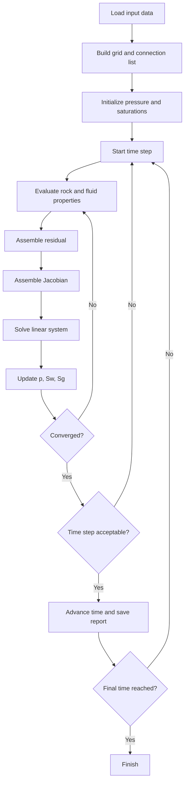

# Workflow Reservoir Simulator Development

Dokumen ini merangkum isi utama dari `Workflow.pdf` dan menjelaskannya dengan bahasa yang lebih operasional untuk orang yang sedang belajar membuat software simulasi reservoir.

Fokus dokumen ini ada dua:

1. Memahami alur algoritma simulator reservoir.
2. Memahami bagaimana alur itu diterjemahkan menjadi workflow pembuatan software.

Catatan:

- Inti workflow diambil dari `Workflow.pdf`.
- Penjelasan tambahan tentang grid, transmissibility, residual, dan perbedaan antar fasa dipertegas dengan konteks teori numerik reservoir simulation secara umum agar lebih mudah dipahami.
- Dokumen ini sekarang juga diperdetail memakai VBA dari workbook `basic theory/excell mas zuher/ressim_NewClass.xlsm`, `ressim_NewClass1.xlsm`, dan `ressim_NewClass2.xlsm`.
- Dari inspeksi VBA, `ressim_NewClass.xlsm` dan `ressim_NewClass1.xlsm` pada dasarnya identik, sedangkan `ressim_NewClass2.xlsm` adalah versi yang lebih berkembang. Karena itu, detail implementasi di bawah terutama mengacu ke `ressim_NewClass2.xlsm`.

Mulai versi ini, dokumen ini diposisikan sebagai master file untuk development software. Jadi isi di dalamnya sengaja menyatukan empat sudut pandang sekaligus:

1. workflow algoritma dari slide,
2. implementasi aktual dari VBA workbook,
3. CRUD data yang bergerak di runtime,
4. arah desain software yang nanti bisa diterjemahkan ke Python.

## Cara Pakai Dokumen Ini

Dokumen ini cukup panjang. Supaya enak dibaca, pakai jalur baca yang sesuai kebutuhanmu.

### Kalau mau paham gambaran besar dulu

Baca urutan ini:

1. Bagian `1. Gambaran besar`
2. Bagian `2. Workflow utama dari PDF`
3. Bagian `3` sampai `8`
4. Bagian `13. Inti yang perlu kamu pegang`

### Kalau mau fokus ke rumus

Baca urutan ini:

1. Bagian `2A. Cara Membaca Simbol di Rumus`
2. Bagian `2B. Highlight Rumus Utama`
3. Bagian `4.4`, `5.3`, `5.4`, `5.7`, `6.2`, `7`
4. Contoh hitungan di `4.7`, `5.8`, `6.7`, `7.3`

### Kalau mau cocokkan dengan workbook VBA

Baca urutan ini:

1. Bagian `0. Status Kecocokan Dokumen dengan Source`
2. Bagian `3.4`, `4.6`, `5.7`, `6.6`, `7.2`, `8.2`, `8A`

### Kalau mau langsung bayangin alur implementasi software

Baca urutan ini:

1. Bagian `1. Gambaran besar`
2. Bagian `8A. Workflow Aktual dari Workbook VBA`
3. Bagian `8B. Peta 6 Module Utama dari Workbook VBA`
4. Bagian `8C. CRUD Data per Module untuk Development Software`
5. Bagian `10. Workflow implementasi software`
6. Bagian `12. Pseudocode sederhana`

### Kalau mau fokus ke module dan CRUD untuk development

Baca urutan ini:

1. Bagian `8A. Workflow Aktual dari Workbook VBA`
2. Bagian `8B. Peta 6 Module Utama dari Workbook VBA`
3. Bagian `8C. CRUD Data per Module untuk Development Software`
4. Bagian `2B. Highlight Rumus Utama`
5. Bagian `10. Workflow implementasi software`

## Peta Isi Singkat

- `0`: status kecocokan dokumen dengan source VBA
- `1`: gambaran besar simulator reservoir
- `2`: peta workflow dari slide
- `2A`: cara membaca simbol rumus
- `2B`: kamus cepat rumus utama
- `3`: tahap preparation
- `4`: tahap connection list
- `5`: tahap residual calculation
- `6`: tahap Jacobian
- `7`: tahap Newton update
- `8`: tahap convergence dan constraints
- `8A`: workflow aktual workbook VBA
- `8B`: peta 6 module utama workbook VBA
- `8C`: CRUD data per module untuk development software
- `9` sampai `14`: ringkasan, implementasi software, FAQ, pseudocode, inti materi, dan penutup

## 0. Status Kecocokan Dokumen dengan Source

Supaya jelas dari awal, dokumen ini saya susun dengan tiga level kepastian:

### 0.1 Tiga Level Kepastian

- `persis sesuai kode VBA`: rumus atau alur yang memang ditulis langsung di workbook.
- `interpretasi konsep dari kode`: penjelasan fisik dari rumus yang ada di workbook.
- `catatan kemungkinan typo / belum final`: bagian yang terlihat masih merupakan versi latihan, prototipe, atau implementasi yang belum rapi di source.

Bagian yang sudah saya cocokkan langsung terhadap source:

### 0.2 Yang Sudah Dicocokkan Langsung

- urutan workflow `RunSim`
- pembentukan grid dan connection list di `DataModule`
- transmissibility di `GridDim`
- interpolasi PVT di `PVTModule`
- interpolasi relative permeability dan capillary pressure di `RockModule`
- residual, flux, dan perturbation Jacobian di `Residual`
- solver sparse `ILU + PBiCGSTAB` di `MatrixSolver`

Bagian yang perlu dibaca dengan hati-hati karena source-nya sendiri belum final:

### 0.3 Yang Masih Perlu Dibaca Hati-Hati

- rumus densitas minyak di PVT karena ada indikasi typo nama variabel
- akumulasi gas karena denominator state lama memakai `Bo`, bukan `Bg`
- well term yang masih contoh dummy
- update state di `UpdateNewTime` yang masih tampak belum rapi untuk semua array
- pemakaian array `PVT()` di flux yang tidak di-refresh penuh setiap Newton iteration

Jadi kalau kamu tanya "apakah ini sudah sesuai?", jawabannya:

### 0.4 Jawaban Singkat

- secara workflow dan struktur numerik: ya, sudah sejalan dengan workbook
- secara detail implementasi: saya tandai mana yang benar-benar sesuai kode dan mana yang harus dianggap versi latihan atau kemungkinan typo

## 1. Gambaran besar

Secara sederhana, simulator reservoir mencoba menjawab pertanyaan ini:

"Jika tekanan, saturasi, sifat batuan, sifat fluida, dan kondisi sumur diketahui pada saat ini, bagaimana keadaan reservoir berubah pada time step berikutnya?"

Untuk menjawab itu, simulator biasanya melakukan loop berikut:

```text
Siapkan data model
-> Bentuk grid dan koneksi antar cell
-> Hitung residual persamaan aliran untuk tiap fasa
-> Bentuk Jacobian
-> Selesaikan koreksi Newton
-> Update tekanan dan saturasi
-> Cek konvergensi
-> Jika belum konvergen, ulangi iterasi
-> Jika sudah konvergen, maju ke time step berikutnya
```

Secara software, ini berarti kita tidak langsung "menghitung jawaban akhir". Kita membangun mesin iteratif yang berulang kali:

- mengevaluasi properti,
- menyusun persamaan,
- menyelesaikan sistem linear,
- memperbaiki tebakan solusi.

## 2. Workflow utama dari PDF

`Workflow.pdf` membagi alur menjadi 6 tahap utama:

1. Preparation
2. Connection List
3. Residual Calculation
4. Jacobian of Residual Function
5. Update Iteration
6. Check Residual and Numerical Constraints

Di bawah ini penjelasan detail tiap tahap.

## 2A. Cara Membaca Simbol di Rumus

Sebelum masuk ke contoh hitungan, ini arti simbol yang paling sering muncul di dokumen ini. Tujuannya supaya setiap rumus tidak terasa seperti kumpulan huruf tanpa makna.

### 2A.1 Indeks yang dipakai

- $i$: cell yang sedang dihitung.
- $j$: cell tetangga yang terkoneksi dengan cell $i$.
- $p$: phase, bisa oil, water, atau gas.
- $n$: state pada awal time step lama.
- $k$: state tebakan saat iterasi Newton sekarang.
- $n+1$: state target pada akhir time step.

### 2A.2 Besaran utama yang sering muncul

- $p$: tekanan cell.
- $S_o, S_w, S_g$: saturasi oil, water, gas.
- $V_b$: bulk volume cell.
- $V_{pore}$: pore volume efektif cell.
- $B_o, B_w, B_g$: formation volume factor tiap phase.
- $\mu_o, \mu_w, \mu_g$: viskositas tiap phase.
- $k_{ro}, k_{rw}, k_{rg}$: relative permeability tiap phase.
- $\rho_o, \rho_w, \rho_g$: densitas tiap phase.
- $R_{so}, R_{sw}$: gas terlarut dalam oil atau water.
- $Pcow, Pcgw$: capillary pressure oil-water dan gas-water.
- $\Delta t$: ukuran time step.
- $T_{ij}$: transmissibility antar dua cell.
- $F_{p,ij}$: flux phase $p$ dari koneksi antara cell $i$ dan $j$.
- $R_{p,i}$: residual phase $p$ di cell $i$.
- $J$: Jacobian, yaitu matriks sensitivitas residual terhadap unknown.

### 2A.3 Arti fisik rumus-rumus utama dalam satu kalimat

- $ngrid = nx \times ny \times nz$: menghitung jumlah total cell model.
- $Y(p)$ dari interpolasi PVT: mencari properti fluida pada tekanan tertentu dari tabel.
- $T_{ij}$: mengukur seberapa kuat hubungan aliran antara dua cell.
- $F_{p,ij}$: menghitung laju aliran phase tertentu melalui satu koneksi.
- $R_{p,i}$: mengukur seberapa besar neraca massa cell-phase itu belum seimbang.
- $J = \partial R / \partial m$: mengukur seberapa sensitif residual terhadap perubahan tekanan dan saturasi.
- $J \Delta m = -r$: mencari koreksi state agar residual makin mendekati nol.

### 2A.4 Cara membayangkan rumus secara intuitif

- Rumus grid menjawab: model dibagi jadi berapa kotak?
- Rumus transmissibility menjawab: antar dua kotak ini, jalur alirnya sekuat apa?
- Rumus flux menjawab: kalau ada beda potential, berapa fluida yang pindah?
- Rumus accumulation menjawab: isi fluida di dalam satu cell berubah berapa selama satu time step?
- Rumus residual menjawab: setelah akumulasi dan flux dihitung, masih ada error balance atau tidak?
- Rumus Jacobian menjawab: kalau tekanan atau saturasi digeser sedikit, residual berubah seberapa besar?
- Rumus Newton update menjawab: koreksi apa yang harus diberikan ke pressure dan saturation supaya error turun?

## 2B. Highlight Rumus Utama

Bagian ini dibuat sebagai "kamus cepat" untuk rumus-rumus penting yang muncul di workflow dan di VBA workbook. Formatnya sengaja sederhana:

- `gunanya`: rumus ini dipakai untuk apa
- `cara pakai`: input apa yang harus tersedia sebelum rumus dipakai
- `hasil/fungsi`: output rumus ini nantinya dipakai untuk apa lagi
- `keterangan variabel`: arti setiap simbol yang muncul langsung di bawah rumusnya

### 2B.1 Jumlah grid

$$
ngrid = nx \times ny \times nz
$$

Keterangan variabel:

- `ngrid`: jumlah total cell pada model.
- `nx`: jumlah cell arah `x`.
- `ny`: jumlah cell arah `y`.
- `nz`: jumlah cell arah `z`.

Gunanya:

- menghitung total jumlah cell pada model.

Cara pakai:

- tentukan dulu jumlah cell arah `x`, `y`, dan `z`.
- pada workbook contoh: `nx = 5`, `ny = 5`, `nz = 1`.

Hasil/fungsi:

- dipakai untuk alokasi semua array solver seperti pressure, saturasi, residual, Jacobian, dan daftar koneksi.

### 2B.2 Bulk volume cell

$$
V_b = dx_i \times dy_j \times dz_k
$$

Keterangan variabel:

- `V_b`: bulk volume atau volume total batuan pada satu cell.
- `dx_i`: panjang cell pada arah `x` untuk indeks `i`.
- `dy_j`: lebar cell pada arah `y` untuk indeks `j`.
- `dz_k`: tebal cell pada arah `z` untuk indeks `k`.

Gunanya:

- menghitung volume total batuan pada satu cell.

Cara pakai:

- ambil ukuran cell arah `x`, `y`, `z`.
- pakai satu rumus ini untuk setiap cell.

Hasil/fungsi:

- menjadi dasar untuk menghitung pore volume.
- juga dipakai saat menghitung accumulation term.

### 2B.3 Interpolasi properti PVT

$$
Y(p) = Y_i + \frac{Y_i - Y_{i+1}}{p_i - p_{i+1}} (p - p_i)
$$

Keterangan variabel:

- `Y(p)`: nilai properti fluida pada tekanan `p` yang sedang dicari.
- `Y_i`: nilai properti pada titik tabel ke-`i`.
- `Y_{i+1}`: nilai properti pada titik tabel ke-`i+1`.
- `p`: tekanan target yang ingin dievaluasi.
- `p_i`: tekanan pada titik tabel ke-`i`.
- `p_{i+1}`: tekanan pada titik tabel ke-`i+1`.

Catatan:

- `Y` bisa berarti `Bo`, `Bw`, `Bg`, `mo`, `mw`, `mg`, `Rso`, atau `Rsw`.

Gunanya:

- mencari nilai properti fluida pada tekanan tertentu saat nilai itu tidak persis ada di tabel.

Cara pakai:

- cari dua titik tabel PVT yang mengapit tekanan `p`.
- `Y` bisa berarti `Bo`, `Bw`, `Bg`, `mo`, `mw`, `mg`, `Rso`, atau `Rsw`.

Hasil/fungsi:

- memberi properti fluida yang dipakai dalam perhitungan densitas, flux, dan accumulation.

### 2B.4 Densitas in-situ phase

$$
\rho_w = \frac{\rho_{w,ref}}{B_w}
$$

Keterangan variabel:

- `\rho_w`: densitas air pada kondisi reservoir.
- `\rho_{w,ref}`: densitas air pada kondisi referensi atau permukaan.
- `B_w`: water formation volume factor.

$$
\rho_g = \frac{\rho_{g,ref}}{B_g}
$$

Keterangan variabel:

- `\rho_g`: densitas gas pada kondisi reservoir.
- `\rho_{g,ref}`: densitas gas pada kondisi referensi atau permukaan.
- `B_g`: gas formation volume factor.

$$
\rho_o \approx \frac{\rho_{o,ref} + R_{so}\rho_{g,ref} + R_{sw}\rho_{w,ref}}{B_o}
$$

Keterangan variabel:

- `\rho_o`: densitas oil pada kondisi reservoir.
- `\rho_{o,ref}`: densitas oil pada kondisi referensi atau permukaan.
- `R_{so}`: gas yang terlarut di oil.
- `\rho_{g,ref}`: densitas gas pada kondisi referensi.
- `R_{sw}`: gas atau komponen terlarut yang diasosiasikan dengan water dalam model workbook.
- `\rho_{w,ref}`: densitas water pada kondisi referensi.
- `B_o`: oil formation volume factor.

Gunanya:

- menghitung densitas phase di kondisi reservoir, bukan di kondisi referensi.

Cara pakai:

- hitung atau interpolasi dulu `B_o`, `B_w`, `B_g`, `Rso`, `Rsw`.
- pada workbook, rumus densitas oil ada indikasi typo, jadi makna fisiknya lebih penting daripada bentuk literal variabelnya.

Hasil/fungsi:

- dipakai dalam gravity term pada potential difference.
- ikut menentukan arah dan besar flux antar cell.

### 2B.5 Kompresibilitas fluida

$$
C_o = \frac{C_{o,ref}}{1 + C_{o,ref}(p - p_{ref})}
$$

Keterangan variabel:

- `C_o`: kompresibilitas oil pada tekanan `p`.
- `C_{o,ref}`: kompresibilitas oil pada tekanan referensi.
- `p`: tekanan yang sedang dievaluasi.
- `p_{ref}`: tekanan referensi.

$$
C_w = \frac{C_{w,ref}}{1 + C_{w,ref}(p - p_{ref})}
$$

Keterangan variabel:

- `C_w`: kompresibilitas water pada tekanan `p`.
- `C_{w,ref}`: kompresibilitas water pada tekanan referensi.
- `p`: tekanan yang sedang dievaluasi.
- `p_{ref}`: tekanan referensi.

$$
C_g = \frac{C_{g,ref}}{1 + C_{g,ref}(p - p_{ref})}
$$

Keterangan variabel:

- `C_g`: kompresibilitas gas pada tekanan `p`.
- `C_{g,ref}`: kompresibilitas gas pada tekanan referensi.
- `p`: tekanan yang sedang dievaluasi.
- `p_{ref}`: tekanan referensi.

Gunanya:

- mengoreksi kompresibilitas phase terhadap perubahan tekanan.

Cara pakai:

- sediakan nilai referensi kompresibilitas dan tekanan referensi.
- evaluasi pada tekanan cell yang sedang dipakai.

Hasil/fungsi:

- membantu merepresentasikan sifat fluida yang berubah saat pressure berubah.
- penting untuk model fluida kompresibel.

### 2B.6 Tekanan awal hidrostatik

$$
p_{init,i} = p_{init,ref} + \rho_o \frac{(depth_i - d_{ref})}{144}
$$

Keterangan variabel:

- `p_{init,i}`: tekanan awal cell ke-`i`.
- `p_{init,ref}`: tekanan awal referensi.
- `\rho_o`: densitas oil yang dipakai untuk gradien hidrostatik awal.
- `depth_i`: kedalaman cell ke-`i`.
- `d_{ref}`: kedalaman referensi.
- `144`: faktor konversi unit yang dipakai pada formulasi workbook.

Gunanya:

- membentuk distribusi tekanan awal berdasarkan kedalaman.

Cara pakai:

- butuh tekanan referensi, depth referensi, densitas, dan depth tiap cell.

Hasil/fungsi:

- memberi kondisi awal yang lebih realistis daripada semua cell diberi tekanan sama.

### 2B.7 Harmonic average permeability

$$
k_{harm,ij} = \frac{2k_i k_j}{k_i + k_j}
$$

Keterangan variabel:

- `k_{harm,ij}`: permeabilitas efektif pada interface antara cell `i` dan `j`.
- `k_i`: permeabilitas cell `i` pada arah koneksi.
- `k_j`: permeabilitas cell `j` pada arah koneksi.

Gunanya:

- menghitung permeabilitas efektif pada interface antara dua cell.

Cara pakai:

- ambil permeabilitas cell kiri dan kanan atau dua cell yang terkoneksi.

Hasil/fungsi:

- dipakai langsung dalam rumus transmissibility.
- membuat koneksi antar dua cell lebih stabil secara numerik dibanding rata-rata aritmetika biasa.

### 2B.8 Transmissibility

$$
T_{ij} = 0.00603 \times \frac{2 k_i k_j}{k_i + k_j} \times \frac{A_{ij}}{L_{ij}}
$$

Keterangan variabel:

- `T_{ij}`: transmissibility antara cell `i` dan `j`.
- `0.00603`: faktor konversi unit lapangan yang dipakai workbook.
- `k_i`: permeabilitas cell `i` pada arah koneksi.
- `k_j`: permeabilitas cell `j` pada arah koneksi.
- `A_{ij}`: luas bidang kontak antara cell `i` dan `j`.
- `L_{ij}`: jarak karakteristik atau jarak pusat-ke-pusat antara cell `i` dan `j`.

Gunanya:

- mengukur kekuatan koneksi aliran antar dua cell.

Cara pakai:

- hitung dulu area interface `A`, jarak pusat-ke-pusat `L`, dan permeability harmonic average.
- faktor `0.00603` dipakai sebagai konversi unit lapangan pada workbook.

Hasil/fungsi:

- dipakai di semua rumus flux.
- kalau `T` besar, aliran antar cell akan lebih mudah terjadi.

### 2B.9 Mobility phase

$$
\lambda_p = \frac{k_{rp}}{\mu_p B_p}
$$

Keterangan variabel:

- `\lambda_p`: mobility phase `p`.
- `k_{rp}`: relative permeability phase `p`.
- `\mu_p`: viskositas phase `p`.
- `B_p`: formation volume factor phase `p`.

Gunanya:

- mengukur kemampuan phase tertentu untuk bergerak melalui batuan.

Cara pakai:

- butuh `kr`, viskositas, dan formation volume factor phase tersebut.

Hasil/fungsi:

- mobility digabung dengan transmissibility untuk membentuk koefisien flux phase.

### 2B.10 Potential difference antar cell

$$
\Delta \Phi_o = p_j - p_i - \frac{\rho_{o,j} + \rho_{o,i}}{2} \frac{\Delta z}{144}
$$

Keterangan variabel:

- `\Delta \Phi_o`: beda potential oil antara cell `i` dan `j`.
- `p_i`: tekanan cell `i`.
- `p_j`: tekanan cell `j`.
- `\rho_{o,i}`: densitas oil di cell `i`.
- `\rho_{o,j}`: densitas oil di cell `j`.
- `\Delta z`: beda kedalaman antara dua cell.
- `144`: faktor konversi unit.

$$
\Delta \Phi_w = p_j - p_i - \frac{\rho_{w,j} + \rho_{w,i}}{2} \frac{\Delta z}{144} - (Pcow_j - Pcow_i)
$$

Keterangan variabel:

- `\Delta \Phi_w`: beda potential water antara cell `i` dan `j`.
- `p_i`: tekanan cell `i`.
- `p_j`: tekanan cell `j`.
- `\rho_{w,i}`: densitas water di cell `i`.
- `\rho_{w,j}`: densitas water di cell `j`.
- `\Delta z`: beda kedalaman antara dua cell.
- `Pcow_i`: capillary pressure oil-water di cell `i`.
- `Pcow_j`: capillary pressure oil-water di cell `j`.
- `144`: faktor konversi unit.

$$
\Delta \Phi_g = p_j - p_i - \frac{\rho_{g,j} + \rho_{g,i}}{2} \frac{\Delta z}{144} + (Pcgw_j - Pcgw_i)
$$

Keterangan variabel:

- `\Delta \Phi_g`: beda potential gas antara cell `i` dan `j`.
- `p_i`: tekanan cell `i`.
- `p_j`: tekanan cell `j`.
- `\rho_{g,i}`: densitas gas di cell `i`.
- `\rho_{g,j}`: densitas gas di cell `j`.
- `\Delta z`: beda kedalaman antara dua cell.
- `Pcgw_i`: capillary pressure gas-water di cell `i`.
- `Pcgw_j`: capillary pressure gas-water di cell `j`.
- `144`: faktor konversi unit.

Gunanya:

- menghitung driving force aliran antar dua cell untuk tiap phase.

Cara pakai:

- butuh pressure dua cell, densitas phase, beda kedalaman, dan capillary pressure bila phase-nya water atau gas.

Hasil/fungsi:

- dipakai langsung dalam rumus flux.
- menentukan apakah aliran cenderung masuk atau keluar dari cell.

### 2B.11 Flux phase antar cell

$$
F_o = T_{ij} \times \frac{k_{ro,up}}{\mu_{o,up}} \times \frac{\Delta \Phi_o}{\overline{B_o}}
$$

Keterangan variabel:

- `F_o`: flux oil pada koneksi `i-j`.
- `T_{ij}`: transmissibility koneksi `i-j`.
- `k_{ro,up}`: relative permeability oil dari sisi upstream.
- `\mu_{o,up}`: viskositas oil dari sisi upstream.
- `\Delta \Phi_o`: beda potential oil.
- `\overline{B_o}`: rata-rata oil formation volume factor antara dua cell.

$$
F_w = T_{ij} \times \frac{k_{rw,up}}{\mu_{w,up}} \times \frac{\Delta \Phi_w}{\overline{B_w}}
$$

Keterangan variabel:

- `F_w`: flux water pada koneksi `i-j`.
- `T_{ij}`: transmissibility koneksi `i-j`.
- `k_{rw,up}`: relative permeability water dari sisi upstream.
- `\mu_{w,up}`: viskositas water dari sisi upstream.
- `\Delta \Phi_w`: beda potential water.
- `\overline{B_w}`: rata-rata water formation volume factor antara dua cell.

$$
F_g = T_{ij} \times \frac{k_{rg,up}}{\mu_{g,up}} \times \frac{\Delta \Phi_g}{\overline{B_g}}
$$

Keterangan variabel:

- `F_g`: flux gas pada koneksi `i-j`.
- `T_{ij}`: transmissibility koneksi `i-j`.
- `k_{rg,up}`: relative permeability gas dari sisi upstream.
- `\mu_{g,up}`: viskositas gas dari sisi upstream.
- `\Delta \Phi_g`: beda potential gas.
- `\overline{B_g}`: rata-rata gas formation volume factor antara dua cell.

Gunanya:

- menghitung laju aliran oil, water, atau gas lewat satu koneksi.

Cara pakai:

- butuh transmissibility, mobility phase, dan potential difference.
- pada workbook dipakai upwinding, artinya `kr` dan `mu` diambil dari sisi upstream tergantung tanda potential difference.

Hasil/fungsi:

- semua flux koneksi dijumlahkan untuk membentuk `NetFlux` di residual tiap cell.

### 2B.12 Pore volume efektif

$$
V_{pore}^k = V_b \phi \left(1 + c_{rock}(p^k - p_{ref})\right)
$$

Keterangan variabel:

- `V_{pore}^k`: pore volume efektif pada iterasi `k`.
- `V_b`: bulk volume cell.
- `\phi`: porositas batuan.
- `c_{rock}`: kompresibilitas batuan.
- `p^k`: tekanan cell pada iterasi `k`.
- `p_{ref}`: tekanan referensi batuan.

Gunanya:

- menghitung volume pori aktual pada iterasi tertentu, dengan efek kompresibilitas batuan.

Cara pakai:

- butuh bulk volume, porositas, kompresibilitas batuan, dan tekanan cell.

Hasil/fungsi:

- dipakai di accumulation term semua phase.

### 2B.13 Accumulation oil dan water

$$
Acc_o = \frac{1}{\Delta t}\left(\frac{V_{pore}^k S_o^k}{B_o^k} - \frac{V_{pore}^n S_o^n}{B_o^n}\right)
$$

Keterangan variabel:

- `Acc_o`: accumulation oil.
- `\Delta t`: ukuran time step.
- `V_{pore}^k`: pore volume pada iterasi `k`.
- `S_o^k`: saturasi oil pada iterasi `k`.
- `B_o^k`: oil formation volume factor pada iterasi `k`.
- `V_{pore}^n`: pore volume pada awal time step lama.
- `S_o^n`: saturasi oil pada awal time step lama.
- `B_o^n`: oil formation volume factor pada awal time step lama.

$$
Acc_w = \frac{1}{\Delta t}\left(\frac{V_{pore}^k S_w^k}{B_w^k} - \frac{V_{pore}^n S_w^n}{B_w^n}\right)
$$

Keterangan variabel:

- `Acc_w`: accumulation water.
- `\Delta t`: ukuran time step.
- `V_{pore}^k`: pore volume pada iterasi `k`.
- `S_w^k`: saturasi water pada iterasi `k`.
- `B_w^k`: water formation volume factor pada iterasi `k`.
- `V_{pore}^n`: pore volume pada awal time step lama.
- `S_w^n`: saturasi water pada awal time step lama.
- `B_w^n`: water formation volume factor pada awal time step lama.

Gunanya:

- menghitung perubahan kandungan oil atau water di dalam satu cell selama satu time step.

Cara pakai:

- butuh state lama `n`, state iterasi sekarang `k`, pore volume, saturasi, dan formation volume factor.

Hasil/fungsi:

- dipakai dalam residual sebagai term akumulasi massa.

### 2B.14 Accumulation gas

$$
Acc_g = \frac{1}{\Delta t}\left(\frac{V_{pore}^k S_g^k}{B_g^k} - \frac{V_{pore}^n S_g^n}{B_*^n}\right) + R_{so}^k Acc_o + R_{sw}^k Acc_w
$$

Keterangan variabel:

- `Acc_g`: accumulation gas.
- `\Delta t`: ukuran time step.
- `V_{pore}^k`: pore volume pada iterasi `k`.
- `S_g^k`: saturasi gas pada iterasi `k`.
- `B_g^k`: gas formation volume factor pada iterasi `k`.
- `V_{pore}^n`: pore volume pada awal time step lama.
- `S_g^n`: saturasi gas pada awal time step lama.
- `B_*^n`: faktor volume formasi gas state lama seperti yang tertulis di workbook, walaupun ada indikasi belum rapi.
- `R_{so}^k`: solution gas-oil ratio pada iterasi `k`.
- `Acc_o`: accumulation oil.
- `R_{sw}^k`: coupling ratio terkait water pada iterasi `k`.
- `Acc_w`: accumulation water.

Gunanya:

- menghitung perubahan kandungan gas, termasuk coupling gas bebas dan gas terlarut.

Cara pakai:

- butuh state gas, PVT gas, dan coupling term `Rso`, `Rsw`.
- pada workbook, denominator state lama gas tampak masih belum rapi dan kemungkinan harusnya `Bg`, bukan `Bo`.

Hasil/fungsi:

- dipakai di residual gas.
- menjadi alasan kenapa persamaan gas biasanya lebih rumit daripada oil dan water.

### 2B.15 Residual umum per phase

$$
R_{p,i} = Acc_{p,i} + \sum_{j \in N(i)} F_{p,ij} - q_{p,i}
$$

Keterangan variabel:

- `R_{p,i}`: residual phase `p` di cell `i`.
- `Acc_{p,i}`: accumulation phase `p` di cell `i`.
- `\sum_{j \in N(i)} F_{p,ij}`: jumlah flux phase `p` dari semua tetangga `j` yang terkoneksi ke cell `i`.
- `N(i)`: himpunan atau daftar tetangga cell `i`.
- `q_{p,i}`: source/sink phase `p` di cell `i`, misalnya dari well.

Gunanya:

- mengukur apakah neraca massa phase pada cell itu sudah balance atau belum.

Cara pakai:

- hitung dulu accumulation, flux dari semua koneksi, dan source/sink jika ada well.

Hasil/fungsi:

- residual inilah yang harus dibuat mendekati nol oleh Newton iteration.

### 2B.16 Residual aktual workbook

$$
R_o = NetFlux_o - Acc_o
$$

Keterangan variabel:

- `R_o`: residual oil.
- `NetFlux_o`: jumlah flux oil dari semua koneksi pada cell itu.
- `Acc_o`: accumulation oil.

$$
R_w = NetFlux_w - Acc_w
$$

Keterangan variabel:

- `R_w`: residual water.
- `NetFlux_w`: jumlah flux water dari semua koneksi pada cell itu.
- `Acc_w`: accumulation water.

$$
R_g = NetFlux_g - Acc_g
$$

Keterangan variabel:

- `R_g`: residual gas.
- `NetFlux_g`: jumlah flux gas dari semua koneksi pada cell itu.
- `Acc_g`: accumulation gas.

Gunanya:

- ini adalah bentuk residual yang benar-benar dipakai di `ressim_NewClass2.xlsm`.

Cara pakai:

- jumlahkan semua flux koneksi per phase, lalu kurangi dengan accumulation phase itu.
- term well di workbook saat ini masih dummy.

Hasil/fungsi:

- dipakai untuk membentuk RHS Newton dan untuk menghitung error konvergensi `ResidErr`.

### 2B.17 Error residual maksimum

$$
ResidErr = \max \left(|R_o|, |R_w|, |R_g|\right) \text{ untuk semua cell}
$$

Keterangan variabel:

- `ResidErr`: residual error maksimum seluruh model.
- `R_o`: residual oil.
- `R_w`: residual water.
- `R_g`: residual gas.
- `|.|`: nilai absolut.
- `\max`: ambil nilai terbesar.

Gunanya:

- mengukur error terburuk di seluruh model.

Cara pakai:

- hitung residual semua cell dan semua phase, lalu ambil nilai absolut maksimum.

Hasil/fungsi:

- dipakai sebagai kriteria konvergensi Newton di workbook.

### 2B.18 Jumlah non-zero Jacobian

$$
nnz = \sum_{i=1}^{ngrid} 9(1 + nCon_i)
$$

Keterangan variabel:

- `nnz`: jumlah elemen non-zero pada matriks Jacobian sparse.
- `\sum`: penjumlahan untuk semua cell.
- `i`: indeks cell.
- `ngrid`: jumlah total cell model.
- `9`: ukuran blok lokal `3 x 3` untuk tiga residual terhadap tiga unknown.
- `nCon_i`: jumlah koneksi cell ke-`i`.
- `1 + nCon_i`: satu blok untuk cell sendiri ditambah blok untuk semua tetangga yang terkoneksi.

Gunanya:

- menghitung berapa banyak elemen Jacobian sparse yang perlu disiapkan.

Cara pakai:

- untuk tiap cell, hitung satu blok `3 x 3` untuk cell itu sendiri dan satu blok `3 x 3` untuk tiap koneksi.

Hasil/fungsi:

- dipakai saat alokasi memori matriks sparse `aMat`.

### 2B.19 Jacobian numerik terhadap pressure

$$
\frac{\partial R}{\partial p} \approx \frac{R^{base} - R^{perturbed}}{\Delta p}
$$

Keterangan variabel:

- `\partial R / \partial p`: turunan parsial residual terhadap pressure.
- `R^{base}`: residual sebelum pressure diperturbasi.
- `R^{perturbed}`: residual setelah pressure diperturbasi.
- `\Delta p`: besar perturbasi pressure.
- `\approx`: dihitung secara numerik sebagai pendekatan, bukan turunan analitik exact.

Gunanya:

- mengukur sensitivitas residual terhadap perubahan pressure.

Cara pakai:

- hitung residual awal.
- ubah pressure sedikit.
- hitung residual lagi.
- bagi selisih residual dengan besar perturbasi.

Hasil/fungsi:

- memberi elemen Jacobian untuk kolom pressure.

### 2B.20 Jacobian numerik terhadap saturasi

$$
\frac{\partial R}{\partial S_w} \approx \frac{R^{perturbed} - R^{base}}{\Delta S_w}
$$

Keterangan variabel:

- `\partial R / \partial S_w`: turunan parsial residual terhadap saturasi water.
- `R^{perturbed}`: residual setelah `S_w` diperturbasi.
- `R^{base}`: residual sebelum perturbasi.
- `\Delta S_w`: besar perturbasi saturasi water.

$$
\frac{\partial R}{\partial S_g} \approx \frac{R^{perturbed} - R^{base}}{\Delta S_g}
$$

Keterangan variabel:

- `\partial R / \partial S_g`: turunan parsial residual terhadap saturasi gas.
- `R^{perturbed}`: residual setelah `S_g` diperturbasi.
- `R^{base}`: residual sebelum perturbasi.
- `\Delta S_g`: besar perturbasi saturasi gas.

Gunanya:

- mengukur sensitivitas residual terhadap perubahan saturasi.

Cara pakai:

- naikkan `Sw` atau `Sg` sedikit.
- koreksi `So` agar total saturasi tetap `1`.
- hitung residual baru, lalu ambil selisih terhadap residual awal.

Hasil/fungsi:

- memberi elemen Jacobian untuk kolom saturasi water dan gas.

### 2B.21 Sistem Newton

$$
J \Delta m = -R
$$

Keterangan variabel:

- `J`: matriks Jacobian.
- `\Delta m`: vektor koreksi unknown.
- `R`: vektor residual.
- `-R`: right-hand side sistem Newton.

Gunanya:

- mencari koreksi state yang membuat residual turun.

Cara pakai:

- bentuk Jacobian dan residual dulu.
- susun RHS sebagai negatif residual.
- selesaikan sistem linear sparse.

Hasil/fungsi:

- menghasilkan `\Delta p`, `\Delta S_w`, `\Delta S_g`.

### 2B.22 Update state

$$
p^{k+1} = p^k + \Delta p
$$

Keterangan variabel:

- `p^{k+1}`: pressure baru setelah update.
- `p^k`: pressure lama pada iterasi sekarang.
- `\Delta p`: koreksi pressure dari solver Newton.

$$
S_w^{k+1} = S_w^k + \Delta S_w
$$

Keterangan variabel:

- `S_w^{k+1}`: saturasi water baru.
- `S_w^k`: saturasi water lama.
- `\Delta S_w`: koreksi saturasi water.

$$
S_g^{k+1} = S_g^k + \Delta S_g
$$

Keterangan variabel:

- `S_g^{k+1}`: saturasi gas baru.
- `S_g^k`: saturasi gas lama.
- `\Delta S_g`: koreksi saturasi gas.

$$
S_o^{k+1} = 1 - S_w^{k+1} - S_g^{k+1}
$$

Keterangan variabel:

- `S_o^{k+1}`: saturasi oil baru.
- `1`: total saturasi seluruh phase dalam satu cell.
- `S_w^{k+1}`: saturasi water baru.
- `S_g^{k+1}`: saturasi gas baru.

Gunanya:

- memperbarui tebakan solusi setelah koreksi Newton diperoleh.

Cara pakai:

- tambahkan hasil solver linear ke state lama.
- lalu hitung ulang `So` dari constraint saturasi.

Hasil/fungsi:

- memberi state baru untuk dipakai menghitung residual berikutnya.

## 3. Tahap 1 - Preparation

Tahap ini adalah tahap menyiapkan semua data yang dibutuhkan simulator.

Isi yang disebut di slide:

- Model geometry/dimension
- Model discretization (`dx`, `dy`, `dz`)
- Model properties
- Rock properties: porosity, `PermX`, `PermY`, `PermZ`, `PVMult`, `TransMult`, `NullGrid`
- Rock-fluid interactions: relative permeability dan capillary pressure table
- Rock compressibility dan reference pressure
- Fluid properties: PVT table, fluid density, reference pressure

### 3.1 Apa arti praktisnya?

Sebelum menghitung aliran, simulator harus tahu:

- bentuk reservoir,
- reservoir dibagi jadi berapa cell,
- setiap cell punya ukuran berapa,
- setiap cell punya porositas dan permeabilitas berapa,
- fluida di dalamnya bagaimana perilakunya terhadap tekanan,
- hubungan antar fasa bagaimana,
- ada cell aktif atau tidak.

### 3.2 Kenapa tahap ini penting?

Semua rumus di tahap berikutnya bergantung pada data ini. Misalnya:

- akumulasi massa bergantung pada pore volume, saturasi, dan formation volume factor,
- aliran antar cell bergantung pada permeabilitas, area interface, jarak antar pusat cell, dan mobilitas fasa,
- tekanan kapiler dan relative permeability memengaruhi distribusi aliran antar fasa.

### 3.3 Kalau diterjemahkan ke software

Di level software, tahap preparation biasanya dipecah menjadi komponen seperti ini:

- `input_reader`: membaca file geometri, properti batuan, properti fluida, dan data sumur.
- `grid_builder`: membangun cell dan ukuran grid.
- `rock_model`: menyediakan porosity, permeability, compressibility.
- `fluid_model`: menyediakan `B_o`, `B_w`, `B_g`, viskositas, densitas, `R_s`, dan tabel PVT lain.
- `relperm_model`: menghitung `kro`, `krw`, `krg` dan mungkin `Pc`.

### 3.4 Implementasi tahap preparation di VBA workbook

Di workbook VBA, tahap preparation tersebar di beberapa prosedur berikut:

- `ReadRefData`: membaca data referensi dari sheet `REF`.
- `ReadGridData`: membentuk ukuran grid dasar dan properti default grid.
- `ReadPVTData`: membaca tabel PVT dari sheet `PVT`.
- `ReadTableRock`: membaca tabel relative permeability dan capillary pressure dari sheet `ROCK`.
- `Initialization`: membentuk kondisi awal tekanan dan saturasi.

Urutan pemanggilan aktualnya ada di `RunSim`:

```text
ReadAllDATA
-> AllocateMemory
-> Initialization
-> CalcModel_PVT
```

Kalau dicocokkan dengan `RunSim`, urutan runtime lengkap yang benar-benar terjadi adalah:

```text
ReadAllDATA
-> AllocateMemory
-> Initialization
-> CalcModel_PVT
-> MakeReport(0, 0)
-> masuk loop time step
```

Arti bagian ini:

- semua data dibaca dulu,
- memori array solver disiapkan,
- state awal dibentuk,
- properti PVT awal dihitung,
- hasil awal ditulis ke sheet report,
- baru simulasi maju ke loop waktu.

#### a. Data referensi dari sheet `REF`

VBA membaca parameter berikut:

- `dREF`: depth referensi
- `pREF`: pressure referensi
- `rDENOIL`, `rDENWATER`, `rDENGAS`: densitas referensi minyak, air, gas
- `cROCK`: kompresibilitas batuan
- `Pb`: bubble-point atau pressure acuan saturasi
- `CoRef`, `CwRef`, `CgRef`: kompresibilitas referensi fluida

Ini dipakai untuk membentuk tekanan awal, pore volume terkompresi, dan properti PVT yang tergantung tekanan.

#### b. Geometri dan properti grid awal

Di `ReadGridData`, model yang dipakai pada workbook contoh adalah:

- `nx = 5`
- `ny = 5`
- `nz = 1`

Jadi total cell:

$$
ngrid = nx \times ny \times nz = 25
$$

Ukuran grid dibuat seragam:

- `dx = 200`
- `dy = 200`
- `dz = 100`

Properti default grid juga diisi seragam untuk semua cell:

- porositas `0.25`
- `permX = 1000`
- `permY = 1000`
- `permZ = 250`
- `PVMult = 1`

Artinya workbook ini masih berupa model latihan atau model dasar, belum pembacaan properti per-cell yang kompleks dari file eksternal.

#### c. PVT diimplementasikan sebagai interpolasi linier

Fungsi `calcPVT(pVal)` membaca dua titik tekanan yang mengapit `pVal`, lalu melakukan interpolasi linier untuk:

- `Bo`
- `mo`
- `Rso`
- `Bg`
- `mg`
- `Bw`
- `mw`
- `Rsw`

Pola yang dipakai di VBA adalah:

$$
Y(p) = Y_i + \frac{Y_i - Y_{i+1}}{p_i - p_{i+1}} (p - p_i)
$$

secara konsep ekuivalen dengan interpolasi linier standar antar dua titik tabel PVT.

Arti rumus ini:

- kalau tekanan yang dibutuhkan tidak persis ada di tabel, workbook mengambil dua titik tekanan yang mengapitnya,
- lalu workbook menghitung nilai properti di antaranya secara garis lurus,
- jadi tabel PVT berfungsi seperti "lookup table + interpolasi".

Setelah itu, densitas dan kompresibilitas dibentuk lagi dari hasil interpolasi:

$$
\rho_w = \frac{\rho_{w,ref}}{B_w}
$$

Arti rumus ini:

- ketika `Bw` membesar, densitas air in-situ mengecil,
- karena volume air di reservoir menjadi lebih besar dibanding volume referensinya.

$$
\rho_g = \frac{\rho_{g,ref}}{B_g}
$$

Arti rumus ini:

- gas juga dihitung dari densitas referensi yang dikoreksi oleh faktor volume formasi gas.

Secara persis di VBA, densitas minyak ditulis dengan pola:

$$
\rho_o = \frac{\rho_{o,ref} + R_{so}\rho_{g,ref} + R_{sw}\rho_{w,ref?}}{B_o}
$$

Arti konsep rumus ini:

- densitas minyak in-situ dianggap berasal dari minyak dasar ditambah komponen terlarut, lalu dibagi `Bo`.
- ini menunjukkan bahwa oil phase di model black-oil tidak berdiri sendiri, tetapi bisa membawa gas terlarut.

$$
C_o = \frac{C_{o,ref}}{1 + C_{o,ref}(p - p_{ref})}
$$

$$
C_w = \frac{C_{w,ref}}{1 + C_{w,ref}(p - p_{ref})}
$$

$$
C_g = \frac{C_{g,ref}}{1 + C_{g,ref}(p - p_{ref})}
$$

Catatan penting:

- Di VBA ada indikasi typo pada rumus densitas minyak karena dipakai `rDWATER`, bukan `rDENWATER`.
- Jadi, untuk belajar konsep, anggap maksud rumus densitas minyak adalah densitas minyak permukaan ditambah kontribusi gas/air terlarut lalu dibagi `Bo`, tetapi implementasi workbook ini belum sepenuhnya rapi.
- Jadi di dokumen ini, saya membedakan antara `makna fisik rumus` dan `penulisan literal di VBA`.

#### d. Rock-fluid interaction juga diinterpolasi linier

Fungsi `CalcRelperm(swVal, sgVal)` membaca dua tabel:

- tabel oil-water: `sw`, `krow`, `krwo`, `pcow`
- tabel gas-water: `sg`, `krgw`, `krwg`, `pcgw`

Lalu VBA melakukan interpolasi linier untuk mendapatkan:

- `kro`
- `krw`
- `krg`
- `pcow`
- `pcgw`

Secara konsep, itulah alasan beda fasa beda rumus: karena nilai `kr` dan `Pc` untuk tiap fasa berasal dari tabel yang berbeda dan bergantung pada saturasi yang berbeda.

Ada satu detail penting yang perlu dibayangkan:

- `Sw` terutama mengontrol pasangan oil-water,
- `Sg` terutama mengontrol pasangan gas-water,
- jadi perubahan saturasi tidak hanya mengubah satu phase, tetapi juga mengubah pembagian jalur alir antar phase.

#### e. Inisialisasi tekanan awal memakai gradien hidrostatik

Di `Initialization`, tekanan awal cell dibentuk dari:

$$
p_{init,i} = p_{init,ref} + \rho_o \frac{(depth_i - d_{ref})}{144}
$$

Secara fisik, ini berarti workbook memulai simulasi dengan tekanan yang sudah berubah terhadap kedalaman.

Arti visualnya:

- cell yang lebih dalam akan punya tekanan awal lebih tinggi,
- jadi bahkan sebelum ada aliran, model sudah punya distribusi tekanan vertikal.

## 4. Tahap 2 - Connection List

Ini salah satu bagian paling penting, dan biasanya memang membingungkan di awal.

### 4.1 Apa yang dimaksud koneksi antar grid?

Setelah reservoir dibagi menjadi banyak cell, simulator harus tahu cell mana yang bertetangga dan bisa saling mengalirkan fluida.

Itulah yang disebut `connection list`.

Kalau cell `i` menempel dengan cell `j`, maka ada koneksi `i <-> j`.

Koneksi ini bukan cuma "tetangga", tetapi menyimpan informasi numerik untuk menghitung aliran antar cell, misalnya:

- cell tujuan atau tetangga,
- jarak antar pusat cell,
- luas bidang kontak,
- transmissibility,
- multiplier transmissibility.

Di slide, struktur data koneksi ditulis kira-kira berisi:

- `nCon`: jumlah koneksi
- `ConTo()`: koneksi menuju cell nomor berapa
- `dCon()`: jarak antar cell
- `ACon()`: luas interface antar cell
- `Trans()`: transmissibility
- `TransMult()`: multiplier transmissibility

### 4.2 Structured grid vs unstructured grid

#### Structured grid

Untuk structured grid, penomoran masih bisa memakai indeks `i, j, k`.

Artinya tetangga biasanya mudah dicari:

- barat/timur (`W/E`)
- selatan/utara (`S/N`)
- bawah/atas (`B/T`)

Pada grid kartesian 3D, satu cell internal biasanya punya maksimal 6 tetangga.

#### Unstructured grid

Untuk unstructured grid, indeks `i, j, k` tidak cukup. Tetangga harus dideteksi dari geometri nyata cell. Dua cell dianggap terkoneksi kalau mereka berbagi sisi atau interface yang valid untuk aliran.

Jadi pada unstructured grid, koneksi harus dihitung dari adjacency geometri, bukan dari pola indeks tetap.

### 4.3 Kenapa koneksi ini krusial?

Karena aliran antar cell dihitung melalui koneksi tersebut. Jika koneksi salah:

- fluida bisa mengalir ke arah yang salah,
- ada cell yang seharusnya terhubung jadi terisolasi,
- ada cell yang seharusnya tidak terhubung malah jadi bocor,
- Jacobian akan salah struktur.

### 4.4 Rumus dasar transmissibility

Secara konsep, transmissibility adalah ukuran "seberapa mudah fluida lewat dari satu cell ke cell tetangga".

Bentuk paling dasar:

$$
T_{ij} \approx \frac{k A}{L}
$$

dengan:

- $k$: permeabilitas efektif pada arah aliran,
- $A$: luas bidang kontak antar dua cell,
- $L$: jarak karakteristik antar pusat cell.

Untuk aliran per fasa, biasanya dipakai transmissibility fasa atau flux coefficient:

$$
\lambda_{p,ij} T_{ij}
=
\frac{k_{rp,ij}}{\mu_{p,ij} B_{p,ij}} T_{ij}
$$

dengan:

- $k_{rp}$: relative permeability fasa $p$,
- $\mu_p$: viskositas fasa,
- $B_p$: formation volume factor fasa,
- $\lambda_p$: mobility fasa.

Intinya: koneksi antar grid menyediakan jalur aliran, sedangkan transmissibility memberi bobot kuat-lemahnya jalur itu.

Kalau dibayangkan seperti pipa antar dua kotak:

- `A` membuat pipa terasa lebih besar atau kecil,
- `L` membuat pipa terasa lebih pendek atau panjang,
- `k` membuat medium terasa lebih mudah atau lebih sulit ditembus.

### 4.5 Contoh sederhana

Misalkan ada grid 2D seperti ini:

```text
[1] [2] [3]
[4] [5] [6]
```

Maka cell 5 terhubung ke:

- 2 di atas
- 4 di kiri
- 6 di kanan

Jika model 3D, masih bisa ada koneksi ke atas lapisan dan bawah lapisan.

Jadi saat residual cell 5 dihitung, kontribusi aliran dari semua cell yang terhubung ini harus ikut masuk.

### 4.6 Implementasi connection list di VBA workbook

Bagian ini ada di prosedur `GridDim` dan tipe data `ConGrid`.

Struktur `ConGrid` di VBA berisi:

- `nCon`: jumlah koneksi cell
- `iCon()`: index cell tetangga
- `ACon()`: luas interface
- `LCon()`: jarak antar pusat cell
- `Trans()`: transmissibility
- `tMult()`: transmissibility multiplier
- `depth`, `Vb`, `por`: properti lokal cell

#### a. Jumlah koneksi per cell

Untuk model kartesian, `GridDim` menghitung jumlah koneksi berdasarkan posisi cell:

- cell pojok punya koneksi lebih sedikit,
- cell sisi punya koneksi menengah,
- cell internal punya koneksi penuh.

Pada model workbook saat ini, karena `nz = 1`, koneksi hanya aktif di arah `x` dan `y`.

#### b. Volume bulk cell

Workbook membentuk volume bulk tiap cell sebagai:

$$
V_b = dx_i \times dy_j \times dz_k
$$

#### c. Jarak dan area interface

Untuk koneksi arah `x`:

$$
L_{x,ij} = 0.5 (dx_i + dx_j)
$$

$$
A_{x,ij} = dy_j \times dz_k
$$

Untuk koneksi arah `y`:

$$
L_{y,ij} = 0.5 (dy_i + dy_j)
$$

$$
A_{y,ij} = dx_i \times dz_k
$$

Untuk koneksi arah `z` konsepnya sama, hanya area menjadi `dx * dy` dan jarak memakai `dz`.

#### d. Rumus transmissibility aktual di VBA

VBA memakai harmonic average permeability antar dua cell:

$$
k_{harm,ij} = \frac{2 k_i k_j}{k_i + k_j}
$$

lalu transmissibility dasar dihitung sebagai:

$$
T_{ij} = 0.00603 \times k_{harm,ij} \times \frac{A_{ij}}{L_{ij}}
$$

atau jika ditulis persis seperti pola di kode:

$$
T_{ij} = 0.00603 \times \frac{2 k_i k_j}{k_i + k_j} \times \frac{A_{ij}}{L_{ij}}
$$

Makna tiap komponen:

- harmonic average dipakai agar aliran antar dua cell dengan permeabilitas berbeda tetap konsisten secara numerik,
- `A/L` menangkap efek geometri,
- `0.00603` adalah faktor konversi unit lapangan yang umum dipakai pada formulasi reservoir simulator.

Ini menjawab pertanyaan "apa itu koneksi antar grid":

Koneksi antar grid bukan garis abstrak, tetapi record data yang menyimpan semua koefisien geometri dan properti yang diperlukan untuk menghitung flux numerik antar dua cell.

### 4.7 Contoh hitungan kecil 2 cell untuk koneksi dan transmissibility

Supaya lebih kebayang, ambil contoh dua cell yang berdampingan di arah `x`.

Data contoh:

- `dx_1 = 200 ft`, `dx_2 = 200 ft`
- `dy = 200 ft`
- `dz = 100 ft`
- `k_1 = 1000 mD`, `k_2 = 1000 mD`

#### a. Hitung area interface

Karena koneksi di arah `x`, luas bidang kontak adalah:

$$
A_{12} = dy \times dz = 200 \times 100 = 20000
$$

Arti rumus ini:

- semakin besar bidang kontak antar dua cell, semakin mudah fluida lewat.

#### b. Hitung jarak pusat-ke-pusat

$$
L_{12} = 0.5(dx_1 + dx_2) = 0.5(200 + 200) = 200
$$

Arti rumus ini:

- semakin jauh jarak antar pusat cell, semakin susah fluida mengalir.

#### c. Hitung harmonic permeability

$$
k_{harm,12} = \frac{2k_1k_2}{k_1+k_2} = \frac{2(1000)(1000)}{1000+1000} = 1000
$$

Arti rumus ini:

- harmonic average dipakai agar koneksi antara dua cell tidak terlalu dipengaruhi secara tidak realistis oleh cell yang lebih permeabel saja.

#### d. Hitung transmissibility

$$
T_{12} = 0.00603 \times 1000 \times \frac{20000}{200} = 603
$$

Arti angka `603` ini:

- itu adalah "kekuatan koneksi" antara cell 1 dan cell 2.
- kalau semua hal lain sama, makin besar `T`, makin besar flux yang bisa lewat.

Jadi, untuk dua cell ini, workbook akan menyimpan satu record koneksi yang secara konsep berisi:

```text
cell 1 terhubung ke cell 2
area = 20000
jarak = 200
transmissibility = 603
```

## 5. Tahap 3 - Residual Calculation

Residual adalah inti dari metode numerik ini.

### 5.1 Apa itu residual?

Residual adalah ukuran error dari persamaan neraca massa. Kalau residual sama dengan nol, artinya persamaan balance untuk cell dan fasa tersebut sudah terpenuhi.

Secara intuitif:

```text
residual = akumulasi + aliran masuk/keluar - sumber/sumur
```

Jika `residual != 0`, berarti tebakan solusi kita belum benar.

### 5.2 Unknown yang dicari

Di slide, iterasi dilakukan terhadap:

- tekanan `p`
- saturasi air `Sw`
- saturasi gas `Sg`

Lalu saturasi minyak dihitung dari constraint saturasi:

$$
S_o = 1 - S_w - S_g
$$

Artinya dalam black-oil 3-phase yang dipakai di slide, parameter utama per cell adalah:

$$
m = [p, S_w, S_g]^T
$$

### 5.3 Bentuk umum residual per fasa

Walaupun OCR slide tidak menangkap semua simbol dengan rapi, bentuk umum residual per fasa dapat dipahami sebagai:

$$
R_{p,i}
=
\frac{\left( V_{pore,i} \frac{S_{p,i}}{B_{p,i}} \right)^{n+1} - \left( V_{pore,i} \frac{S_{p,i}}{B_{p,i}} \right)^n}{\Delta t}
+ \sum_{j \in N(i)} F_{p,ij}^{n+1}
- q_{p,i}^{n+1}
$$

dengan:

- $p$ bisa berarti oil, water, atau gas phase,
- $i$ adalah cell yang sedang dihitung,
- $N(i)$ adalah daftar tetangga cell `i`,
- $F_{p,ij}$ adalah flux fasa $p$ antara cell `i` dan `j`,
- $q_{p,i}$ adalah source/sink, misalnya well rate.

Residual dicari sampai mendekati nol.

Cara membayangkannya:

- kalau residual besar, berarti cell itu masih "protes" karena neraca massanya belum cocok,
- kalau residual mendekati nol, berarti akumulasi, aliran, dan source/sink sudah saling balance.

### 5.4 Bentuk flux antar cell

Flux antar dua cell biasanya mengikuti ide Darcy:

$$
F_{p,ij} = \lambda_{p,ij} T_{ij} \Delta \Phi_{p,ij}
$$

dengan potential difference:

$$
\Delta \Phi_{p,ij} = p_i - p_j - \rho_{p,ij} g (z_i - z_j)
$$

Jadi aliran tidak hanya dipengaruhi perbedaan tekanan, tapi juga gravitasi.

Pada implementasi VBA, flux juga memasukkan capillary pressure untuk air dan gas, sehingga potential difference yang benar-benar dipakai adalah:

$$
\Delta \Phi_o = p_j - p_i - \frac{\rho_{o,j} + \rho_{o,i}}{2} \frac{\Delta z}{144}
$$

$$
\Delta \Phi_w = p_j - p_i - \frac{\rho_{w,j} + \rho_{w,i}}{2} \frac{\Delta z}{144} - (Pcow_j - Pcow_i)
$$

$$
\Delta \Phi_g = p_j - p_i - \frac{\rho_{g,j} + \rho_{g,i}}{2} \frac{\Delta z}{144} + (Pcgw_j - Pcgw_i)
$$

Artinya:

- minyak memakai beda tekanan dan gravitasi,
- air memakai beda tekanan, gravitasi, dan kapiler oil-water,
- gas memakai beda tekanan, gravitasi, dan kapiler gas-water.

Ini salah satu jawaban konkret kenapa beda fasa beda rumus.

### 5.5 Kenapa beda fasa beda rumus?

Ini poin yang sering bikin bingung.

Jawaban sederhananya:

Semua fasa memakai pola persamaan yang mirip, tetapi setiap fasa punya properti dan kadang coupling yang berbeda.

#### Air

Biasanya paling sederhana. Rumus air memakai:

- $S_w$
- $B_w$
- $\mu_w$
- $kr_w$

sehingga residual air berbentuk:

$$
R_w = Acc_w + Flux_w - q_w
$$

#### Minyak

Mirip air, tetapi memakai properti minyak:

- $S_o$
- $B_o$
- $\mu_o$
- $kr_o$

sehingga:

$$
R_o = Acc_o + Flux_o - q_o
$$

#### Gas

Gas biasanya paling "rumit" karena dalam black-oil model gas bisa muncul sebagai:

- free gas,
- dissolved gas di dalam fasa minyak.

Akibatnya residual gas sering punya coupling tambahan, misalnya term yang melibatkan solution gas ratio $R_s$.

Secara konsep:

$$
R_g = Acc_{g,free} + Acc_{g,dissolved} + Flux_{g,free} + Flux_{g,dissolved} - q_g - R_s q_o
$$

Jadi ketika dosen bilang "beda fasa beda rumus", maksudnya biasanya bukan algoritmanya berubah total, tetapi isi tiap residual phase berbeda karena:

- saturasinya berbeda,
- mobility-nya berbeda,
- PVT-nya berbeda,
- coupling fisiknya berbeda.

### 5.6 Apa yang dihitung sebelum residual?

Slide menekankan bahwa sebelum menghitung residual, kita harus menghitung properti batuan dan fluida dari tebakan iterasi saat itu:

- gunakan `p^k`, `Sw^k`, `Sg^k`
- hitung `So^k = 1 - Sw^k - Sg^k`
- evaluasi PVT properties
- evaluasi rock properties
- evaluasi relative permeability dan capillary pressure bila diperlukan

Ini penting karena residual bersifat nonlinear. Properti berubah saat tekanan dan saturasi berubah.

### 5.7 Implementasi residual di VBA workbook

Residual utama dibentuk di dua prosedur:

- `ResidCell(eCell)`: menghitung residual untuk satu cell
- `NetFluxIn(eCell, IndexCon, ...)`: menghitung kontribusi flux dari satu koneksi

#### a. Loop residual per cell

`ResidCell` melakukan langkah berikut:

1. hitung PVT cell saat ini `calcPVT(pk(eCell))`
2. hitung PVT state lama `calcPVT(pnn(eCell))`
3. hitung relperm cell saat ini `CalcRelperm(swk(eCell), sgk(eCell))`
4. loop semua koneksi `i = 1 .. nCon`
5. untuk tiap koneksi, hitung `NetFluxIn`
6. jumlahkan net flux oil, water, gas
7. hitung accumulation term
8. bentuk residual akhir

Kalau dibayangkan seperti proses akuntansi per cell, urutannya adalah:

1. lihat kondisi cell sekarang,
2. lihat kondisi cell di awal time step,
3. hitung uang yang masuk/keluar lewat tetangga,
4. hitung isi tabungan di dalam cell bertambah atau berkurang,
5. selisih keduanya menjadi residual.

#### b. Akumulasi yang dipakai di VBA

Pore volume efektif dihitung sebagai:

$$
V_{pore}^k = V_b \phi \left(1 + c_{rock}(p^k - p_{ref})\right)
$$

Arti rumus ini:

- pori batuan tidak dianggap benar-benar tetap,
- jika tekanan berubah, volume pori ikut sedikit berubah sesuai kompresibilitas batuan.

Lalu akumulasi oil dan water di VBA adalah:

$$
Acc_o = \frac{1}{\Delta t}\left(\frac{V_{pore}^k S_o^k}{B_o^k} - \frac{V_{pore}^n S_o^n}{B_o^n}\right)
$$

Arti rumus ini:

- kandungan oil di dalam cell dibandingkan antara state lama dan state tebakan sekarang,
- lalu dibagi `\Delta t` supaya menjadi laju perubahan per satuan waktu.

$$
Acc_w = \frac{1}{\Delta t}\left(\frac{V_{pore}^k S_w^k}{B_w^k} - \frac{V_{pore}^n S_w^n}{B_w^n}\right)
$$

Maknanya sama untuk air, hanya propertinya memakai phase water.

Untuk gas, kode VBA menulis:

$$
Acc_g = \frac{1}{\Delta t}\left(\frac{V_{pore}^k S_g^k}{B_g^k} - \frac{V_{pore}^n S_g^n}{B_*^n}\right) + R_{so}^k Acc_o + R_{sw}^k Acc_w
$$

Arti konsep rumus gas ini:

- gas dihitung bukan hanya sebagai free gas,
- tetapi juga sebagai gas yang "ikut numpang" di phase lain melalui term `Rso` dan `Rsw`.

dengan catatan penting:

- di kode tertulis denominator state lama gas memakai `Bo`, bukan `Bg`,
- secara fisik ini sangat mungkin typo implementasi,
- tetapi struktur coupling-nya tetap jelas: residual gas memasukkan kontribusi gas bebas plus gas terlarut yang ikut terbawa oleh oil dan water.

#### c. Flux di VBA memakai upwinding

Setelah potential difference dihitung, workbook memilih mobility dari sisi upstream berdasarkan tanda potential difference.

Contoh untuk minyak:

$$
F_o = T_{ij} \times \frac{k_{ro,up}}{\mu_{o,up}} \times \frac{\Delta \Phi_o}{\overline{B_o}}
$$

dengan:

$$
\overline{B_o} = \frac{B_{o,i} + B_{o,j}}{2}
$$

Pola yang sama dipakai untuk air dan gas:

$$
F_w = T_{ij} \times \frac{k_{rw,up}}{\mu_{w,up}} \times \frac{\Delta \Phi_w}{\overline{B_w}}
$$

$$
F_g = T_{ij} \times \frac{k_{rg,up}}{\mu_{g,up}} \times \frac{\Delta \Phi_g}{\overline{B_g}}
$$

Jadi dari workbook ini, kamu bisa lihat bahwa perbedaan rumus antar fasa datang dari tiga sumber utama:

- beda `kr`, `mu`, dan `B` tiap fasa,
- beda potential karena densitas tiap fasa berbeda,
- adanya capillary pressure pada water dan gas.

Catatan kecocokan yang penting:

- `dpo`, `dpw`, `dpg` memang dihitung dari `calcPVT(pk(...))`, jadi densitas phase mengikuti state iterasi sekarang.
- tetapi `BoAvg`, `BwAvg`, `BgAvg` diambil dari array `PVT()` yang dibentuk oleh `CalcModel_PVT`.
- artinya workbook mencampur properti yang dihitung langsung saat iterasi dengan properti tersimpan di array global.

Secara teori ideal, semua properti flux biasanya di-update konsisten pada state iterasi yang sama. Jadi di sini kita harus membedakan:

- `sesuai kode`: memang begitu yang dilakukan workbook
- `sesuai teori penuh`: seharusnya semua properti di-update konsisten di iterasi yang sama

#### d. Bentuk residual akhir di VBA

Workbook versi `NewClass2` memakai tanda residual:

$$
R_o = NetFlux_o - Acc_o
$$

$$
R_w = NetFlux_w - Acc_w
$$

$$
R_g = NetFlux_g - Acc_g
$$

Ini penting karena versi workbook yang lebih lama masih memakai tanda `NetFlux + Acc`, lalu di `NewClass2` diperbaiki menjadi `NetFlux - Acc`.

Arti perbaikannya:

- versi lama terlihat belum konsisten dengan bentuk neraca massa yang dipakai,
- versi `NewClass2` lebih masuk akal sebagai formulasi residual untuk solver Newton.

#### e. Well term di workbook masih placeholder

Di `ResidCell`, term sumur belum diimplementasikan secara final. Saat ini masih ada contoh sederhana:

- jika `eCell = 13`, residual air ditambah `2`

Jadi bagian well model pada workbook ini belum bisa dianggap rumus produksi/injeksi final.

### 5.8 Contoh hitungan kecil 1 cell dan 2 cell untuk flux dan residual

Bagian ini sengaja dibuat dengan angka kecil supaya alur hitungnya kelihatan.

#### Contoh A - residual 1 cell tanpa koneksi

Bayangkan satu cell saja, tanpa aliran ke tetangga dan tanpa sumur.

Data contoh:

- `dx = 200`, `dy = 200`, `dz = 100`
- `V_b = 200 \times 200 \times 100 = 4,000,000`
- `\phi = 0.25`
- `c_{rock} = 0`
- `\Delta t = 2`
- `S_o^n = 0.70`, `S_o^k = 0.68`
- `B_o^n = 1.20`, `B_o^k = 1.25`

##### 1. Hitung pore volume

$$
V_{pore} = V_b \phi = 4,000,000 \times 0.25 = 1,000,000
$$

Arti rumus ini:

- dari total volume batuan, hanya bagian pori yang bisa diisi fluida.

##### 2. Hitung akumulasi oil

$$
Acc_o = \frac{1}{2}\left(\frac{1,000,000 \times 0.68}{1.25} - \frac{1,000,000 \times 0.70}{1.20}\right)
$$

$$
Acc_o = \frac{1}{2}(544,000 - 583,333.33) = -19,666.67
$$

Arti nilai negatif ini:

- jumlah oil dalam cell pada tebakan baru lebih kecil daripada state lama.
- secara intuitif, cell itu sedang kehilangan kandungan oil.

##### 3. Hitung residual oil

Karena tidak ada koneksi dan tidak ada well, maka `NetFlux_o = 0`.

Residual workbook:

$$
R_o = NetFlux_o - Acc_o = 0 - (-19,666.67) = 19,666.67
$$

Arti residual positif ini:

- tebakan state sekarang belum balance.
- solver nanti harus mengubah tekanan atau saturasi supaya error ini turun menuju nol.

#### Contoh B - 2 cell untuk flux oil

Sekarang pakai dua cell yang terhubung dengan transmissibility hasil contoh sebelumnya, yaitu `T = 603`.

Data tambahan:

- `p_1 = 3000 psi`
- `p_2 = 3050 psi`
- `\Delta z = 0`
- `k_{ro,up} = 0.8`
- `\mu_o = 2 cp`
- `\overline{B_o} = 1.2`

##### 1. Hitung potential difference oil

Karena beda kedalaman nol:

$$
\Delta \Phi_o = p_2 - p_1 = 3050 - 3000 = 50
$$

Arti rumus ini:

- driving force aliran oil di contoh ini murni dari beda tekanan.

##### 2. Hitung flux oil

$$
F_o = T_{12} \times \frac{k_{ro,up}}{\mu_{o,up}} \times \frac{\Delta \Phi_o}{\overline{B_o}}
$$

$$
F_o = 603 \times \frac{0.8}{2} \times \frac{50}{1.2}
$$

$$
F_o = 603 \times 0.4 \times 41.6667 \approx 10,050
$$

Arti angka ini:

- ini adalah kontribusi aliran oil dari koneksi cell 1-2 ke residual.
- besar kecilnya ditentukan bersama oleh koneksi (`T`), mobilitas phase, dan beda potential.

##### 3. Gabungkan dengan residual cell

Kalau pada cell 1 akumulasi oil tadi adalah `Acc_o = -19,666.67`, maka residual oil menjadi:

$$
R_o = NetFlux_o - Acc_o = 10,050 - (-19,666.67) = 29,716.67
$$

Arti hasil ini:

- karena flux dan akumulasi belum saling menutup sempurna, residual masih besar.
- Newton iteration akan mengubah state agar nilai ini makin mendekati nol.

#### Contoh C - apa arti beda rumus oil, water, gas pada contoh yang sama?

Kalau geometri koneksinya sama, yang berubah antar fasa adalah koefisien phase-nya.

Untuk oil:

$$
F_o = T \times \frac{k_{ro}}{\mu_o} \times \frac{\Delta \Phi_o}{\overline{B_o}}
$$

Untuk water:

$$
F_w = T \times \frac{k_{rw}}{\mu_w} \times \frac{\Delta \Phi_w}{\overline{B_w}}
$$

Untuk gas:

$$
F_g = T \times \frac{k_{rg}}{\mu_g} \times \frac{\Delta \Phi_g}{\overline{B_g}}
$$

Artinya:

- koneksi geometrinya bisa sama,
- tetapi flux tiap fasa tetap beda karena mobility, density, capillary pressure, dan `B`-nya beda.

## 6. Tahap 4 - Jacobian of Residual Function

Setelah residual dihitung, kita perlu Jacobian.

### 6.1 Apa itu Jacobian?

Jacobian adalah matriks turunan parsial residual terhadap semua unknown.

Jika unknown per cell adalah `p`, `Sw`, `Sg`, maka Jacobian menjawab pertanyaan seperti:

- kalau tekanan cell ini saya ubah sedikit, residual oil berubah berapa?
- kalau `Sw` saya ubah sedikit, residual water berubah berapa?
- kalau `Sg` tetangga berubah sedikit, residual gas cell ini berubah berapa?

Secara umum:

$$
J = \frac{\partial R}{\partial m}
$$

### 6.2 Jacobian numerik dengan perturbation

Slide menyebut bahwa Jacobian idealnya dihitung analitik, tetapi karena sulit, dipakai metode numerik dengan perturbation.

Contoh untuk residual phase $p$:

$$
\frac{\partial R_p}{\partial p}
\approx
\frac{R_p(p + \Delta p, S_w, S_g) - R_p(p, S_w, S_g)}{\Delta p}
$$

$$
\frac{\partial R_p}{\partial S_w}
\approx
\frac{R_p(p, S_w + \Delta S_w, S_g) - R_p(p, S_w, S_g)}{\Delta S_w}
$$

$$
\frac{\partial R_p}{\partial S_g}
\approx
\frac{R_p(p, S_w, S_g + \Delta S_g) - R_p(p, S_w, S_g)}{\Delta S_g}
$$

Dan setelah parameter di-perturb, properti fluida dan batuan juga harus dihitung ulang.

Kalau dibayangkan sederhana:

- residual itu seperti termometer error,
- Jacobian mengukur seberapa cepat termometer itu berubah ketika knop `p`, `Sw`, atau `Sg` diputar sedikit.

### 6.3 Kenapa residual tetangga juga ikut berubah?

Kalau kita ubah tekanan cell `e`, maka aliran pada koneksi yang melibatkan cell `e` juga berubah. Akibatnya:

- residual cell `e` berubah,
- residual cell tetangga yang terhubung ke `e` juga berubah.

Itu sebabnya Jacobian simulator reservoir bersifat sparse, tetapi tidak diagonal.

Hanya cell yang sama dan cell tetangga yang biasanya saling memengaruhi langsung.

### 6.4 Rumus jumlah non-zero Jacobian dari slide

Slide memberi rumus umum:

$$
nPhases \times nParams \times (1 + nConnections)
$$

Maknanya:

- `nPhases`: jumlah residual phase per cell
- `nParams`: jumlah unknown per cell
- `1 + nConnections`: cell itu sendiri + semua cell yang terhubung langsung

Untuk black-oil 3-phase dengan 3 parameter (`p`, `Sw`, `Sg`) dan 6 koneksi:

$$
3 \times 3 \times (1 + 6) = 63
$$

Jadi untuk satu cell internal 3D, secara lokal bisa ada 63 elemen turunan yang relevan.

### 6.5 Arti matriks di slide

Slide halaman Jacobian menunjukkan bahwa:

- baris merepresentasikan residual (`Ro`, `Rw`, `Rg`) untuk tiap cell,
- kolom merepresentasikan unknown (`p`, `Sw`, `Sg`) dari cell itu sendiri dan cell tetangga.

Jadi struktur Jacobian mengikuti struktur koneksi grid.

Kalau koneksi grid berubah, pola sparse matrix juga ikut berubah.

### 6.6 Implementasi Jacobian di VBA workbook

Ada dua bagian penting di VBA:

- `AllocateMemory`: membentuk struktur sparse matrix lebih dulu
- `Pertub1Cell`: mengisi nilai Jacobian dengan perturbation numerik

#### a. Struktur sparse matrix dibentuk sebelum iterasi

Workbook menyimpan Jacobian dalam format COO lewat tipe `SparseType`:

- `Val()` untuk nilai
- `iRow()` untuk indeks baris
- `jCol()` untuk indeks kolom

Jumlah elemen non-zero dihitung sebagai:

$$
nnz = \sum_{i=1}^{ngrid} 9(1 + nCon_i)
$$

Kenapa `9`? Karena setiap pasangan "residual 3 fasa" terhadap "unknown 3 parameter" menghasilkan blok lokal `3 x 3`.

#### b. Susunan blok lokal Jacobian

Untuk tiap cell `i`, barisnya adalah:

- `3i-2` untuk residual oil
- `3i-1` untuk residual water
- `3i` untuk residual gas

Kolomnya, baik untuk cell sendiri maupun cell tetangga, adalah:

- `3j-2` untuk tekanan `p_j`
- `3j-1` untuk `Sw_j`
- `3j` untuk `Sg_j`

Jadi setiap koneksi menghasilkan satu blok lokal:

$$
\begin{bmatrix}
\partial R_o / \partial p & \partial R_o / \partial S_w & \partial R_o / \partial S_g \\
\partial R_w / \partial p & \partial R_w / \partial S_w & \partial R_w / \partial S_g \\
\partial R_g / \partial p & \partial R_g / \partial S_w & \partial R_g / \partial S_g
\end{bmatrix}
$$

#### c. Perturbation yang benar-benar dipakai

Di `Pertub1Cell`, workbook memakai:

- `dpx = 2`
- `dS = 0.00001`

Turunan dihitung dengan cara:

- pressure: perturb `pk(eCell)`
- water saturation: perturb `swk(eCell)` dan koreksi `sok(eCell)` agar total saturasi tetap 1
- gas saturation: perturb `sgk(eCell)` dan koreksi `sok(eCell)`

Ini sangat penting secara fisik, karena di model 3-fasa jumlah saturasi harus memenuhi:

$$
S_o + S_w + S_g = 1
$$

Jadi saat `Sw` atau `Sg` diubah, `So` tidak boleh dibiarkan tetap.

Ini sangat penting untuk pemahaman:

- unknown yang diselesaikan solver adalah `p`, `Sw`, `Sg`,
- tetapi secara fisik tetap ada empat besaran state yang dipantau: `p`, `So`, `Sw`, `Sg`,
- `So` bukan di-solve langsung, melainkan dihitung dari constraint saturasi.

#### d. Kenapa residual tetangga ikut diisi?

Di `Pertub1Cell`, setelah cell `e` diperturbasi, residual yang dihitung bukan hanya residual cell `e`, tetapi juga residual semua cell yang terhubung ke `e`.

Itulah implementasi langsung dari ide pada slide:

- satu perubahan di cell `e` memengaruhi flux di koneksi-koneksi yang menyentuh `e`,
- maka residual tetangga juga berubah,
- maka Jacobian bersifat sparse tetapi punya coupling antar cell bertetangga.

Catatan kecocokan source:

- di `Pertub1Cell`, pressure diperturb dengan pola `pk = pk - dpx`, lalu turunan dihitung `(ResidBase - ResidPerturbed) / dpx`.
- untuk saturasi, pola tandanya dibalik: `(ResidPerturbed - ResidBase) / dS`.

Jadi kalau kamu lihat tanda turunan di workbook tampak tidak seragam, itu memang mengikuti cara perturbasi yang ditulis di kodenya.

### 6.7 Contoh hitungan kecil Jacobian supaya tidak abstrak

Contoh ini bersifat ilustratif. Angkanya tidak harus berasal dari satu kasus fisik lengkap, tetapi dipakai untuk memahami arti turunan numerik di workbook.

#### Contoh A - turunan residual oil terhadap pressure

Misalkan residual oil cell 1 pada state awal adalah:

$$
R_o = 120
$$

Workbook lalu menurunkan pressure cell itu sebesar `dpx = 2 psi`, dan residual oil yang baru menjadi:

$$
R_o^{perturbed} = 128
$$

Karena pola VBA untuk pressure adalah:

$$
\frac{\partial R_o}{\partial p} \approx \frac{R_o^{base} - R_o^{perturbed}}{dpx}
$$

maka:

$$
\frac{\partial R_o}{\partial p} \approx \frac{120 - 128}{2} = -4
$$

Arti nilai `-4` ini:

- jika pressure dinaikkan sedikit, residual oil cenderung turun.
- jadi pressure punya pengaruh berlawanan arah terhadap residual oil di titik iterasi itu.

#### Contoh B - turunan residual oil terhadap water saturation

Misalkan residual awal tetap `120`, lalu `Sw` dinaikkan kecil sekali sesuai workbook, yaitu `dS = 0.00001`, dan residual baru menjadi `120.06`.

Maka:

$$
\frac{\partial R_o}{\partial S_w} \approx \frac{120.06 - 120}{0.00001} = 6000
$$

Arti nilai `6000` ini:

- residual oil sangat sensitif terhadap perubahan `Sw` pada titik itu.
- perubahan saturasi yang sangat kecil saja bisa memberi perubahan residual yang cukup terasa.

#### Contoh C - kenapa tetangga ikut punya turunan?

Misalkan cell 1 terhubung ke cell 2. Jika pressure cell 1 digeser, flux pada koneksi `1-2` ikut berubah. Karena flux itu masuk ke residual dua cell sekaligus, maka:

- `R_1` berubah,
- `R_2` juga berubah.

Itulah sebabnya ada elemen Jacobian seperti:

$$
\frac{\partial R_{o,2}}{\partial p_1}
$$

Arti rumus ini:

- residual oil di cell 2 dipengaruhi oleh pressure di cell 1 karena keduanya terhubung.
- kalau tidak ada koneksi, turunan silang seperti ini biasanya nol.

## 7. Tahap 5 - Update Iteration dengan Newton Method

Setelah residual dan Jacobian didapat, update variabel dilakukan dengan Newton iteration.

Slide menuliskan bentuk umum:

$$
J^k \Delta m^{k+1} = -r^k
$$

dengan:

$$
\Delta m^{k+1} = [\Delta p, \Delta S_w, \Delta S_g]^T
$$

Lalu solusi di-update:

$$
m^{k+1} = m^k + \Delta m^{k+1}
$$

atau secara komponen:

$$
\begin{bmatrix}
p \\
S_w \\
S_g
\end{bmatrix}^{k+1}
=
\begin{bmatrix}
p \\
S_w \\
S_g
\end{bmatrix}^k
+
\begin{bmatrix}
\Delta p \\
\Delta S_w \\
\Delta S_g
\end{bmatrix}^{k+1}
$$

### 7.1 Makna praktisnya

Kita mulai dari tebakan awal, misalnya nilai pada awal time step. Lalu:

1. hitung residual,
2. hitung Jacobian,
3. selesaikan sistem linear,
4. dapatkan koreksi,
5. update variabel,
6. ulangi sampai residual kecil.

Jadi Newton bukan langsung memberi solusi final. Newton memberi "arah koreksi" agar tebakan makin dekat ke solusi.

### 7.2 Implementasi update Newton dan solver linear di VBA workbook

Urutan nyata di VBA untuk satu iterasi Newton adalah:

```text
CalcAllResid
-> Pertub1Cell untuk semua cell
-> bentuk RHS = -Residual
-> SolveSparseSystem(aMat, RHS)
-> update pk, swk, sgk
-> hitung ulang sok = 1 - swk - sgk
-> CalcAllResid lagi
```

#### a. RHS sistem Newton

Workbook membentuk right-hand side sebagai:

$$
b = -R
$$

atau per cell:

$$
b_i = [-R_{o,i}, -R_{w,i}, -R_{g,i}]^T
$$

#### b. Solver linearnya bukan inverse biasa

Workbook tidak menghitung `J^{-1}` secara eksplisit. Sebaliknya, ia memakai solver sparse iteratif:

- `COO_to_CSR`
- `ScaleMatrix`
- `BuildILU`
- `ApplyILU`
- `SolvePBiCGSTAB`

Jadi pipeline linearnya adalah:

```text
Jacobian COO
-> convert ke CSR
-> scaling diagonal
-> ILU(0) preconditioner
-> Preconditioned BiCGSTAB
```

Ini penting dipahami: workbook Excel ini bukan sekadar hitung formula satu-persatu, tetapi sudah memakai pola solver numerik yang serius untuk sistem sparse besar.

Kalau dibayangkan:

- residual dan Jacobian adalah "masalah matematikanya",
- ILU + BiCGSTAB adalah "mesin pemecah persamaan linearnya".

Jadi inti simulator bukan hanya rumus fisika, tetapi juga kemampuan menyelesaikan sistem linear besar dengan efisien.

#### c. Update variabel state

Setelah solusi linear `x` didapat, VBA memperbarui:

$$
p^{k+1} = p^k + \Delta p
$$

$$
S_w^{k+1} = S_w^k + \Delta S_w
$$

$$
S_g^{k+1} = S_g^k + \Delta S_g
$$

lalu:

$$
S_o^{k+1} = 1 - S_w^{k+1} - S_g^{k+1}
$$

Workbook juga menambahkan batas kecil:

- jika `|Sg| < 1e-5`, maka `Sg = 0`

Ini adalah bentuk sederhana dari numerical clipping agar nilai gas yang sangat kecil tidak berosilasi.

### 7.3 Contoh kecil update Newton

Misalkan pada satu iterasi kita punya state awal:

$$
p^k = 3000, \quad S_w^k = 0.20, \quad S_g^k = 0.10
$$

Maka:

$$
S_o^k = 1 - 0.20 - 0.10 = 0.70
$$

Setelah menyelesaikan sistem linear, solver memberi koreksi:

$$
\Delta p = -15, \quad \Delta S_w = 0.01, \quad \Delta S_g = -0.02
$$

Maka state baru menjadi:

$$
p^{k+1} = 3000 - 15 = 2985
$$

$$
S_w^{k+1} = 0.20 + 0.01 = 0.21
$$

$$
S_g^{k+1} = 0.10 - 0.02 = 0.08
$$

$$
S_o^{k+1} = 1 - 0.21 - 0.08 = 0.71
$$

Arti langkah ini:

- solver tidak langsung memberi jawaban akhir,
- solver hanya memberi koreksi,
- lalu state diperbarui sedikit demi sedikit sampai residual cukup kecil.

## 8. Tahap 6 - Check Residual and Numerical Constraints

Setelah update, solver harus memeriksa apakah solusi layak diterima.

Slide menyebut beberapa constraint:

1. `MaxNewton`: jumlah iterasi Newton maksimum
2. `MaxResidErr`: residual error maksimum untuk tiap cell
3. `dpMax`, `dSwMax`, `dSgMax`: batas maksimum perubahan parameter per step

Kalau semua syarat terpenuhi:

- time maju ke `time + deltat`

Kalau tidak terpenuhi:

- `deltat = lambda * deltat`
- dengan `0 < lambda < 1`

Artinya time step diperkecil agar sistem nonlinear lebih mudah dikonvergensikan.

### 8.1 Kenapa time step harus dikecilkan?

Kalau perubahan dalam satu langkah terlalu besar:

- residual sulit turun,
- Newton bisa overshoot,
- saturasi bisa keluar dari rentang fisik,
- solver linear bisa makin sulit.

Jadi time step control adalah bagian penting dari stabilitas simulasi.

### 8.2 Kondisi stop dan keterbatasan implementasi workbook

Di `RunSim`, workbook memakai:

- `tOL = 1e-8`
- `IterMax = 50`
- `delTime = 2`
- `tMax = 10`

Loop waktu yang sebenarnya adalah:

```text
selama vTime < tMax:
     iterasi Newton sampai ResidErr <= tOL atau iter >= IterMax
     vTime = vTime + delTime
     UpdateNewTime
     MakeReport
```

Catatan penting untuk pemahaman workflow:

- `Workflow.pdf` menyebut time-step cutback jika solusi gagal memenuhi constraint,
- tetapi workbook VBA ini belum mengimplementasikan reduksi `delTime = lambda * delTime`,
- jadi implementasinya masih versi sederhana dari workflow teoritis.

Selain itu, ada beberapa hal yang perlu dianggap sebagai "versi latihan / belum final":

- well term masih placeholder,
- ada beberapa typo atau inkonsistensi kecil pada rumus gas/PVT,
- `UpdateNewTime` belum sepenuhnya rapi untuk semua array state,
- model grid masih hard-coded `5 x 5 x 1`.

Satu detail yang juga perlu kamu ingat saat mencocokkan dokumen ini dengan source:

- `ResidErr` di workbook didefinisikan sebagai residual absolut maksimum dari semua cell dan semua phase.

Artinya:

- yang dipantau solver bukan rata-rata error,
- tetapi error terburuk di seluruh model.
- jadi satu cell yang masih jelek bisa menahan seluruh iterasi untuk dianggap belum konvergen.

Karena itu, workbook ini sangat bagus sebagai titik awal memahami alur solver dan sumber rumus, tetapi belum bisa dianggap simulator reservoir final yang lengkap.

## 8A. Workflow Aktual dari Workbook VBA

Supaya runtut sesuai permintaanmu, berikut alur aktual yang benar-benar terjadi di workbook `ressim_NewClass2.xlsm`:

```text
RunSim
-> ReadAllDATA
    -> ReadRefData
    -> ReadGridData
    -> GridDim
    -> ReadPVTData
    -> ReadTableRock
-> AllocateMemory
-> Initialization
-> CalcModel_PVT
-> MakeReport(0, 0)
-> loop time step
    -> CalcAllResid
    -> jika residual belum kecil: NewTonIteration
        -> Pertub1Cell untuk semua cell
        -> bentuk Jacobian sparse
        -> bentuk RHS = -Residual
        -> SolveSparseSystem
        -> update p, Sw, Sg, So
        -> CalcAllResid lagi
    -> jika konvergen: UpdateNewTime
    -> MakeReport
-> selesai saat waktu simulasi mencapai tMax
```

Kalau diterjemahkan ke bahasa sederhana:

1. Workbook membaca semua data input.
2. Workbook membentuk grid dan daftar koneksi antar cell.
3. Workbook menghitung properti fluida dan batuan dari state awal.
4. Workbook menyusun residual untuk tiap cell dan tiap fasa.
5. Workbook menghitung Jacobian dengan perturbation numerik.
6. Workbook menyelesaikan sistem linear Newton.
7. Workbook memperbarui tekanan dan saturasi.
8. Workbook mengulang proses sampai residual kecil.
9. Workbook maju ke time step berikutnya dan menulis hasil ke sheet report.

## 8B. Peta 6 Module Utama dari Workbook VBA

Bagian ini saya tambahkan supaya `workflow.md` tidak berhenti di level tahap algoritma, tetapi juga langsung menunjukkan pemetaan ke module nyata yang ada di workbook VBA. Tujuannya sederhana: saat nanti kamu develop software, kamu tidak perlu bolak-balik membuka banyak file hanya untuk menjawab pertanyaan seperti:

- logic ini seharusnya tinggal di module mana?
- data ini dibentuk di mana?
- rumus ini milik tahap apa dan owner-nya siapa?

Kalau diringkas, alur owner module-nya adalah:

```text
Data Module
-> PVT Module dan Rock Module
-> Residual Module
-> Matrix Solver
-> kembali ke Residual Module untuk update state
-> kembali ke Data Module untuk commit time step dan report
```

### 8B.1 Ringkasan cepat 6 module

| Module | Procedure utama | Tugas utama | Input utama | Output utama |
| --- | --- | --- | --- | --- |
| `Data Module` | `ReadRefData`, `ReadGridData`, `GridDim`, `AllocateMemory`, `Initialization`, `RunSim`, `UpdateNewTime`, `MakeReport` | membangun model, grid, state awal, loop waktu, dan report | sheet `REF`, `INIT`, dimensi grid, properti default | `ReferenceData`, `GridData`, `ConnectionList`, `InitialState`, `ReportRows` |
| `PVT Module` | `ReadPVTData`, `calcPVT`, `CalcModel_PVT` | mengubah pressure menjadi properti fluida | sheet `PVT`, pressure cell, parameter referensi fluida | `CellPVT`, array `PVT()` |
| `Rock Module` | `ReadTableRock`, `CalcRelperm` | mengubah saturasi menjadi relperm dan capillary pressure | sheet `ROCK`, `Sw`, `Sg` | `CellRockFluid` |
| `Residual Module` | `ResidCell`, `NetFluxIn`, `CalcAllResid`, `Pertub1Cell`, `NewTonIteration` | menghitung flux, accumulation, residual, Jacobian, dan update Newton | connection list, state lama, state iterasi, properti PVT, properti relperm | `Residual`, `RHS`, `Jacobian`, `IterationState` baru |
| `Matrix Solver` | `COO_to_CSR`, `ScaleMatrix`, `BuildILU`, `ApplyILU`, `SolvePBiCGSTAB`, `SolveSparseSystem` | menyelesaikan sistem linear sparse Newton | Jacobian COO dan `RHS` | `NewtonCorrection` |
| `Matrix 1` | `zFactorHY`, `FindFYZero`, `FY`, `dFYdY` | utility korelasi `z-factor` gas | `Tpr`, `Ppr` | `z-factor` |

### 8B.2 Data Module

Peran utamanya:

- menjadi pintu masuk data model,
- membentuk geometri dan koneksi grid,
- mengalokasikan semua array solver,
- menyiapkan kondisi awal,
- mengatur loop time step,
- menulis hasil ke Excel.

Kalau diterjemahkan ke bahasa software:

- ini adalah gabungan `input_reader`, `grid_builder`, `state_initializer`, `simulation_runner`, dan `report_writer`.

Rumus paling penting yang benar-benar hidup di module ini:

$$
ngrid = nx \times ny \times nz
$$

$$
V_b = dx_i \times dy_j \times dz_k
$$

$$
T_{ij} = 0.00603 \times \frac{2k_i k_j}{k_i + k_j} \times \frac{A_{ij}}{L_{ij}}
$$

$$
p_{init,i} = pInit + \rho_{o,ref}\frac{(depth_i - dREF)}{144}
$$

$$
nnz = \sum_{i=1}^{ngrid} 9(1 + nCon_i)
$$

Arti praktis untuk development software:

- semua data umur panjang lahir atau pertama kali dialokasikan di sini.
- kalau nanti kamu bikin software Python, bagian ini jangan dicampur dengan solver linear dan jangan dicampur dengan evaluasi properti fluida.

### 8B.3 PVT Module

Peran utamanya:

- membaca tabel PVT,
- menginterpolasi properti fluida dari pressure,
- membentuk densitas dan kompresibilitas in-situ.

Rumus paling penting di module ini:

$$
Y(p) = Y_i + \frac{Y_i - Y_{i+1}}{p_i - p_{i+1}} (p - p_i)
$$

$$
\rho_w = \frac{\rho_{w,ref}}{B_w}
$$

$$
\rho_g = \frac{\rho_{g,ref}}{B_g}
$$

$$
\rho_o \approx \frac{\rho_{o,ref} + R_{so}\rho_{g,ref} + R_{sw}\rho_{w,ref}}{B_o}
$$

$$
C_o = \frac{C_{o,ref}}{1 + C_{o,ref}(p - p_{ref})}
$$

$$
C_w = \frac{C_{w,ref}}{1 + C_{w,ref}(p - p_{ref})}
$$

$$
C_g = \frac{C_{g,ref}}{1 + C_{g,ref}(p - p_{ref})}
$$

Arti praktis untuk development software:

- module ini sebaiknya berdiri sendiri sebagai evaluator properti fluida.
- input utamanya pressure, output utamanya paket properti fluida yang siap dipakai residual dan flux.
- jangan letakkan rumus flux di module ini; tugasnya berhenti pada `given pressure -> return fluid properties`.

### 8B.4 Rock Module

Peran utamanya:

- membaca tabel relperm dan capillary pressure,
- mengubah `Sw` dan `Sg` menjadi `kro`, `krw`, `krg`, `Pcow`, `Pcgw`.

Rumus paling penting di module ini:

$$
Y(S_w) = Y_i + \frac{Y_i - Y_{i+1}}{S_{w,i} - S_{w,i+1}} (S_w - S_{w,i})
$$

$$
Y(S_g) = Y_i + \frac{Y_i - Y_{i+1}}{S_{g,i} - S_{g,i+1}} (S_g - S_{g,i})
$$

Secara intent kode, `kro` tiga fasa juga dibentuk dari kombinasi tabel oil-water dan gas-water, yaitu semangat model Stone 3-phase, walaupun literal rumus di workbook masih belum rapi.

Arti praktis untuk development software:

- ini adalah `rock_fluid_model` atau `relperm_model`.
- input utamanya saturasi, output utamanya properti relperm dan capillary pressure.
- nanti kalau kamu bikin software, bagian ini harus mudah diganti jika ingin memakai Corey, Stone I, Stone II, atau model lain.

### 8B.5 Residual Module

Peran utamanya:

- menghitung flux antar cell,
- menghitung accumulation,
- membentuk residual per fasa,
- menghitung Jacobian numerik,
- memanggil solver linear,
- meng-update state Newton.

Rumus paling penting di module ini:

$$
\Delta \Phi_o = p_j - p_i - \frac{\rho_{o,j} + \rho_{o,i}}{2} \frac{\Delta z}{144}
$$

$$
\Delta \Phi_w = p_j - p_i - \frac{\rho_{w,j} + \rho_{w,i}}{2} \frac{\Delta z}{144} - (Pcow_j - Pcow_i)
$$

$$
\Delta \Phi_g = p_j - p_i - \frac{\rho_{g,j} + \rho_{g,i}}{2} \frac{\Delta z}{144} + (Pcgw_j - Pcgw_i)
$$

$$
F_o = T_{ij} \times \frac{k_{ro,up}}{\mu_{o,up}} \times \frac{\Delta \Phi_o}{\overline{B_o}}
$$

$$
F_w = T_{ij} \times \frac{k_{rw,up}}{\mu_{w,up}} \times \frac{\Delta \Phi_w}{\overline{B_w}}
$$

$$
F_g = T_{ij} \times \frac{k_{rg,up}}{\mu_{g,up}} \times \frac{\Delta \Phi_g}{\overline{B_g}}
$$

$$
V_{pore}^k = V_b \phi \left(1 + c_{rock}(p^k - p_{ref})\right)
$$

$$
Acc_o = \frac{1}{\Delta t}\left(\frac{V_{pore}^k S_o^k}{B_o^k} - \frac{V_{pore}^n S_o^n}{B_o^n}\right)
$$

$$
Acc_w = \frac{1}{\Delta t}\left(\frac{V_{pore}^k S_w^k}{B_w^k} - \frac{V_{pore}^n S_w^n}{B_w^n}\right)
$$

$$
Acc_g = \frac{1}{\Delta t}\left(\frac{V_{pore}^k S_g^k}{B_g^k} - \frac{V_{pore}^n S_g^n}{B_*^n}\right) + R_{so}^k Acc_o + R_{sw}^k Acc_w
$$

$$
R_o = NetFlux_o - Acc_o
$$

$$
R_w = NetFlux_w - Acc_w
$$

$$
R_g = NetFlux_g - Acc_g
$$

$$
\frac{\partial R}{\partial p} \approx \frac{R^{base} - R^{perturbed}}{\Delta p}
$$

$$
\frac{\partial R}{\partial S_w} \approx \frac{R^{perturbed} - R^{base}}{\Delta S_w}
$$

$$
\frac{\partial R}{\partial S_g} \approx \frac{R^{perturbed} - R^{base}}{\Delta S_g}
$$

$$
J \Delta m = -R
$$

$$
p^{k+1} = p^k + \Delta p, \quad S_w^{k+1} = S_w^k + \Delta S_w, \quad S_g^{k+1} = S_g^k + \Delta S_g
$$

$$
S_o^{k+1} = 1 - S_w^{k+1} - S_g^{k+1}
$$

Arti praktis untuk development software:

- ini adalah jantung simulator.
- kalau nanti kamu membangun software, module ini idealnya dipisah lagi menjadi beberapa komponen: `flux_calculator`, `accumulation_model`, `residual_assembler`, `jacobian_assembler`, dan `newton_updater`.

### 8B.6 Matrix Solver

Peran utamanya:

- menerima Jacobian sparse dan RHS,
- mengubah format matrix,
- melakukan scaling,
- membangun preconditioner,
- menjalankan BiCGSTAB sampai dapat koreksi unknown.

Rumus paling penting di module ini:

$$
y = A x
$$

$$
a \cdot b = \sum_i a_i b_i, \quad \|a\| = \sqrt{a \cdot a}
$$

$$
A_{i,:}^{scaled} = \frac{A_{i,:}}{A_{ii}}, \quad b_i^{scaled} = \frac{b_i}{A_{ii}}
$$

$$
M \approx LU
$$

$$
\beta = \left(\frac{\rho}{\rho_{old}}\right)\left(\frac{\alpha}{\omega}\right)
$$

$$
p = r + \beta(p - \omega v)
$$

$$
\alpha = \frac{\rho}{r_0 \cdot v}
$$

$$
s = r - \alpha v
$$

$$
\omega = \frac{t \cdot s}{t \cdot t}
$$

$$
x = x + \alpha \hat{p} + \omega \hat{s}
$$

Arti praktis untuk development software:

- bagian ini jangan dicampur dengan physics residual.
- ini murni `linear_algebra_engine`.
- kalau nanti ingin ganti solver ke GMRES, CPR, atau direct sparse solver, perubahan idealnya cukup terjadi di sini.

### 8B.7 Matrix 1

Peran utamanya:

- utility korelasi `z-factor` gas.

Rumus paling penting di module ini:

$$
z = \left(\frac{0.6125 P_{pr}}{T_{pr} y}\right)\exp\left[-1.2\left(1 - \frac{1}{T_{pr}}\right)^2\right]
$$

$$
y^{new} = y^{old} - \frac{FY(T_{pr}, P_{pr}, y)}{dFY/dy}
$$

Arti praktis untuk development software:

- pada workbook sekarang, module ini belum masuk ke flow utama `RunSim`.
- jadi untuk development software, anggap dulu ini utility tambahan yang bisa dipisah dari main workflow.

## 8C. CRUD Data per Module untuk Development Software

Bagian ini adalah jembatan langsung antara `workflow.md`, `vba.md`, dan kebutuhan software engineering. Kalau bagian `8B` menjawab "module ini tugasnya apa", maka bagian `8C` menjawab "module ini menciptakan data apa, membaca apa, meng-update apa, dan data lamanya hilang dengan cara apa".

### 8C.1 Tabel CRUD ringkas per module

| Module | Create | Read | Update | Delete / reset logis | Output jadi input mana? |
| --- | --- | --- | --- | --- | --- |
| `Data Module` | reference data, grid data, connection list, state awal, report | sheet input, state runtime | previous state, waktu simulasi, report block | `ReDim` array, clear report awal | ke `PVT Module`, `Rock Module`, `Residual Module` |
| `PVT Module` | tabel PVT, properti fluida per cell | pressure cell, parameter referensi | overwrite `CellPVT` saat pressure berubah | hasil evaluasi lama tertimpa | ke `Residual Module` |
| `Rock Module` | tabel relperm/capillary, properti relperm per cell | saturasi cell | overwrite `CellRockFluid` saat saturasi berubah | hasil evaluasi lama tertimpa | ke `Residual Module` |
| `Residual Module` | flux, accumulation, residual, RHS, Jacobian numerik, updated iteration state | connection list, state lama, state iterasi, `CellPVT`, `CellRockFluid` | residual, Jacobian, state Newton di tiap iterasi | assembly lama tertimpa iterasi baru | ke `Matrix Solver`, lalu balik lagi ke dirinya sendiri dan ke `Data Module` |
| `Matrix Solver` | CSR matrix, ILU, vektor solusi | Jacobian COO, RHS | vektor iteratif internal solver | buffer solver tertimpa solve berikutnya | ke `Residual Module` sebagai correction |
| `Matrix 1` | nilai iterasi `y`, `z-factor` | `Tpr`, `Ppr` | update `y` sampai akar tercapai | iterasi lama tertimpa | secara konsep ke module gas/PVT |

### 8C.2 CRUD detail yang paling penting untuk software

#### a. Data yang lahir sekali di awal run

Owner utamanya:

- `Data Module`
- sebagian `PVT Module` dan `Rock Module`

Contoh data:

- `ReferenceData`
- `GridData`
- `ConnectionList`
- `PVTTable`
- `RockFluidTable`
- struktur sparse awal Jacobian

Arti untuk software:

- data jenis ini cocok ditempatkan pada object domain yang relatif stabil, misalnya `Grid`, `Connections`, `ReferenceData`, `PVTTable`, `RockTable`.

#### b. Data yang terus dibaca ulang tapi jarang diubah

Owner utamanya:

- `PVT Module`
- `Rock Module`
- `Data Module`

Contoh data:

- tabel PVT,
- tabel relperm,
- properti grid,
- daftar koneksi.

Arti untuk software:

- data jenis ini sebaiknya immutable atau minimal tidak sering diubah selama satu run.

#### c. Data yang berubah di tiap iterasi Newton

Owner utamanya:

- `Residual Module`
- `Matrix Solver`

Contoh data:

- `pk`, `swk`, `sgk`, `sok`
- `CellPVT`
- `CellRockFluid`
- `NetFlux`
- `Accumulation`
- `Residual`
- `RHS`
- `aMat.Val`
- vector correction `x`

Arti untuk software:

- data jenis ini adalah runtime working state.
- jangan dicampur dengan input mentah dan jangan disimpan di layer UI.

#### d. Data yang di-commit saat time step selesai

Owner utamanya:

- `Data Module`

Contoh data:

- `pnn`, `swnn`, `sgnn`, `sonn`
- `pn1`, `swn1`, `sgn1`, `son1`
- waktu simulasi

Arti untuk software:

- ini adalah boundary antara satu time step dan time step berikutnya.
- pada desain software, bagian ini cocok ditangani oleh `TimeStepController` atau `StateManager`.

#### e. Data yang menjadi output akhir ke user

Owner utamanya:

- `Data Module`

Contoh data:

- pressure map per waktu,
- `So`, `Sw`, `Sg` per waktu,
- block report di sheet output.

Arti untuk software:

- ini sebaiknya dipisah dari runtime solver internals.
- hasil solver konvergen menjadi input report layer, bukan langsung bercampur dengan UI logic.

### 8C.3 Flow CRUD antar module yang benar-benar terjadi

Kalau disederhanakan ke bentuk yang sangat praktis untuk development software, alurnya seperti ini:

```text
Data Module membuat input model dan state awal
-> PVT Module membuat properti fluida dari pressure
-> Rock Module membuat relperm dan capillary pressure dari saturasi
-> Residual Module membaca semuanya lalu membuat flux, accumulation, residual, Jacobian, RHS
-> Matrix Solver membaca Jacobian dan RHS lalu membuat correction
-> Residual Module memakai correction untuk update state iterasi
-> jika belum konvergen, ulang ke evaluasi properti
-> jika konvergen, Data Module commit state dan membuat report
```

Kalau diubah menjadi satu kalimat pendek:

`Data Module` membangun state, `PVT Module` dan `Rock Module` mengevaluasi properti, `Residual Module` membentuk masalah nonlinear, `Matrix Solver` memecahkan masalah linearnya, lalu `Data Module` menyimpan state yang sudah diterima dan menulis hasil.

### 8C.4 Implikasi langsung untuk desain software

Kalau kamu menjadikan dokumen ini sebagai master file development, maka pemisahan tanggung jawab yang paling sehat biasanya seperti ini:

1. `reader/input layer`: baca `REF`, `PVT`, `ROCK`, `INIT`, dan grid.
2. `domain model layer`: simpan `Grid`, `Connection`, `State`, `ReferenceData`, `PVTTable`, `RockTable`.
3. `property layer`: evaluator PVT dan relperm.
4. `physics layer`: flux, accumulation, residual.
5. `numerics layer`: Jacobian assembler dan linear solver.
6. `simulation layer`: Newton loop, time-step loop, convergence check, commit step.
7. `report layer`: export hasil untuk user.

Kalau pemisahan ini dijaga, software nanti jauh lebih mudah dirawat daripada jika semua rumus dan semua data diletakkan di satu class besar.

## 9. Ringkasan hubungan antar tahap

Workflow dari PDF sebenarnya sangat logis:

1. Siapkan data fisik dan numerik.
2. Bangun struktur koneksi antar cell.
3. Dengan tebakan solusi saat ini, hitung residual tiap phase di tiap cell.
4. Hitung sensitivitas residual terhadap perubahan unknown, yaitu Jacobian.
5. Selesaikan sistem Newton untuk mendapat koreksi solusi.
6. Cek apakah solusi sudah cukup baik; jika belum, iterasi lagi atau kecilkan time step.

## 10. Workflow implementasi software

Kalau materi PDF ini diterjemahkan menjadi workflow pembuatan software, urutannya biasanya seperti ini.

### 10.1 Tahap desain konsep

Pahami dulu model fisika yang ingin disimulasikan:

- single phase, two phase, atau three phase,
- black-oil atau compositional,
- compressible atau incompressible,
- structured grid atau unstructured grid,
- explicit, IMPES, atau fully implicit.

Tanpa keputusan ini, rumus yang dipakai akan campur aduk.

### 10.2 Tahap desain data structure

Tentukan objek inti yang akan dipakai di kode, misalnya:

- `Cell`
- `Connection`
- `Grid`
- `RockProperties`
- `FluidProperties`
- `State`
- `Well`
- `ResidualAssembler`
- `JacobianAssembler`
- `LinearSolver`
- `TimeStepController`

Contoh data minimal:

```text
Cell:
- id
- volume
- porosity
- perm_x, perm_y, perm_z
- depth

Connection:
- from_cell
- to_cell
- distance
- area
- transmissibility
- trans_mult

State:
- pressure
- sw
- sg
- so
```

### 10.3 Tahap implementasi inti solver

Urutan implementasi yang paling masuk akal biasanya:

1. Bangun grid dan connection list.
2. Implement evaluasi properti batuan dan fluida.
3. Implement flux antar cell.
4. Implement residual per phase.
5. Implement Jacobian.
6. Implement linear solver.
7. Implement Newton loop.
8. Implement time-step control.
9. Tambahkan well model dan reporting.

Kenapa urutannya seperti itu? Karena:

- tanpa grid dan koneksi, tidak ada aliran antar cell,
- tanpa properti, tidak ada koefisien fisik,
- tanpa residual, tidak ada persamaan yang diselesaikan,
- tanpa Jacobian, Newton tidak bisa jalan,
- tanpa time-step control, simulasi sulit stabil.

### 10.4 Loop software yang terjadi saat runtime



## 11. Menjawab kebingungan yang paling umum

### 11.1 "Beda fasa beda rumus" itu maksudnya apa?

Maksudnya bukan tiap fasa punya algoritma yang sama sekali berbeda. Polanya tetap sama:

$$
\text{accumulation} + \text{flux} - \text{source/sink} = 0
$$

Yang berbeda adalah isi koefisien dan coupling fisiknya.

Contoh:

- air pakai $S_w, B_w, \mu_w, kr_w$
- minyak pakai $S_o, B_o, \mu_o, kr_o$
- gas pakai $S_g, B_g, \mu_g, kr_g$ dan sering ada term tambahan seperti $R_s$

### 11.2 "Koneksi antar grid" itu maksudnya apa?

Itu adalah daftar cell mana yang saling bertetangga dan bisa saling mengalirkan fluida, lengkap dengan data geometrinya.

Bukan cuma informasi tetangga, tapi juga basis untuk menghitung flux numerik.

### 11.3 Kenapa Jacobian tidak penuh semua?

Karena residual satu cell umumnya hanya dipengaruhi langsung oleh:

- cell itu sendiri,
- cell tetangga yang terhubung.

Jadi matrix-nya sparse.

### 11.4 Kenapa harus iteratif?

Karena properti fluida dan batuan berubah terhadap tekanan dan saturasi, sehingga persamaannya nonlinear. Solusi nonlinear umumnya tidak bisa diselesaikan sekali hitung secara langsung.

## 12. Pseudocode sederhana

Berikut pseudocode yang cukup dekat dengan isi slide:

```text
read_input()
build_grid()
build_connection_list()
initialize_state(p, Sw, Sg)

time = 0
while time < final_time:
    dt_try = dt
    converged_time_step = false

    while not converged_time_step:
        state_k = state_at_beginning_of_timestep

        for k in 1..MaxNewton:
            So = 1 - Sw - Sg
            eval_rock_properties(state_k)
            eval_fluid_properties(state_k)
            assemble_residual(R, state_k, connections)

            if residual_ok(R):
                converged_time_step = true
                break

            assemble_jacobian(J, state_k, connections)
            solve(J * delta = -R)
            state_k = state_k + delta

            if parameter_change_too_large(delta):
                break

        if converged_time_step:
            state = state_k
            time = time + dt_try
        else:
            dt_try = lambda * dt_try
```

## 13. Inti yang perlu kamu pegang

Kalau ingin memahami materi dosen ini dengan cepat, pegang 5 ide inti berikut:

1. Reservoir dibagi menjadi banyak cell.
2. Cell-cell itu dihubungkan oleh connection list.
3. Untuk tiap phase dan tiap cell, dibuat residual neraca massa.
4. Residual diselesaikan dengan Newton, jadi perlu Jacobian.
5. Jika solusi sulit konvergen, time step diperkecil.

Kalau 5 poin ini sudah nyambung, biasanya slide tentang residual, Jacobian, dan koneksi grid mulai jauh lebih masuk akal.

## 14. Penutup

`Workflow.pdf` sebenarnya sedang menjelaskan tulang punggung dari simulator reservoir fully implicit:

- siapkan model,
- bangun koneksi,
- hitung residual,
- hitung Jacobian,
- lakukan Newton update,
- cek convergence dan kontrol time step.

Jadi dari sudut pandang software engineering, simulator reservoir adalah program yang menggabungkan:

- data structure geometri,
- model properti batuan dan fluida,
- diskretisasi persamaan aliran,
- aljabar linear skala besar,
- loop nonlinear dan loop time stepping.

Kalau semua ini dipahami sebagai satu workflow utuh, maka istilah seperti residual, Jacobian, transmissibility, connection list, dan update Newton akan terasa saling terhubung, bukan potongan rumus yang berdiri sendiri.